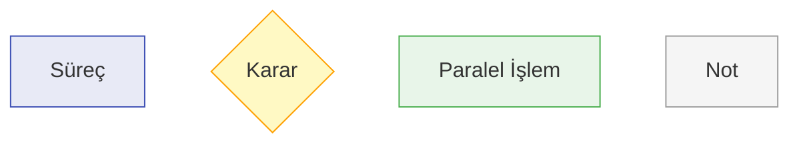

# BPM Platform Akış Diyagramları

Bu dizin, BPM platformunun çeşitli bileşenlerinin akış diyagramlarını içermektedir.

## İş Süreçleri Akış Diyagramları

1. [İş Kuralları Yönetimi](business-rules-flow.md)
2. [Veri Yönetimi](data-management-flow.md)
3. [Entegrasyon Yönetimi](integration-management-flow.md)
4. [Raporlama ve Analitik](reporting-analytics-flow.md)
5. [Denetim ve Uyumluluk](audit-compliance-flow.md)
6. [Destek ve Eğitim](support-training-flow.md)
7. [Performans İzleme](performance-monitoring-flow.md)
8. [Güvenlik Yönetimi](security-management-flow.md)
9. [Yedekleme ve Geri Yükleme](backup-restore-flow.md)
10. [Çoklu Dil Desteği](multilanguage-support-flow.md)
11. [API Sürüm Yönetimi](api-version-management-flow.md)
12. [API Kullanım İstatistikleri](api-usage-statistics-flow.md)

## Diyagram Özellikleri

- Tüm diyagramlar Mermaid formatında oluşturulmuştur
- Her diyagram kendi dosyasında bulunmaktadır
- Diyagramlar modüler ve yeniden kullanılabilir yapıdadır
- Stil tanımlamaları standardize edilmiştir
- Not ve açıklamalar eklenmiştir

## Stil Tanımlamaları

## Kullanım

1. Her diyagram dosyası markdown formatındadır
2. Diyagramlar GitHub ve benzeri platformlarda otomatik olarak render edilir
3. Diyagramlar export edilebilir ve farklı formatlarda kullanılabilir
4. Güncellemeler için Mermaid syntax kullanılmalıdır

## Güncelleme

Diyagramları güncellemek için:

1. İlgili .md dosyasını açın
2. Mermaid kod bloğunu düzenleyin
3. Değişiklikleri kaydedin
4. Diyagramın doğru render edildiğini kontrol edin

## Notlar

- Diyagramlar sürekli güncellenmektedir
- Yeni özellikler eklendikçe diyagramlar da güncellenir
- Her güncelleme için versiyon kontrolü yapılır
- Geriye dönük uyumluluk gözetilir 