# BPM Platform - Analiz ve İyileştirme Akışı

Bu diyagram, BPM Platform'un süreç analizi ve sürekli iyileştirme süreçlerini gösterir.

```mermaid
graph TB
    %% Stil Tanımlamaları
    classDef analysis fill:#E8EAF6,stroke:#3F51B5,stroke-width:2px
    classDef mining fill:#E3F2FD,stroke:#2196F3,stroke-width:2px
    classDef improvement fill:#E8F5E9,stroke:#4CAF50,stroke-width:2px
    classDef simulation fill:#FFF3E0,stroke:#FF9800,stroke-width:2px
    classDef ai fill:#FCE4EC,stroke:#E91E63,stroke-width:2px
    classDef reporting fill:#F3E5F5,stroke:#9C27B0,stroke-width:2px

    %% Veri Toplama ve Analiz
    subgraph DataCollection["Veri Toplama ve Analiz"]
        %% Veri Kaynakları
        subgraph DataSources["Veri Kaynakları"]
            ProcessLogs[Süreç Logları]:::analysis
            UserActivities[Kullanıcı Aktiviteleri]:::analysis
            SystemMetrics[Sistem Metrikleri]:::analysis
            BusinessKPIs[İş KPI'ları]:::analysis
        end

        %% Veri İşleme
        subgraph DataProcessing["Veri İşleme"]
            DataCleaning[Veri Temizleme]:::analysis
            DataTransformation[Veri Dönüşümü]:::analysis
            DataEnrichment[Veri Zenginleştirme]:::analysis
            DataValidation[Veri Doğrulama]:::analysis
        end
    end

    %% Süreç Madenciliği
    subgraph ProcessMining["Süreç Madenciliği"]
        %% Madencilik İşlemleri
        subgraph MiningOperations["Madencilik İşlemleri"]
            ProcessDiscovery[Süreç Keşfi]:::mining
            ConformanceChecking[Uygunluk Kontrolü]:::mining
            PerformanceAnalysis[Performans Analizi]:::mining
            VariantAnalysis[Varyant Analizi]:::mining
        end

        %% Patern Analizi
        subgraph PatternAnalysis["Patern Analizi"]
            BottleneckDetection[Darboğaz Tespiti]:::mining
            DeviationAnalysis[Sapma Analizi]:::mining
            RootCauseAnalysis[Kök Neden Analizi]:::mining
            TrendIdentification[Trend Tespiti]:::mining
        end
    end

    %% İyileştirme Önerileri
    subgraph ImprovementSuggestions["İyileştirme Önerileri"]
        %% Öneri Geliştirme
        ProcessOptimization[Süreç Optimizasyonu]:::improvement
        ResourceAllocation[Kaynak Tahsisi]:::improvement
        AutomationOpportunities[Otomasyon Fırsatları]:::improvement
        QualityEnhancement[Kalite İyileştirme]:::improvement
    end

    %% Simülasyon ve Test
    subgraph SimulationTesting["Simülasyon ve Test"]
        %% Simülasyon
        ProcessSimulation[Süreç Simülasyonu]:::simulation
        ScenarioAnalysis[Senaryo Analizi]:::simulation
        ImpactAssessment[Etki Değerlendirme]:::simulation
        PerformancePrediction[Performans Tahmini]:::simulation
    end

    %% Yapay Zeka Desteği
    subgraph AISupport["Yapay Zeka Desteği"]
        %% AI Modelleri
        PredictiveAnalytics[Öngörücü Analitik]:::ai
        MachineLearning[Makine Öğrenimi]:::ai
        DecisionSupport[Karar Desteği]:::ai
        AutomatedInsights[Otomatik İçgörüler]:::ai
    end

    %% Raporlama ve İzleme
    subgraph ReportingMonitoring["Raporlama ve İzleme"]
        %% Raporlar
        AnalysisReports[Analiz Raporları]:::reporting
        ImprovementReports[İyileştirme Raporları]:::reporting
        ComparisonReports[Karşılaştırma Raporları]:::reporting
        ROIReports[ROI Raporları]:::reporting
    end

    %% Bağlantılar - Veri
    DataSources --> DataProcessing
    ProcessLogs --> DataCleaning
    UserActivities --> DataTransformation
    SystemMetrics --> DataEnrichment
    BusinessKPIs --> DataValidation

    %% Bağlantılar - Madencilik
    DataProcessing --> MiningOperations
    ProcessDiscovery --> PatternAnalysis
    ConformanceChecking --> BottleneckDetection
    PerformanceAnalysis --> DeviationAnalysis
    VariantAnalysis --> RootCauseAnalysis

    %% Bağlantılar - İyileştirme
    PatternAnalysis --> ImprovementSuggestions
    ProcessOptimization --> SimulationTesting
    ResourceAllocation --> ProcessSimulation
    AutomationOpportunities --> ScenarioAnalysis
    QualityEnhancement --> ImpactAssessment

    %% Bağlantılar - AI
    ProcessMining --> AISupport
    PredictiveAnalytics --> ProcessOptimization
    MachineLearning --> ResourceAllocation
    DecisionSupport --> AutomationOpportunities
    AutomatedInsights --> QualityEnhancement

    %% Bağlantılar - Raporlama
    SimulationTesting --> ReportingMonitoring
    AnalysisReports --> ImprovementSuggestions
    ImprovementReports --> ProcessMining
    ComparisonReports --> AISupport
    ROIReports --> DataCollection

    %% Geri Bildirim Döngüleri
    ImpactAssessment --> ProcessDiscovery
    PerformancePrediction --> PerformanceAnalysis
    AutomatedInsights --> PatternAnalysis
    ROIReports --> ImprovementSuggestions

    %% Notlar
    note1[Sürekli İyileştirme]:::note
    note2[Veri Odaklı Kararlar]:::note
    note3[AI Destekli Analiz]:::note
    note4[Simülasyon Tabanlı]:::note
    note5[ROI Odaklı]:::note

    %% Not Bağlantıları
    ImprovementSuggestions -.-> note1
    ProcessMining -.-> note2
    AISupport -.-> note3
    SimulationTesting -.-> note4
    ReportingMonitoring -.-> note5

    classDef note fill:#F5F5F5,stroke:#9E9E9E,stroke-width:1px
```

## Diyagram Açıklaması

### Veri Toplama ve Analiz
#### Veri Kaynakları
- **Süreç Logları**: İşlem kayıtları
- **Kullanıcı Aktiviteleri**: Kullanıcı eylemleri
- **Sistem Metrikleri**: Sistem ölçümleri
- **İş KPI'ları**: Performans göstergeleri

#### Veri İşleme
- **Veri Temizleme**: Veri kalitesi
- **Veri Dönüşümü**: Format dönüşümü
- **Veri Zenginleştirme**: Veri artırma
- **Veri Doğrulama**: Veri kontrolü

### Süreç Madenciliği
#### Madencilik İşlemleri
- **Süreç Keşfi**: Süreç analizi
- **Uygunluk Kontrolü**: Standart kontrolü
- **Performans Analizi**: Performans ölçümü
- **Varyant Analizi**: Farklılık analizi

#### Patern Analizi
- **Darboğaz Tespiti**: Problem noktaları
- **Sapma Analizi**: İstisnalar
- **Kök Neden Analizi**: Problem nedenleri
- **Trend Tespiti**: Eğilim analizi

### İyileştirme Önerileri
- **Süreç Optimizasyonu**: Süreç iyileştirme
- **Kaynak Tahsisi**: Kaynak yönetimi
- **Otomasyon Fırsatları**: Otomasyon analizi
- **Kalite İyileştirme**: Kalite artırma

### Simülasyon ve Test
- **Süreç Simülasyonu**: Senaryo testi
- **Senaryo Analizi**: What-if analizi
- **Etki Değerlendirme**: Impact analizi
- **Performans Tahmini**: Tahminleme

### Yapay Zeka Desteği
- **Öngörücü Analitik**: Tahmin modelleri
- **Makine Öğrenimi**: ML modelleri
- **Karar Desteği**: Karar sistemleri
- **Otomatik İçgörüler**: AI içgörüleri

### Raporlama ve İzleme
- **Analiz Raporları**: Analiz sonuçları
- **İyileştirme Raporları**: İyileştirme sonuçları
- **Karşılaştırma Raporları**: Benchmark
- **ROI Raporları**: Yatırım getirisi

### Önemli Özellikler
- Sürekli iyileştirme
- Veri odaklı kararlar
- AI destekli analiz
- Simülasyon tabanlı
- ROI odaklı