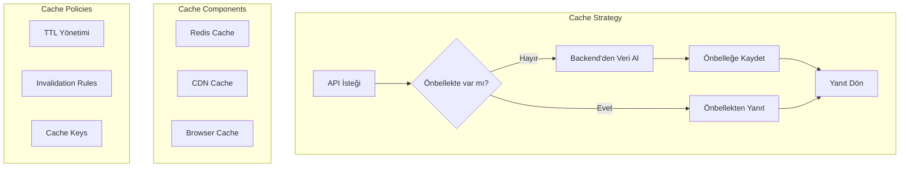

# API Önbellek Stratejisi

## Önbellek Katmanları

1. **CDN Önbelleği**
   - Statik içerik
   - API yanıtları
   - TTL: 1-24 saat

2. **Uygulama Önbelleği (Redis)**
   - Sık kullanılan veriler
   - Oturum bilgileri
   - TTL: 5-60 dakika

3. **Tarayıcı Önbelleği**
   - UI bileşenleri
   - API yanıtları
   - TTL: Kaynak bazlı

## Önbellek Stratejileri

- Write-Through Cache
- Cache-Aside
- Read-Through Cache
- Refresh-Ahead Cache

## Önbellek Yönetimi

- Otomatik TTL yönetimi
- Manuel invalidasyon
- Pattern bazlı temizleme
- Versiyonlama