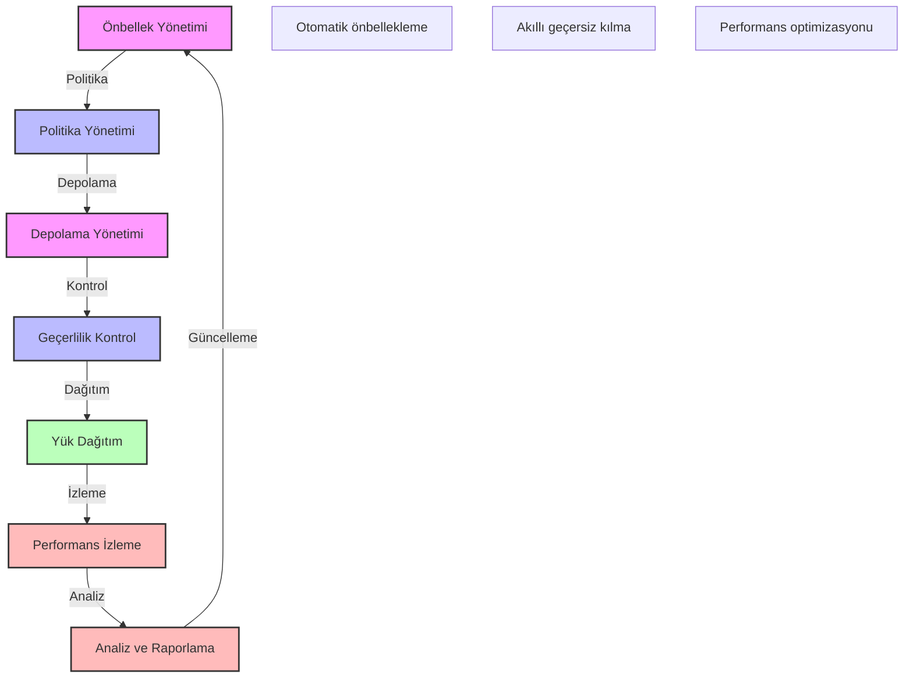

# BPM Platform - API Önbellekleme Stratejisi

Bu diyagram, BPM platformunun API önbellekleme stratejisini ve süreçlerini göstermektedir.

## Önemli Noktalar

1. Önbellek Yönetimi
   - Önbellek stratejisi
   - Önbellek tipleri
   - Önbellek seviyesi
   - Önbellek dağıtımı

2. Politika Yönetimi
   - TTL (Time-to-Live)
   - Geçersiz kılma kuralları
   - Yenileme stratejisi
   - Öncelik yönetimi

3. Depolama Yönetimi
   - Bellek içi depolama
   - Dağıtık önbellek
   - Kalıcı depolama
   - Veri senkronizasyonu

4. Geçerlilik Kontrol
   - Cache-Control
   - ETag kontrolü
   - Last-Modified kontrolü
   - Conditional requests

5. Yük Dağıtım
   - Coğrafi dağıtım
   - Edge caching
   - Load balancing
   - Failover yönetimi

6. Performans İzleme
   - Hit/Miss oranları
   - Yanıt süreleri
   - Bellek kullanımı
   - Bant genişliği

7. Analiz ve Raporlama
   - Performans raporları
   - Kullanım analizi
   - Optimizasyon önerileri
   - Trend analizi 