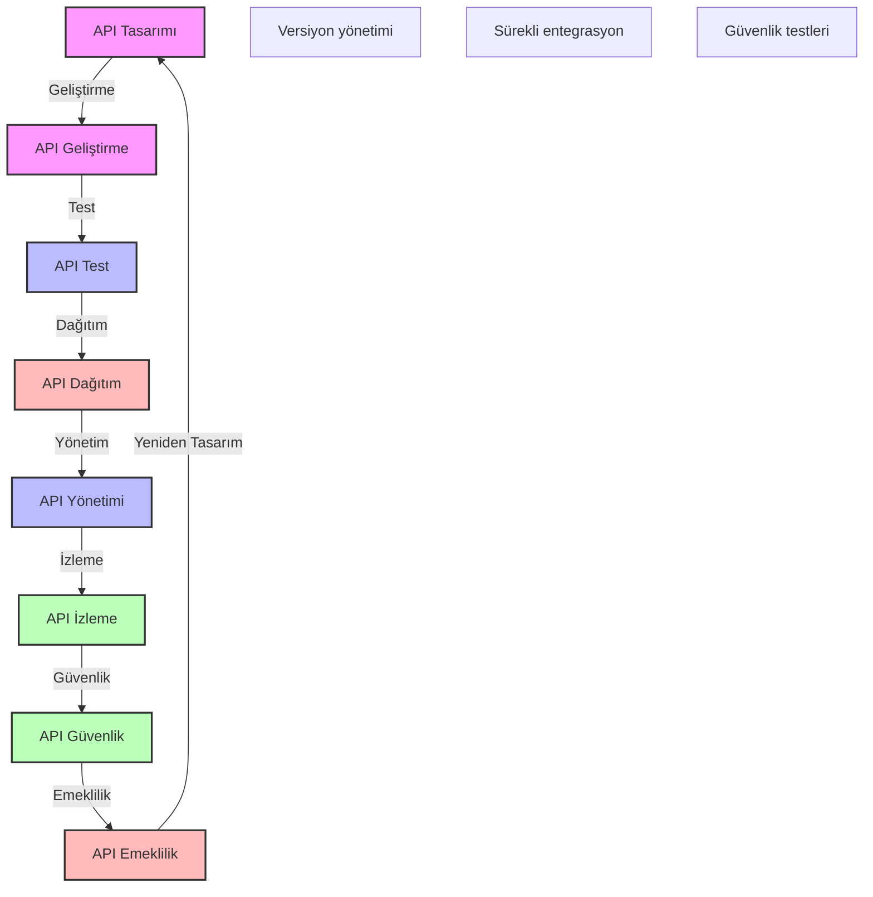

# BPM Platform - API Yaşam Döngüsü

Bu diyagram, BPM platformundaki API'lerin yaşam döngüsünü göstermektedir.

## Önemli Noktalar

1. API Tasarımı
   - Gereksinim analizi
   - Endpoint tanımları
   - Veri modelleri
   - Dokümantasyon

2. API Geliştirme
   - Kod geliştirme
   - Versiyon kontrolü
   - Kod standartları
   - Birim testler

3. API Test
   - Entegrasyon testleri
   - Performans testleri
   - Güvenlik testleri
   - Kullanılabilirlik testleri

4. API Dağıtım
   - Ortam yönetimi
   - Versiyon dağıtımı
   - Rollback planları
   - Dağıtım otomasyonu

5. API Yönetimi
   - Versiyon yönetimi
   - Erişim kontrolü
   - Kullanım politikaları
   - SLA yönetimi

6. API İzleme
   - Performans metrikleri
   - Kullanım analizi
   - Hata izleme
   - Trend analizi

7. API Güvenlik
   - Kimlik doğrulama
   - Yetkilendirme
   - Veri şifreleme
   - Güvenlik denetimi

8. API Emeklilik
   - Kullanım analizi
   - Geçiş planı
   - Versiyon sonlandırma
   - Arşivleme