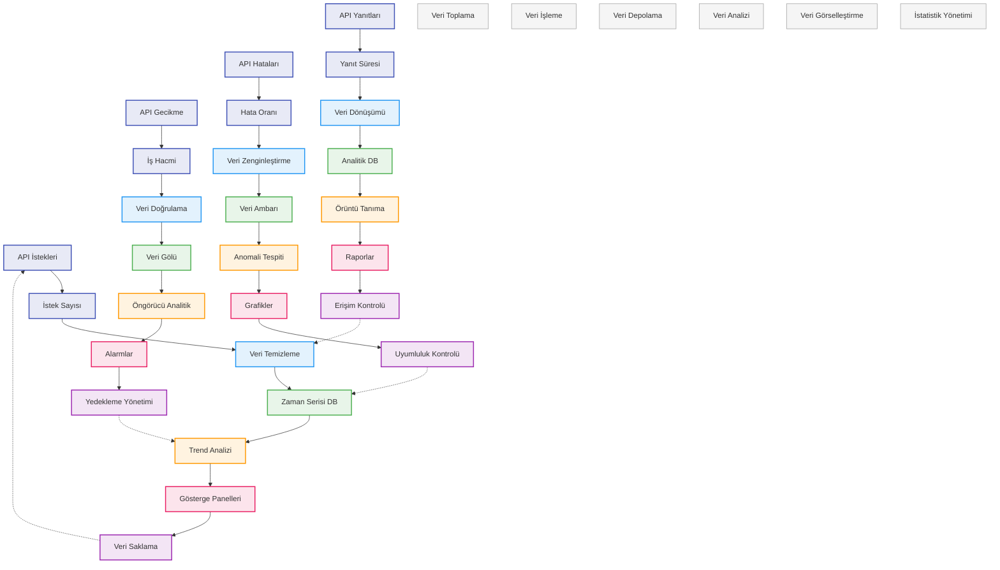

# BPM Platform - API Kullanım İstatistikleri Akışı

Bu diyagram, BPM Platform'un API kullanım istatistiklerinin toplanması, analizi ve raporlanması süreçlerini gösterir.

## Diyagram Açıklaması

### Veri Toplama
#### Veri Kaynakları
- **API İstekleri**: API requests
- **API Yanıtları**: API responses
- **API Hataları**: API errors
- **API Gecikme**: API latency

#### Metrikler
- **İstek Sayısı**: Request count
- **Yanıt Süresi**: Response time
- **Hata Oranı**: Error rate
- **İş Hacmi**: Throughput

### Veri İşleme
- **Veri Temizleme**: Data cleaning
- **Veri Dönüşümü**: Data transformation
- **Veri Zenginleştirme**: Data enrichment
- **Veri Doğrulama**: Data validation

### Veri Depolama
- **Zaman Serisi DB**: Time series DB
- **Analitik DB**: Analytics DB
- **Veri Ambarı**: Data warehouse
- **Veri Gölü**: Data lake

### Veri Analizi
- **Trend Analizi**: Trend analysis
- **Örüntü Tanıma**: Pattern recognition
- **Anomali Tespiti**: Anomaly detection
- **Öngörücü Analitik**: Predictive analytics

### Veri Görselleştirme
- **Gösterge Panelleri**: Dashboards
- **Raporlar**: Reports
- **Grafikler**: Charts
- **Alarmlar**: Alerts

### İstatistik Yönetimi
- **Veri Saklama**: Data retention
- **Erişim Kontrolü**: Access control
- **Uyumluluk Kontrolü**: Compliance control
- **Yedekleme Yönetimi**: Backup management

### Önemli Özellikler
- Veri toplama
- Veri işleme
- Veri depolama
- Veri analizi
- Veri görselleştirme
- İstatistik yönetimi