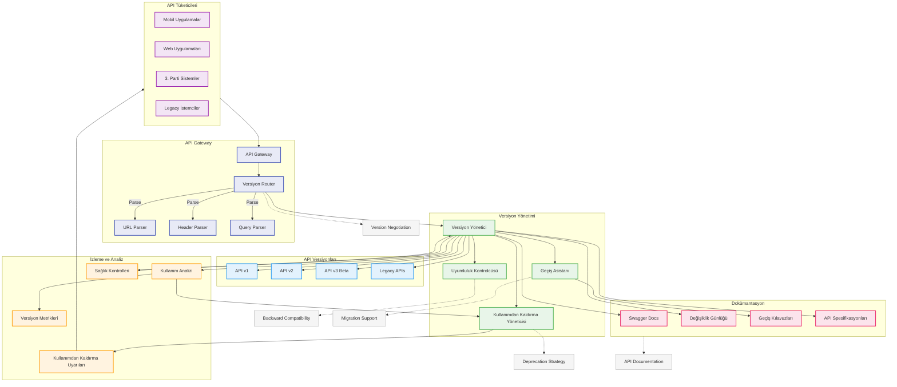

# BPM Platform - API Versiyon Yönetimi Akışı

Bu diyagram, BPM Platform'un API versiyon yönetimi stratejisini ve süreçlerini gösterir.



## Diyagram Açıklaması

### API Gateway ve Routing
- **API Gateway**: Tüm API isteklerinin giriş noktası
- **Versiyon Router**: İstek yönlendirme ve versiyon tespiti
- **URL/Header/Query Parser**: Versiyon bilgisi çıkarma

### Versiyon Yönetimi
- **Versiyon Yönetici**: API versiyonlarının yaşam döngüsü
- **Uyumluluk Kontrolcüsü**: Geriye dönük uyumluluk kontrolü
- **Kullanımdan Kaldırma Yöneticisi**: Deprecated API yönetimi
- **Geçiş Asistanı**: Versiyon geçiş desteği

### API Versiyonları
- **API v1**: Kararlı sürüm
- **API v2**: Güncel kararlı sürüm
- **API v3 Beta**: Test aşamasındaki sürüm
- **Legacy APIs**: Eski sürümler

### İzleme ve Analiz
- **Kullanım Analizi**: API kullanım istatistikleri
- **Versiyon Metrikleri**: Versiyon bazlı metrikler
- **Kullanımdan Kaldırma Uyarıları**: Deprecated API bildirimleri
- **Sağlık Kontrolleri**: API sağlık durumu

### Dokümantasyon
- **Swagger Docs**: API dokümantasyonu
- **Değişiklik Günlüğü**: Sürüm değişiklikleri
- **Geçiş Kılavuzları**: Versiyon geçiş rehberleri
- **API Spesifikasyonları**: Detaylı API özellikleri

### API Tüketicileri
- **Mobil Uygulamalar**: Mobil istemciler
- **Web Uygulamaları**: Web istemcileri
- **3. Parti Sistemler**: Harici sistemler
- **Legacy İstemciler**: Eski istemciler

### Önemli Özellikler
- Versiyon müzakeresi
- Geriye dönük uyumluluk
- Kullanımdan kaldırma stratejisi
- Geçiş desteği
- API dokümantasyonu
``` 