# BPM Platform - Denetim ve Uyumluluk Akışı

Bu diyagram, BPM Platform'un denetim ve uyumluluk süreçlerini gösterir.

```mermaid
graph TB
    %% Stil Tanımlamaları
    classDef audit fill:#E8EAF6,stroke:#3F51B5,stroke-width:2px
    classDef compliance fill:#E3F2FD,stroke:#2196F3,stroke-width:2px
    classDef logger fill:#E8F5E9,stroke:#4CAF50,stroke-width:2px
    classDef monitor fill:#FFF3E0,stroke:#FF9800,stroke-width:2px
    classDef report fill:#FCE4EC,stroke:#E91E63,stroke-width:2px
    classDef security fill:#F3E5F5,stroke:#9C27B0,stroke-width:2px

    %% Denetim Kaynakları
    subgraph AuditSources["Denetim Kaynakları"]
        %% Kullanıcı Aktiviteleri
        subgraph UserActivities["Kullanıcı Aktiviteleri"]
            UserActions[Kullanıcı İşlemleri]:::audit
            SystemAccess[Sistem Erişimleri]:::audit
            DataModifications[Veri Değişiklikleri]:::audit
            ProcessChanges[Süreç Değişiklikleri]:::audit
        end

        %% Sistem Aktiviteleri
        subgraph SystemActivities["Sistem Aktiviteleri"]
            APIAccess[API Erişimleri]:::audit
            SystemEvents[Sistem Olayları]:::audit
            SecurityEvents[Güvenlik Olayları]:::audit
            PerformanceMetrics[Performans Metrikleri]:::audit
        end
    end

    %% Uyumluluk Kontrolleri
    subgraph ComplianceChecks["Uyumluluk Kontrolleri"]
        %% Düzenleyici Uyumluluk
        subgraph RegulatoryCompliance["Düzenleyici Uyumluluk"]
            GDPRChecks[GDPR Kontrolleri]:::compliance
            KVKKChecks[KVKK Kontrolleri]:::compliance
            SOXChecks[SOX Kontrolleri]:::compliance
            ISOChecks[ISO Standartları]:::compliance
        end

        %% Politika Uyumluluk
        subgraph PolicyCompliance["Politika Uyumluluk"]
            SecurityPolicies[Güvenlik Politikaları]:::compliance
            DataPolicies[Veri Politikaları]:::compliance
            AccessPolicies[Erişim Politikaları]:::compliance
            RetentionPolicies[Saklama Politikaları]:::compliance
        end
    end

    %% Loglama ve İzleme
    subgraph LoggingMonitoring["Loglama ve İzleme"]
        %% Log Yönetimi
        AuditLogger[Denetim Loglayıcı]:::logger
        SecurityLogger[Güvenlik Loglayıcı]:::logger
        ComplianceLogger[Uyumluluk Loglayıcı]:::logger
        ActivityLogger[Aktivite Loglayıcı]:::logger

        %% İzleme Araçları
        RealTimeMonitor[Gerçek Zamanlı İzleyici]:::monitor
        AlertSystem[Uyarı Sistemi]:::monitor
        TrendAnalyzer[Trend Analizör]:::monitor
        ViolationDetector[İhlal Dedektörü]:::monitor
    end

    %% Raporlama ve Analiz
    subgraph ReportingAnalysis["Raporlama ve Analiz"]
        %% Raporlar
        ComplianceReports[Uyumluluk Raporları]:::report
        AuditReports[Denetim Raporları]:::report
        SecurityReports[Güvenlik Raporları]:::report
        CustomReports[Özel Raporlar]:::report

        %% Analiz Araçları
        RiskAnalyzer[Risk Analizör]:::report
        TrendReporter[Trend Raporlayıcı]:::report
        ComplianceScorer[Uyumluluk Skorlayıcı]:::report
        ImpactAnalyzer[Etki Analizör]:::report
    end

    %% Güvenlik ve Doğrulama
    subgraph SecurityValidation["Güvenlik ve Doğrulama"]
        DataEncryption[Veri Şifreleme]:::security
        AccessControl[Erişim Kontrolü]:::security
        IntegrityCheck[Bütünlük Kontrolü]:::security
        SignatureVerification[İmza Doğrulama]:::security
    end

    %% Bağlantılar - Denetim Kaynakları
    UserActivities --> AuditLogger
    SystemActivities --> AuditLogger
    UserActivities --> SecurityLogger
    SystemActivities --> SecurityLogger

    %% Bağlantılar - Uyumluluk
    RegulatoryCompliance --> ComplianceLogger
    PolicyCompliance --> ComplianceLogger
    ComplianceChecks --> ViolationDetector

    %% Bağlantılar - İzleme
    AuditLogger --> RealTimeMonitor
    SecurityLogger --> AlertSystem
    ComplianceLogger --> TrendAnalyzer
    ActivityLogger --> ViolationDetector

    %% Bağlantılar - Raporlama
    LoggingMonitoring --> ComplianceReports
    LoggingMonitoring --> AuditReports
    LoggingMonitoring --> SecurityReports
    ViolationDetector --> RiskAnalyzer

    %% Bağlantılar - Güvenlik
    SecurityValidation --> AuditLogger
    SecurityValidation --> ComplianceLogger
    DataEncryption --> IntegrityCheck
    AccessControl --> SignatureVerification

    %% Geri Bildirim Döngüleri
    AlertSystem --> SecurityPolicies
    ViolationDetector --> PolicyCompliance
    RiskAnalyzer --> ComplianceChecks
    TrendAnalyzer --> ImpactAnalyzer

    %% Notlar
    note1[Real-time Monitoring]:::note
    note2[Compliance Validation]:::note
    note3[Security Controls]:::note
    note4[Audit Trail]:::note
    note5[Reporting & Analytics]:::note

    %% Not Bağlantıları
    RealTimeMonitor -.-> note1
    ComplianceChecks -.-> note2
    SecurityValidation -.-> note3
    LoggingMonitoring -.-> note4
    ReportingAnalysis -.-> note5

    classDef note fill:#F5F5F5,stroke:#9E9E9E,stroke-width:1px
```



## Diyagram Açıklaması

### Denetim Kaynakları
#### Kullanıcı Aktiviteleri
- **Kullanıcı İşlemleri**: Kullanıcı seviyesindeki tüm işlemler
- **Sistem Erişimleri**: Sistem giriş/çıkış kayıtları
- **Veri Değişiklikleri**: Veri manipülasyon kayıtları
- **Süreç Değişiklikleri**: İş süreçlerindeki değişiklikler

#### Sistem Aktiviteleri
- **API Erişimleri**: API çağrıları ve yanıtları
- **Sistem Olayları**: Sistem seviyesi olaylar
- **Güvenlik Olayları**: Güvenlikle ilgili olaylar
- **Performans Metrikleri**: Sistem performans verileri

### Uyumluluk Kontrolleri
#### Düzenleyici Uyumluluk
- **GDPR Kontrolleri**: Avrupa veri koruma
- **KVKK Kontrolleri**: Türkiye veri koruma
- **SOX Kontrolleri**: Finansal raporlama
- **ISO Standartları**: Kalite standartları

#### Politika Uyumluluk
- **Güvenlik Politikaları**: Güvenlik kuralları
- **Veri Politikaları**: Veri yönetim kuralları
- **Erişim Politikaları**: Erişim kontrol kuralları
- **Saklama Politikaları**: Veri saklama kuralları

### Loglama ve İzleme
- **Denetim Loglayıcı**: Audit trail kayıtları
- **Güvenlik Loglayıcı**: Güvenlik olayları
- **Uyumluluk Loglayıcı**: Uyumluluk kontrolleri
- **Aktivite Loglayıcı**: Genel sistem aktiviteleri

### Raporlama ve Analiz
- **Uyumluluk Raporları**: Compliance raporları
- **Denetim Raporları**: Audit raporları
- **Güvenlik Raporları**: Security raporları
- **Özel Raporlar**: Custom raporlar

### Güvenlik ve Doğrulama
- **Veri Şifreleme**: Encryption/decryption
- **Erişim Kontrolü**: Access control
- **Bütünlük Kontrolü**: Integrity checks
- **İmza Doğrulama**: Digital signatures

### Önemli Özellikler
- Gerçek zamanlı izleme
- Uyumluluk doğrulama
- Güvenlik kontrolleri
- Denetim izleri
- Raporlama ve analitik
``` 