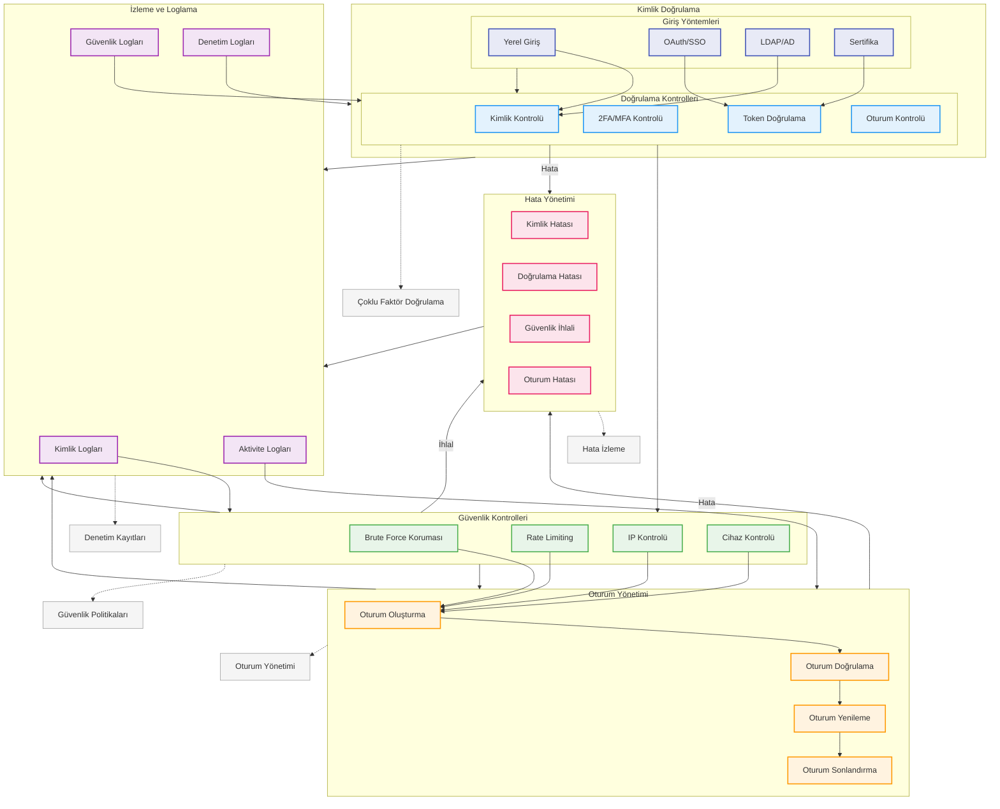

# BPM Platform - Kimlik Doğrulama Akışı

Bu diyagram, BPM Platform'un kimlik doğrulama ve yetkilendirme süreçlerini gösterir.

## Diyagram Açıklaması

### Kimlik Doğrulama
#### Giriş Yöntemleri
- **Yerel Giriş**: Kullanıcı/şifre
- **OAuth/SSO**: Tek oturum açma
- **LDAP/AD**: Dizin servisleri
- **Sertifika**: Dijital sertifikalar

#### Doğrulama Kontrolleri
- **Kimlik Kontrolü**: Kullanıcı doğrulama
- **2FA/MFA**: Çoklu faktör
- **Token Doğrulama**: JWT/OAuth token
- **Oturum Kontrolü**: Session kontrol

### Güvenlik Kontrolleri
- **Brute Force Koruması**: Saldırı engelleme
- **Rate Limiting**: İstek sınırlama
- **IP Kontrolü**: IP filtreleme
- **Cihaz Kontrolü**: Cihaz doğrulama

### Oturum Yönetimi
- **Oturum Oluşturma**: Session başlatma
- **Oturum Doğrulama**: Session kontrol
- **Oturum Yenileme**: Token yenileme
- **Oturum Sonlandırma**: Logout işlemi

### Hata Yönetimi
- **Kimlik Hatası**: Auth hataları
- **Doğrulama Hatası**: Validation
- **Güvenlik İhlali**: Security breach
- **Oturum Hatası**: Session error

### İzleme ve Loglama
- **Kimlik Logları**: Auth logları
- **Güvenlik Logları**: Security logs
- **Aktivite Logları**: User activity
- **Denetim Logları**: Audit trail

### Önemli Özellikler
- Çoklu faktör doğrulama
- Güvenlik politikaları
- Oturum yönetimi
- Hata izleme
- Denetim kayıtları