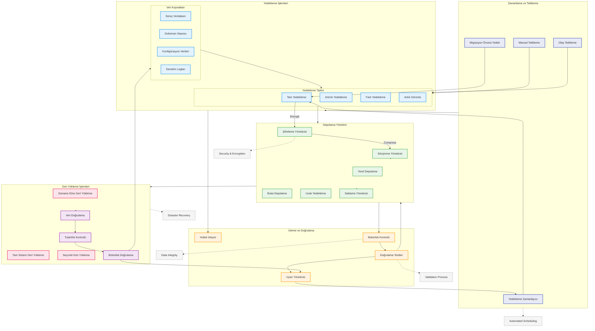

# BPM Platform - Yedekleme ve Geri Yükleme Akışı

Bu diyagram, BPM Platform'un veri yedekleme ve geri yükleme süreçlerini gösterir.



## Diyagram Açıklaması

### Zamanlama ve Tetikleme
- **Yedekleme Zamanlayıcı**: Otomatik yedekleme planları
- **Manuel Tetikleme**: Kullanıcı tarafından başlatılan yedeklemeler
- **Olay Tetikleme**: Sistem olaylarına bağlı yedeklemeler
- **Migrasyon Öncesi Yedek**: Sistem güncellemeleri öncesi yedekleme

### Yedekleme İşlemleri
#### Veri Kaynakları
- **Süreç Veritabanı**: BPMN süreç verileri
- **Doküman Deposu**: Form ve doküman verileri
- **Konfigürasyon Verileri**: Sistem ayarları
- **Denetim Logları**: Audit trail verileri

#### Yedekleme Tipleri
- **Tam Yedekleme**: Tüm sistem verisi
- **Artımlı Yedekleme**: Son yedekten sonraki değişiklikler
- **Fark Yedekleme**: İlk tam yedekten sonraki tüm değişiklikler
- **Anlık Görüntü**: Sistem durumunun anlık kopyası

### Depolama Yönetimi
- **Yerel Depolama**: On-premise yedekleme
- **Bulut Depolama**: Cloud backup
- **Uzak Yedekleme**: Off-site backup
- **Saklama Yöneticisi**: Retention policies
- **Sıkıştırma Yöneticisi**: Backup compression
- **Şifreleme Yöneticisi**: Encryption/decryption

### İzleme ve Doğrulama
- **Yedek İzleyici**: Backup monitoring
- **Bütünlük Kontrolü**: Data integrity checks
- **Doğrulama Testleri**: Validation procedures
- **Uyarı Yöneticisi**: Alert management

### Geri Yükleme İşlemleri
#### Geri Yükleme Tipleri
- **Zamana Göre Geri Yükleme**: Point-in-time recovery
- **Tam Sistem Geri Yükleme**: Full system restore
- **Seçmeli Geri Yükleme**: Selective data restore

#### Doğrulama
- **Veri Doğrulama**: Data validation
- **Tutarlılık Kontrolü**: Consistency checks
- **Bütünlük Doğrulama**: Integrity verification

### Önemli Özellikler
- Otomatik zamanlama
- Veri bütünlüğü
- Güvenlik ve şifreleme
- Doğrulama süreci
- Felaket kurtarma
``` 