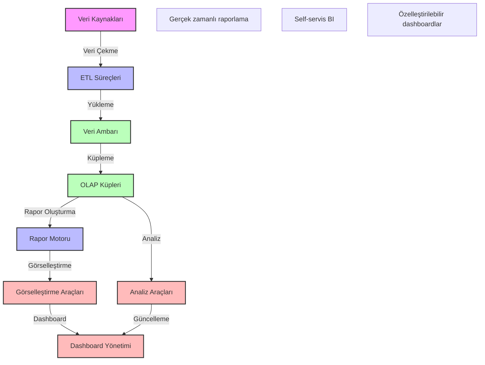

# BPM Platform - İş Zekası ve Raporlama Mimarisi

Bu diyagram, BPM platformundaki iş zekası ve raporlama süreçlerinin mimarisini göstermektedir.

## Önemli Noktalar

1. Veri Kaynakları
   - İşlemsel veritabanları
   - Dosya sistemleri
   - Harici sistemler
   - API'ler

2. ETL Süreçleri
   - Veri çıkarma
   - Veri dönüştürme
   - Veri yükleme
   - Veri doğrulama

3. Veri Ambarı
   - Boyutsal modelleme
   - Veri partisyonlama
   - Veri arşivleme
   - Performans optimizasyonu

4. Raporlama Özellikleri
   - Standart raporlar
   - Ad-hoc raporlar
   - Drill-down analizi
   - Trend analizi

5. Görselleştirme
   - İnteraktif grafikler
   - KPI göstergeleri
   - Coğrafi haritalar
   - Pivot tablolar