# BPMN-Rules Flow

Bu diyagram, BPMN süreç modelleme ve iş kuralları motoru arasındaki entegrasyonu gösterir.

```mermaid
flowchart TD
    subgraph BPMN Modeling
        BM[BPMN Modeler] --> BE[BPMN Editor]
        BM --> BV[BPMN Validator]
        BM --> BS[BPMN Simulator]
        BM --> BA[BPMN Analyzer]
        
        %% BPMN Elements
        BE --> BP[Process Elements]
        BE --> BT[Task Elements]
        BE --> BG[Gateway Elements]
        BE --> BF[Flow Elements]
        
        %% BPMN Validation
        BV --> BC[Syntax Checker]
        BV --> BR[Rule Validator]
        BV --> BD[DMN Validator]
        BV --> BQ[Quality Checker]
    end

    subgraph Rules Engine
        RE[Rules Engine] --> RM[Rules Manager]
        RE --> RD[Rules Designer]
        RE --> RV[Rules Validator]
        RE --> RA[Rules AI Assistant]
        
        %% Rules Components
        RM --> RC[Rule Conditions]
        RM --> RA[Rule Actions]
        RM --> RT[Rule Templates]
        RM --> RH[Rule History]
        
        %% Rules Processing
        RD --> RP[Rule Parser]
        RD --> RX[Rule Executor]
        RD --> RS[Rule Scheduler]
        RD --> RO[Rule Optimizer]
    end

    subgraph DMN Engine
        DE[DMN Engine] --> DM[Decision Manager]
        DE --> DD[Decision Designer]
        DE --> DV[Decision Validator]
        DE --> DA[Decision AI]
        
        %% DMN Components
        DM --> DC[Decision Tables]
        DM --> DL[Decision Logic]
        DM --> DT[Decision Trees]
        DM --> DH[Decision History]
        DM --> DO[Decision Optimizer]
    end

    subgraph Integration Layer
        IL[Integration Layer] --> PI[Process Integrator]
        IL --> RI[Rules Integrator]
        IL --> DI[DMN Integrator]
        IL --> WH[Webhook Manager]
        
        %% Integration Components
        PI --> PF[Process Flow]
        RI --> RF[Rules Flow]
        DI --> DF[Decision Flow]
        
        %% Event Processing
        IL --> EH[Event Handler]
        IL --> EP[Event Processor]
        IL --> EQ[Event Queue]
        IL --> ES[Event Streaming]
    end

    subgraph Execution Engine
        EE[Execution Engine] --> EM[Execution Manager]
        EE --> ES[Execution Scheduler]
        EE --> EV[Execution Validator]
        EE --> EP[Execution Profiler]
        
        %% Execution Components
        EM --> EC[Context Manager]
        EM --> ET[Task Manager]
        EM --> EA[Action Manager]
        EM --> EL[Log Manager]
        EM --> EO[Optimization Engine]
    end

    subgraph Monitoring System
        MS[Monitoring Service] --> MP[Process Monitor]
        MS --> MR[Rules Monitor]
        MS --> MD[Decision Monitor]
        MS --> MA[AI Monitor]
        
        %% Monitoring Components
        MP --> MA[Analytics Engine]
        MP --> MM[Metrics Collector]
        MP --> ML[Log Analyzer]
        MP --> MT[Real-time Tracker]
    end

    subgraph AI System
        AI[AI Engine] --> AP[Pattern Analyzer]
        AI --> AO[Optimization Engine]
        AI --> AR[Rule Recommender]
        AI --> AM[Model Trainer]
        
        %% AI Components
        AP --> AD[Data Processor]
        AP --> AL[Learning Engine]
        AP --> AS[Suggestion Engine]
        AP --> AC[Confidence Scorer]
    end

    subgraph Test System
        TS[Test Manager] --> TU[Unit Tests]
        TS --> TI[Integration Tests]
        TS --> TP[Performance Tests]
        TS --> TL[Load Tests]
        TS --> TE[E2E Tests]
        
        %% Test Components
        TU --> TC[Test Cases]
        TU --> TR[Test Runner]
        TU --> TD[Test Data]
        TU --> TM[Mock Engine]
    end

    subgraph Cache System
        CS[Cache Manager] --> CR[Rule Cache]
        CS --> CD[Decision Cache]
        CS --> CP[Process Cache]
        CS --> CM[Metadata Cache]
    end

    %% BPMN to Rules Flow
    BM -->|Process Definition| IL
    IL -->|Rule Requirements| RE
    RE -->|Rule Execution| EE

    %% Rules to DMN Flow
    RE -->|Decision Rules| DE
    DE -->|Decision Logic| IL
    IL -->|Execution Context| EE

    %% AI Integration
    AI -.->|Optimize| RE
    AI -.->|Analyze| DE
    AI -.->|Suggest| BM

    %% Cache Integration
    CS -.->|Cache| RE
    CS -.->|Cache| DE
    CS -.->|Cache| EE

    %% Test Coverage
    TS -.->|Test| BM
    TS -.->|Test| RE
    TS -.->|Test| DE
    TS -.->|Test| EE

    %% Monitoring Integration
    MS -.->|Monitor| BM
    MS -.->|Monitor| RE
    MS -.->|Monitor| DE
    MS -.->|Monitor| EE

    %% Event Processing
    IL -->|Events| EH
    EH -->|Process| EP
    EP -->|Stream| ES
    ES -->|Queue| EQ

    %% States and Styling
    classDef bpmn fill:#f9f,stroke:#333,stroke-width:2px
    classDef rules fill:#bbf,stroke:#333,stroke-width:2px
    classDef dmn fill:#bfb,stroke:#333,stroke-width:2px
    classDef integration fill:#fdb,stroke:#333,stroke-width:2px
    classDef execution fill:#dff,stroke:#333,stroke-width:2px
    classDef monitoring fill:#ffd,stroke:#333,stroke-width:2px
    classDef ai fill:#dfd,stroke:#333,stroke-width:2px
    classDef test fill:#fdd,stroke:#333,stroke-width:2px
    classDef cache fill:#ddf,stroke:#333,stroke-width:2px
    
    class BM,BE,BV,BS,BA,BP,BT,BG,BF,BC,BR,BD,BQ bpmn
    class RE,RM,RD,RV,RA,RC,RT,RH,RP,RX,RS,RO rules
    class DE,DM,DD,DV,DA,DC,DL,DT,DH,DO dmn
    class IL,PI,RI,DI,WH,PF,RF,DF,EH,EP,EQ,ES integration
    class EE,EM,ES,EV,EP,EC,ET,EA,EL,EO execution
    class MS,MP,MR,MD,MA,MM,ML,MT monitoring
    class AI,AP,AO,AR,AM,AD,AL,AS,AC ai
    class TS,TU,TI,TP,TL,TE,TC,TR,TD,TM test
    class CS,CR,CD,CP,CM cache
```



## Detaylı Açıklama

### Ana Bileşenler

1. **BPMN Modeling**
   - BPMN Modeler (BM): BPMN modelleme aracı
   - BPMN Editor (BE): BPMN düzenleyici
   - BPMN Validator (BV): BPMN doğrulayıcı
   - BPMN Simulator (BS): BPMN simülatörü
   - BPMN Analyzer (BA): BPMN analizörü
   - Process Elements (BP): Süreç elemanları
   - Task Elements (BT): Görev elemanları
   - Gateway Elements (BG): Geçit elemanları
   - Flow Elements (BF): Akış elemanları
   - Syntax Checker (BC): Sözdizimi kontrolü
   - Rule Validator (BR): Kural doğrulayıcı
   - DMN Validator (BD): DMN doğrulayıcı
   - Quality Checker (BQ): Kalite kontrolü

2. **Rules Engine**
   - Rules Engine (RE): Kural motoru
   - Rules Manager (RM): Kural yöneticisi
   - Rules Designer (RD): Kural tasarımcısı
   - Rules Validator (RV): Kural doğrulayıcı
   - Rules AI Assistant (RA): Kural AI desteği
   - Rule Conditions (RC): Kural koşulları
   - Rule Actions (RA): Kural aksiyonları
   - Rule Templates (RT): Kural şablonları
   - Rule History (RH): Kural geçmişi
   - Rule Parser (RP): Kural ayrıştırıcı
   - Rule Executor (RX): Kural yürütücü
   - Rule Scheduler (RS): Kural zamanlayıcı
   - Rule Optimizer (RO): Kural optimizasyonu

3. **DMN Engine**
   - DMN Engine (DE): DMN motoru
   - Decision Manager (DM): Karar yöneticisi
   - Decision Designer (DD): Karar tasarımcısı
   - Decision Validator (DV): Karar doğrulayıcı
   - Decision AI (DA): Karar AI
   - Decision Tables (DC): Karar tabloları
   - Decision Logic (DL): Karar mantığı
   - Decision Trees (DT): Karar ağaçları
   - Decision History (DH): Karar geçmişi
   - Decision Optimizer (DO): Karar optimizasyonu

4. **Integration Layer**
   - Integration Layer (IL): Entegrasyon katmanı
   - Process Integrator (PI): Süreç entegratörü
   - Rules Integrator (RI): Kural entegratörü
   - DMN Integrator (DI): DMN entegratörü
   - Webhook Manager (WH): Webhook yöneticisi
   - Process Flow (PF): Süreç akışı
   - Rules Flow (RF): Kural akışı
   - Decision Flow (DF): Karar akışı
   - Event Handler (EH): Olay işleyici
   - Event Processor (EP): Olay işlemci
   - Event Queue (EQ): Olay kuyruğu
   - Event Streaming (ES): Olay akışı

5. **Execution Engine**
   - Execution Engine (EE): Yürütme motoru
   - Execution Manager (EM): Yürütme yöneticisi
   - Execution Scheduler (ES): Yürütme zamanlayıcı
   - Execution Validator (EV): Yürütme doğrulayıcı
   - Execution Profiler (EP): Yürütme profilörü
   - Context Manager (EC): Bağlam yöneticisi
   - Task Manager (ET): Görev yöneticisi
   - Action Manager (EA): Aksiyon yöneticisi
   - Log Manager (EL): Log yöneticisi
   - Optimization Engine (EO): Optimizasyon motoru

6. **Monitoring System**
   - Monitoring Service (MS): İzleme servisi
   - Process Monitor (MP): Süreç izleyici
   - Rules Monitor (MR): Kural izleyici
   - Decision Monitor (MD): Karar izleyici
   - AI Monitor (MA): AI izleyici
   - Analytics Engine (MA): Analitik motoru
   - Metrics Collector (MM): Metrik toplayıcı
   - Log Analyzer (ML): Log analizörü
   - Real-time Tracker (MT): Gerçek zamanlı izleyici

### Kritik Akışlar

1. **BPMN-Rules Entegrasyonu**
```json
{
  "bpmnRulesIntegration": {
    "source": "bpmnProcess",
    "steps": [
      {
        "type": "processAnalysis",
        "actions": ["extractRules", "validateRules"]
      },
      {
        "type": "ruleGeneration",
        "format": "businessRules",
        "validation": true
      },
      {
        "type": "execution",
        "mode": "realtime",
        "monitoring": true
      }
    ]
  }
}
```

2. **Karar Yönetimi**
```json
{
  "decisionManagement": {
    "source": "businessRules",
    "components": [
      {
        "type": "decisionTable",
        "format": "dmn",
        "validation": true
      },
      {
        "type": "decisionLogic",
        "engine": "dmnEngine",
        "execution": "parallel"
      }
    ]
  }
}
```

### Kullanım Senaryoları

1. **Süreç Modelleme**
   - BPMN diyagramları oluşturma
   - İş kuralları entegrasyonu
   - Süreç doğrulama

2. **Kural Yönetimi**
   - İş kuralları tasarımı
   - Kural setleri oluşturma
   - Kural yürütme ve izleme

3. **Karar Otomasyonu**
   - DMN tabloları oluşturma
   - Karar mantığı tanımlama
   - Karar yürütme ve analiz 