# BPM Platform - İş Kuralları Akışı

Bu diyagram, BPM Platform'un iş kuralları yönetimi ve işleme süreçlerini gösterir.

```mermaid
graph TB
    %% Stil Tanımlamaları
    classDef design fill:#E8EAF6,stroke:#3F51B5,stroke-width:2px
    classDef engine fill:#E3F2FD,stroke:#2196F3,stroke-width:2px
    classDef validation fill:#E8F5E9,stroke:#4CAF50,stroke-width:2px
    classDef storage fill:#FFF3E0,stroke:#FF9800,stroke-width:2px
    classDef execution fill:#FCE4EC,stroke:#E91E63,stroke-width:2px
    classDef monitoring fill:#F3E5F5,stroke:#9C27B0,stroke-width:2px
    classDef security fill:#EFEBE9,stroke:#795548,stroke-width:2px
    classDef error fill:#FFEBEE,stroke:#D32F2F,stroke-width:2px
    classDef note fill:#F5F5F5,stroke:#9E9E9E,stroke-width:1px

    %% Kural Tasarımı
    RuleBuilder[Kural Oluşturucu]:::design
    DecisionTable[Karar Tablosu]:::design
    FlowDesigner[Akış Tasarımcı]:::design
    TemplateEditor[Şablon Düzenleyici]:::design
    VisualEditor[Görsel Editör]:::design
    DecisionTree[Karar Ağacı]:::design

    %% Kural Motoru
    RuleParser[Kural Ayrıştırıcı]:::engine
    RuleCompiler[Kural Derleyici]:::engine
    RuleInterpreter[Kural Yorumlayıcı]:::engine
    RuleOptimizer[Optimize Edici]:::engine
    CacheManager[Önbellek Yöneticisi]:::engine
    DistributedEngine[Dağıtık Motor]:::engine

    %% Doğrulama ve Test
    SyntaxCheck[Sözdizimi Kontrolü]:::validation
    LogicCheck[Mantık Kontrolü]:::validation
    ConflictCheck[Çakışma Kontrolü]:::validation
    PerformanceTest[Performans Testi]:::validation
    ComplianceCheck[Uyumluluk Kontrolü]:::validation
    SecurityCheck[Güvenlik Kontrolü]:::validation

    %% Kural Depolama
    VersionControl[Versiyon Kontrolü]:::storage
    RuleRepository[Kural Deposu]:::storage
    ChangeHistory[Değişiklik Geçmişi]:::storage
    BackupRecovery[Yedekleme ve Kurtarma]:::storage
    EncryptionManager[Şifreleme Yöneticisi]:::storage
    AccessControl[Erişim Kontrolü]:::storage

    %% Kural Yürütme
    ExecutionContext[Yürütme Bağlamı]:::execution
    DataBinding[Veri Bağlama]:::execution
    RuleChaining[Kural Zincirleme]:::execution
    ResultHandling[Sonuç İşleme]:::execution
    DistributedExecution[Dağıtık Yürütme]:::execution
    TransactionManager[İşlem Yöneticisi]:::execution

    %% Hata Yönetimi
    ErrorDetection[Hata Tespiti]:::error
    ErrorHandling[Hata İşleme]:::error
    ErrorRecovery[Hata Kurtarma]:::error
    ErrorLogging[Hata Günlüğü]:::error
    AlertManager[Uyarı Yöneticisi]:::error
    IncidentManager[Olay Yöneticisi]:::error

    %% İzleme ve Analiz
    ExecutionMetrics[Yürütme Metrikleri]:::monitoring
    PerformanceMetrics[Performans Metrikleri]:::monitoring
    UsageAnalytics[Kullanım Analizi]:::monitoring
    AuditLogging[Denetim Günlüğü]:::monitoring
    RealTimeMonitor[Gerçek Zamanlı İzleme]:::monitoring
    BehaviorAnalysis[Davranış Analizi]:::monitoring

    %% Güvenlik ve Uyumluluk
    SecurityManager[Güvenlik Yöneticisi]:::security
    ComplianceManager[Uyumluluk Yöneticisi]:::security
    DataEncryption[Veri Şifreleme]:::security
    AccessManager[Erişim Yöneticisi]:::security
    AuditManager[Denetim Yöneticisi]:::security
    RegulationCheck[Regülasyon Kontrolü]:::security

    %% Bağlantılar - Tasarım
    RuleBuilder --> DecisionTable
    DecisionTable --> FlowDesigner
    FlowDesigner --> TemplateEditor
    TemplateEditor --> VisualEditor
    VisualEditor --> DecisionTree

    %% Bağlantılar - Motor
    RuleParser --> RuleCompiler
    RuleCompiler --> RuleInterpreter
    RuleInterpreter --> RuleOptimizer
    RuleOptimizer --> CacheManager
    CacheManager --> DistributedEngine

    %% Bağlantılar - Doğrulama
    SyntaxCheck --> LogicCheck
    LogicCheck --> ConflictCheck
    ConflictCheck --> PerformanceTest
    PerformanceTest --> ComplianceCheck
    ComplianceCheck --> SecurityCheck

    %% Bağlantılar - Depolama
    VersionControl --> RuleRepository
    RuleRepository --> ChangeHistory
    ChangeHistory --> BackupRecovery
    BackupRecovery --> EncryptionManager
    EncryptionManager --> AccessControl

    %% Bağlantılar - Yürütme
    ExecutionContext --> DataBinding
    DataBinding --> RuleChaining
    RuleChaining --> ResultHandling
    ResultHandling --> DistributedExecution
    DistributedExecution --> TransactionManager

    %% Bağlantılar - Hata
    ErrorDetection --> ErrorHandling
    ErrorHandling --> ErrorRecovery
    ErrorRecovery --> ErrorLogging
    ErrorLogging --> AlertManager
    AlertManager --> IncidentManager

    %% Bağlantılar - İzleme
    ExecutionMetrics --> PerformanceMetrics
    PerformanceMetrics --> UsageAnalytics
    UsageAnalytics --> AuditLogging
    AuditLogging --> RealTimeMonitor
    RealTimeMonitor --> BehaviorAnalysis

    %% Bağlantılar - Güvenlik
    SecurityManager --> ComplianceManager
    ComplianceManager --> DataEncryption
    DataEncryption --> AccessManager
    AccessManager --> AuditManager
    AuditManager --> RegulationCheck

    %% Ana Akış Bağlantıları
    DecisionTree --> RuleParser
    DistributedEngine --> SyntaxCheck
    SecurityCheck --> VersionControl
    AccessControl --> ExecutionContext
    TransactionManager --> ErrorDetection
    IncidentManager --> ExecutionMetrics
    BehaviorAnalysis --> SecurityManager
    RegulationCheck --> RuleBuilder

    %% Geri Bildirim Döngüleri
    BehaviorAnalysis -.-> RuleOptimizer
    PerformanceMetrics -.-> CacheManager
    UsageAnalytics -.-> VisualEditor
    RealTimeMonitor -.-> DistributedExecution
    ErrorLogging -.-> ComplianceCheck
    AuditManager -.-> AccessControl

    %% Notlar
    note1[Kural Tasarımı ve UX]:::note
    note2[Motor ve Optimizasyon]:::note
    note3[Doğrulama ve Güvenlik]:::note
    note4[Depolama ve Erişim]:::note
    note5[Yürütme ve İşlem]:::note
    note6[Hata Yönetimi]:::note
    note7[İzleme ve Analiz]:::note
    note8[Güvenlik ve Uyumluluk]:::note
```



## Diyagram Açıklaması

### Kural Tasarımı ve UX
- **Kural Oluşturucu**: Kullanıcı dostu arayüz ile kural oluşturma
- **Karar Tablosu**: Görsel karar tablosu editörü
- **Akış Tasarımcı**: Karar ağaçları ve akış diyagramları
- **Şablon Düzenleyici**: Yeniden kullanılabilir şablonlar
- **Görsel Editör**: Sürükle-bırak kural tasarımı
- **Karar Ağacı**: Hiyerarşik karar modelleme

### Motor ve Optimizasyon
- **Kural Ayrıştırıcı**: Kural dilini işleme
- **Kural Derleyici**: Optimize edilmiş byte koda derleme
- **Kural Yorumlayıcı**: Çalışma zamanı yorumlama
- **Optimize Edici**: Performans optimizasyonu
- **Önbellek Yöneticisi**: Akıllı önbellekleme
- **Dağıtık Motor**: Yük dengelemeli dağıtık çalışma

### Doğrulama ve Güvenlik
- **Sözdizimi Kontrolü**: Kural sözdizimi doğrulama
- **Mantık Kontrolü**: İş mantığı tutarlılığı
- **Çakışma Kontrolü**: Kural çakışmalarını tespit
- **Performans Testi**: Yük ve stres testleri
- **Uyumluluk Kontrolü**: Regülasyon uyumluluğu
- **Güvenlik Kontrolü**: Güvenlik açığı taraması

### Depolama ve Erişim
- **Versiyon Kontrolü**: Sürüm yönetimi
- **Kural Deposu**: Merkezi kural deposu
- **Değişiklik Geçmişi**: Detaylı değişiklik takibi
- **Yedekleme ve Kurtarma**: Otomatik yedekleme
- **Şifreleme Yöneticisi**: Veri şifreleme
- **Erişim Kontrolü**: RBAC tabanlı erişim

### Yürütme ve İşlem
- **Yürütme Bağlamı**: Çalışma zamanı bağlamı
- **Veri Bağlama**: Dinamik veri bağlama
- **Kural Zincirleme**: Karmaşık kural zincirleri
- **Sonuç İşleme**: Sonuç değerlendirme
- **Dağıtık Yürütme**: Paralel işleme
- **İşlem Yöneticisi**: ACID uyumlu işlemler

### Hata Yönetimi
- **Hata Tespiti**: Proaktif hata tespiti
- **Hata İşleme**: Özel hata işleyiciler
- **Hata Kurtarma**: Otomatik kurtarma
- **Hata Günlüğü**: Detaylı hata kayıtları
- **Uyarı Yöneticisi**: Akıllı uyarı sistemi
- **Olay Yöneticisi**: Olay takibi

### İzleme ve Analiz
- **Yürütme Metrikleri**: Performans metrikleri
- **Performans Metrikleri**: Sistem metrikleri
- **Kullanım Analizi**: Kullanım istatistikleri
- **Denetim Günlüğü**: Detaylı denetim
- **Gerçek Zamanlı İzleme**: Canlı izleme
- **Davranış Analizi**: Kullanıcı davranışları

### Güvenlik ve Uyumluluk
- **Güvenlik Yöneticisi**: Güvenlik politikaları
- **Uyumluluk Yöneticisi**: Regülasyon uyumu
- **Veri Şifreleme**: Uçtan uca şifreleme
- **Erişim Yöneticisi**: Erişim kontrolü
- **Denetim Yöneticisi**: Denetim yönetimi
- **Regülasyon Kontrolü**: Yasal uyumluluk

### Önemli Özellikler
- Kullanıcı dostu tasarım araçları
- Optimize edilmiş kural motoru
- Kapsamlı doğrulama ve test
- Güvenli depolama ve erişim
- Dağıtık yürütme desteği
- Proaktif hata yönetimi
- Gerçek zamanlı izleme
- Güvenlik ve uyumluluk kontrolleri
``` 