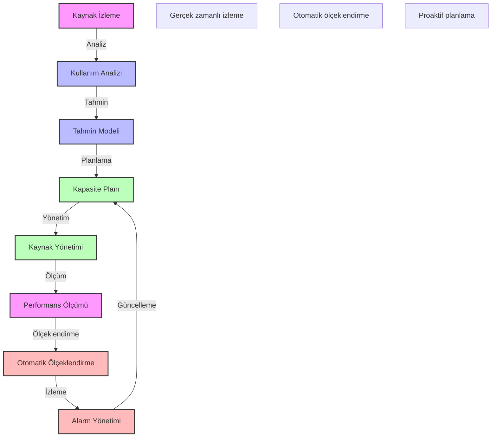

# BPM Platform - Kapasite Planlama Akışı

Bu diyagram, BPM platformundaki kapasite planlama süreçlerini göstermektedir.

## Önemli Noktalar

1. Kaynak İzleme
   - CPU kullanımı
   - Bellek kullanımı
   - Disk kullanımı
   - Ağ kullanımı

2. Kullanım Analizi
   - Kullanım desenleri
   - Yük dağılımı
   - Trend analizi
   - Sezonsal analiz

3. Kapasite Planlama
   - Kısa vadeli planlama
   - Uzun vadeli planlama
   - Kaynak tahsisi
   - Bütçe planlaması

4. Performans Yönetimi
   - SLA takibi
   - Performans metrikleri
   - Darboğaz analizi
   - Optimizasyon önerileri

5. Ölçeklendirme Stratejisi
   - Yatay ölçeklendirme
   - Dikey ölçeklendirme
   - Otomatik ölçeklendirme
   - Yük dengeleme