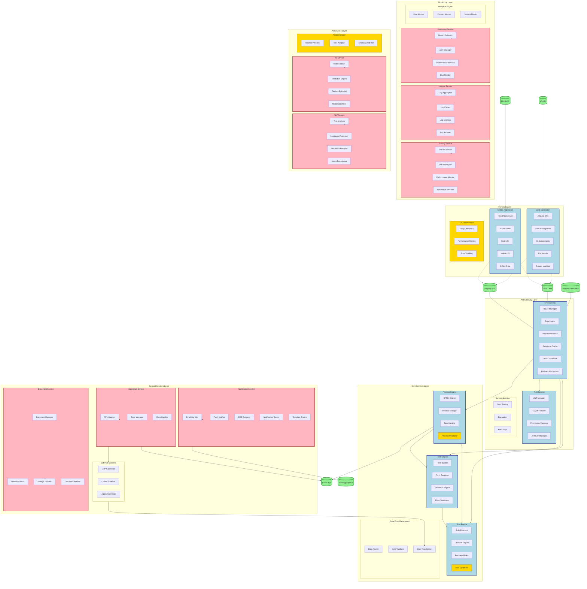

# BPM Platform - Bileşen Diyagramı

Bu diyagram, BPM Platform'un ana bileşenlerini ve aralarındaki ilişkileri gösterir.



## Bileşen Açıklamaları ve Kullanım Senaryoları

### Frontend Layer
- **Web Application**: Angular tabanlı web uygulaması
  - Angular SPA: Single Page Application
  - State Management: Redux pattern ile durum yönetimi
  - UI Components: Yeniden kullanılabilir UI bileşenleri
  - UX Module: Kullanıcı deneyimi optimizasyonu
  - Screen Modules: 
    - Process Designer
    - Task Management
    - Form Builder
    - Analytics Dashboard

- **Mobile Application**: React Native tabanlı mobil uygulama
  - React Native App: Cross-platform mobil uygulama
  - Mobile State: Mobil-specific durum yönetimi
  - Native UI: Platform-specific UI bileşenleri
  - Mobile UX: Mobil kullanıcı deneyimi
  - Offline Sync: Çevrimdışı çalışma desteği

### API Gateway Layer
- **API Gateway**: API yönetimi ve güvenlik
  - Route Manager: API rotalarının yönetimi
  - Rate Limiter: 
    ```json
    {
      "maxRequests": 100,
      "window": "1 minute",
      "byIP": true
    }
    ```
  - DDoS Protection: Distributed Denial of Service koruması
  - Fallback Mechanism: Hata durumunda yedek sistemler

- **Security Policies**: Güvenlik politikaları
  - Data Privacy: KVKK ve GDPR uyumluluğu
  - Encryption: End-to-end şifreleme
  - Audit: Güvenlik denetim logları

### Core Services Layer
- **Process Engine**: BPMN tabanlı süreç yönetimi
  - BPMN Engine: Süreç motoru
  - Process Manager: Süreç yaşam döngüsü yönetimi
  - Task Handler: Görev yönetimi
  - Process Optimizer: Süreç optimizasyonu

- **Form Engine**: Dinamik form yönetimi
  - Form Builder: Sürükle-bırak form tasarımı
  - Form Renderer: Dinamik form görüntüleme
  - Validation Engine: Form doğrulama
  - Form Versioning: Form versiyon kontrolü

### Support Services Layer
- **Notification Service**: Bildirim yönetimi
  ```json
  {
    "notification": {
      "types": ["email", "push", "sms"],
      "templates": {
        "taskAssignment": {
          "priority": "high",
          "channels": ["email", "push"]
        },
        "deadlineWarning": {
          "priority": "critical",
          "channels": ["sms", "push"]
        }
      }
    }
  }
  ```

- **Integration Service**: Sistem entegrasyonları
  ```json
  {
    "integration": {
      "erp": {
        "type": "SAP",
        "sync": "bidirectional",
        "interval": "realtime"
      },
      "crm": {
        "type": "Salesforce",
        "sync": "pull",
        "interval": "15min"
      }
    }
  }
  ```

### Monitoring Layer
- **Monitoring Service**: Sistem izleme
  ```json
  {
    "metrics": {
      "performance": ["responseTime", "throughput"],
      "business": ["processCompletionRate", "taskDuration"],
      "system": ["cpuUsage", "memoryUsage"]
    },
    "alerts": {
      "thresholds": {
        "responseTime": "500ms",
        "errorRate": "1%"
      }
    }
  }
  ```

### AI Services Layer
- **ML Service**: Makine öğrenmesi servisleri
  ```json
  {
    "mlService": {
      "predictions": {
        "processCompletion": {
          "algorithm": "randomForest",
          "accuracy": "85%"
        },
        "taskAssignment": {
          "algorithm": "neuralNetwork",
          "accuracy": "90%"
        }
      }
    }
  }
  ```

- **NLP Service**: Doğal dil işleme servisleri
  ```json
  {
    "nlpService": {
      "textAnalysis": {
        "languages": ["tr", "en"],
        "features": ["sentiment", "intent", "entity"]
      }
    }
  }
  ```

## API Dokümantasyonu
```json
{
  "apiDocs": {
    "swagger": "/api/docs/swagger",
    "postman": "/api/docs/postman",
    "graphql": "/api/docs/graphql",
    "features": {
      "interactive": true,
      "examples": true,
      "authentication": true
    }
  }
}
``` 