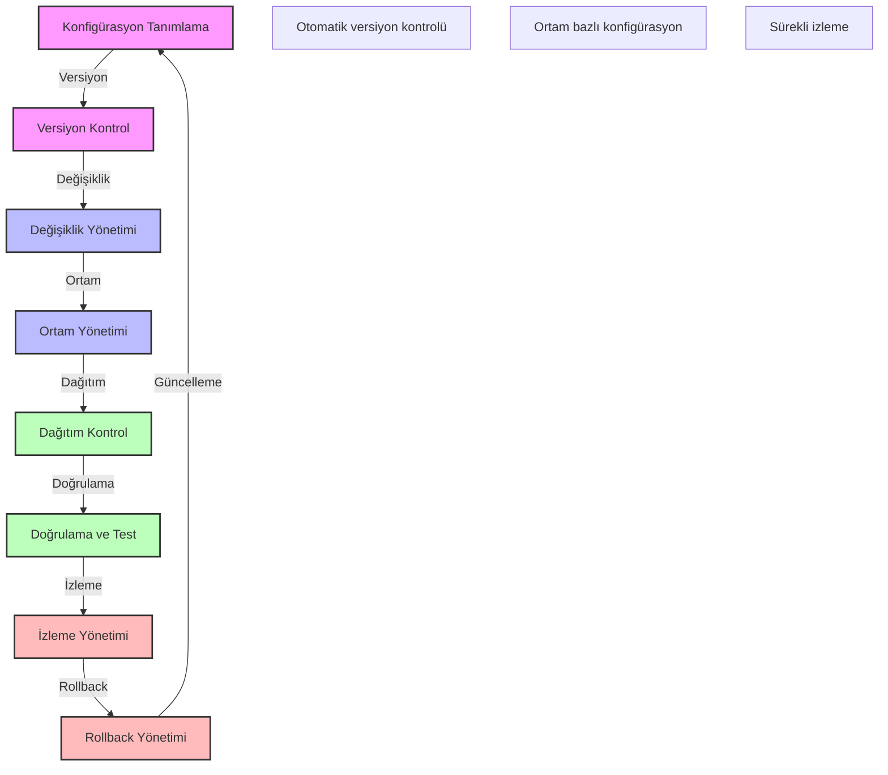

# BPM Platform - Konfigürasyon Yönetimi Akışı

Bu diyagram, BPM platformunun konfigürasyon yönetimi süreçlerini göstermektedir.

## Önemli Noktalar

1. Konfigürasyon Tanımlama
   - Konfigürasyon şablonları
   - Parametre tanımları
   - Bağımlılık yönetimi
   - Güvenlik ayarları

2. Versiyon Kontrol
   - Versiyon numaralandırma
   - Değişiklik geçmişi
   - Branch stratejisi
   - Merge politikaları

3. Değişiklik Yönetimi
   - Değişiklik talebi
   - Onay süreci
   - Risk değerlendirme
   - Etki analizi

4. Ortam Yönetimi
   - Ortam tanımları
   - Ortam değişkenleri
   - Ortam izolasyonu
   - Ortam geçişleri

5. Dağıtım Kontrol
   - Dağıtım planı
   - Dağıtım sırası
   - Bağımlılık kontrolü
   - Dağıtım doğrulama

6. Doğrulama ve Test
   - Konfigürasyon testi
   - Entegrasyon testi
   - Güvenlik testi
   - Performans testi

7. İzleme Yönetimi
   - Konfigürasyon izleme
   - Değişiklik takibi
   - Uyarı yönetimi
   - Audit logging

8. Rollback Yönetimi
   - Rollback planı
   - Versiyon geri alma
   - Veri tutarlılığı
   - Hızlı kurtarma 