# Dashboard Mining Flow

Bu diyagram, süreç madenciliği ve dashboard sistemleri arasındaki entegrasyonu gösterir.

```mermaid
flowchart TD
    subgraph Process Mining
        PM[Process Miner] --> PL[Process Logs]
        PM --> PP[Process Patterns]
        PM --> PA[Process Analytics]
        PM --> PF[Process Forecasting]
        PM --> PV[Process Validator]
    end

    subgraph Data Processing
        DP[Data Processor] --> DC[Data Cleaner]
        DP --> DT[Data Transformer]
        DP --> DE[Data Enricher]
        DP --> DV[Data Validator]
        DP --> DQ[Data Quality Monitor]
        DP --> DS[Data Security Layer]
    end

    subgraph Analytics Engine
        AE[Analytics Engine] --> MP[Mining Processor]
        AE --> ML[Machine Learning]
        AE --> ST[Statistical Analysis]
        AE --> PT[Pattern Recognition]
        AE --> AM[Anomaly Detection]
        AE --> TS[Time Series Analysis]
    end

    subgraph Dashboard System
        DS[Dashboard Service] --> DW[Widgets]
        DS --> DR[Reports]
        DS --> DV[Visualizations]
        DS --> DF[Filters]
        DS --> DD[Data Export]
        DS --> DP[Permission Manager]
        DS --> DC[Cache Manager]
    end

    subgraph Real-time Processing
        RT[Real-time Engine] --> RS[Stream Processor]
        RT --> RM[Real-time Metrics]
        RT --> RA[Real-time Alerts]
        RT --> RC[Real-time Charts]
        RT --> RQ[Message Queue]
        RT --> RC[Cache Layer]
    end

    subgraph Error Management
        EM[Error Manager] --> EL[Error Logger]
        EM --> ER[Retry Manager]
        EM --> EA[Alert Manager]
        EM --> EH[Recovery Handler]
    end

    subgraph Security Layer
        SL[Security Manager] --> SA[Authentication]
        SL --> SZ[Authorization]
        SL --> SE[Encryption]
        SL --> SM[Data Masking]
        SL --> SL[Audit Logging]
    end

    %% Process Mining to Data Processing
    PM -->|Raw Data| DP
    PL -->|Historical Data| DC
    PP -->|Pattern Data| DT
    PA -->|Analytics Data| DE

    %% Data Processing to Analytics
    DP -->|Processed Data| AE
    DC -->|Clean Data| MP
    DT -->|Transformed Data| ML
    DE -->|Enriched Data| ST

    %% Analytics to Dashboard
    AE -->|Analysis Results| DS
    MP -->|Mining Results| DW
    ML -->|Predictions| DR
    ST -->|Statistics| DV

    %% Real-time Integration
    RT -->|Live Data| RQ
    RQ -->|Queued Data| RS
    RS -->|Processed Stream| RC
    RC -->|Cached Data| DS

    %% Security Integration
    SL -.->|Security Check| PM
    SL -.->|Security Check| DP
    SL -.->|Security Check| AE
    SL -.->|Security Check| DS
    SL -.->|Security Check| RT

    %% Error Management Integration
    EM -.->|Error Handling| PM
    EM -.->|Error Handling| DP
    EM -.->|Error Handling| AE
    EM -.->|Error Handling| DS
    EM -.->|Error Handling| RT

    %% States and Styling
    classDef mining fill:#f9f,stroke:#333,stroke-width:2px
    classDef processing fill:#bbf,stroke:#333,stroke-width:2px
    classDef analytics fill:#bfb,stroke:#333,stroke-width:2px
    classDef dashboard fill:#fdb,stroke:#333,stroke-width:2px
    classDef realtime fill:#dff,stroke:#333,stroke-width:2px
    classDef error fill:#fdd,stroke:#333,stroke-width:2px
    classDef security fill:#dfd,stroke:#333,stroke-width:2px
    
    class PM,PL,PP,PA,PF,PV mining
    class DP,DC,DT,DE,DV,DQ,DS processing
    class AE,MP,ML,ST,PT,AM,TS analytics
    class DS,DW,DR,DV,DF,DD,DP,DC dashboard
    class RT,RS,RM,RA,RC,RQ realtime
    class EM,EL,ER,EA,EH error
    class SL,SA,SZ,SE,SM security
```



## Detaylı Açıklama

### Ana Bileşenler

1. **Process Mining**
   - Process Miner (PM): Süreç madenciliği motoru
   - Process Logs (PL): Süreç logları
   - Process Patterns (PP): Keşfedilen süreç desenleri
   - Process Analytics (PA): Süreç analiz sonuçları
   - Process Forecasting (PF): Süreç tahminleme
   - Process Validator (PV): Süreç doğrulama

2. **Data Processing**
   - Data Processor (DP): Veri işleme motoru
   - Data Cleaner (DC): Veri temizleme
   - Data Transformer (DT): Veri dönüştürme
   - Data Enricher (DE): Veri zenginleştirme
   - Data Validator (DV): Veri doğrulama
   - Data Quality Monitor (DQ): Veri kalitesi izleyici
   - Data Security Layer (DS): Veri güvenlik katmanı

3. **Analytics Engine**
   - Analytics Engine (AE): Analitik motoru
   - Mining Processor (MP): Madencilik işlemcisi
   - Machine Learning (ML): Makine öğrenimi
   - Statistical Analysis (ST): İstatistiksel analiz
   - Pattern Recognition (PT): Desen tanıma
   - Anomaly Detection (AM): Anomali algılama
   - Time Series Analysis (TS): Zaman serisi analizi

4. **Dashboard System**
   - Dashboard Service (DS): Dashboard servisi
   - Widgets (DW): Dashboard widget'ları
   - Reports (DR): Raporlar
   - Visualizations (DV): Görselleştirmeler
   - Filters (DF): Filtreler
   - Data Export (DD): Veri dışa aktarma
   - Permission Manager (DP): İzin yöneticisi
   - Cache Manager (DC): Önbellek yöneticisi

5. **Real-time Processing**
   - Real-time Engine (RT): Gerçek zamanlı motor
   - Stream Processor (RS): Akış işleyici
   - Real-time Metrics (RM): Gerçek zamanlı metrikler
   - Real-time Alerts (RA): Gerçek zamanlı uyarılar
   - Real-time Charts (RC): Gerçek zamanlı grafikler
   - Message Queue (RQ): Mesaj kuyusu
   - Cache Layer (RC): Önbellek katmanı

6. **Error Management**
   - Error Manager (EM): Hata yöneticisi
   - Error Logger (EL): Hata kaydedici
   - Retry Manager (ER): Yeniden deneme yöneticisi
   - Alert Manager (EA): Uyarı yöneticisi
   - Recovery Handler (EH): Kurtarma işleyici

7. **Security Layer**
   - Security Manager (SL): Güvenlik yöneticisi
   - Authentication (SA): Kimlik doğrulama
   - Authorization (SZ): Yetkilendirme
   - Encryption (SE): Şifreleme
   - Data Masking (SM): Veri gizleme
   - Audit Logging (SL): Denetim kaydı

### Kritik Akışlar

1. **Veri İşleme Akışı**
   ```json
   {
     "dataProcessing": {
       "source": "processLogs",
       "steps": [
         {
           "type": "cleaning",
           "actions": ["removeDuplicates", "handleMissingValues"]
         },
         {
           "type": "transformation",
           "actions": ["normalize", "aggregate"]
         },
         {
           "type": "enrichment",
           "actions": ["addMetadata", "calculateMetrics"]
         }
       ]
     }
   }
   ```

2. **Analitik İşleme**
   ```json
   {
     "analytics": {
       "type": "processAnalysis",
       "components": [
         {
           "name": "patternDiscovery",
           "algorithm": "sequenceMining",
           "parameters": {
             "minSupport": 0.1,
             "minConfidence": 0.8
           }
         },
         {
           "name": "prediction",
           "model": "timeSeriesForecasting",
           "horizon": "7d"
         }
       ]
     }
   }
   ```

3. **Dashboard Entegrasyonu**
   ```json
   {
     "dashboard": {
       "widgets": [
         {
           "type": "processMap",
           "data": "miningResults",
           "refreshRate": "5m",
           "filters": ["timeRange", "processType"]
         },
         {
           "type": "metrics",
           "data": "realTimeMetrics",
           "refreshRate": "1m",
           "alerts": {
             "threshold": "critical",
             "notification": "immediate"
           }
         }
       ]
     }
   }
   ```

### Kullanım Senaryoları

1. **Süreç Analizi**
   - Süreç loglarından desen keşfi
   - Performans darboğazlarının tespiti
   - Süreç iyileştirme önerileri

2. **Gerçek Zamanlı İzleme**
   - Anlık süreç metrikleri
   - Otomatik uyarı sistemi
   - Canlı dashboard güncellemeleri

3. **Tahminsel Analiz**
   - Süreç tamamlanma süresi tahmini
   - Kaynak kullanım öngörüsü
   - Risk analizi ve erken uyarı
``` 