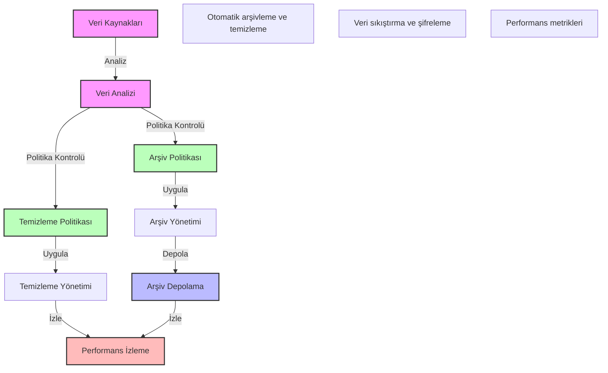

# BPM Platform - Veri Arşivleme ve Temizleme Akışı

Bu diyagram, BPM platformundaki veri arşivleme ve temizleme süreçlerini göstermektedir.

## Önemli Noktalar

1. Veri Kaynakları
   - İşlem verileri
   - Süreç verileri
   - Sistem logları
   - Kullanıcı verileri

2. Arşiv Politikası
   - Yaş bazlı arşivleme
   - Önem bazlı arşivleme
   - Yasal gereklilikler
   - Saklama süreleri

3. Temizleme Politikası
   - Otomatik temizleme kuralları
   - Manuel temizleme prosedürleri
   - İstisna yönetimi
   - Geri dönüşüm politikaları

4. Performans İzleme
   - Arşivleme metrikleri
   - Temizleme metrikleri
   - Depolama kullanımı
   - Sistem performansı