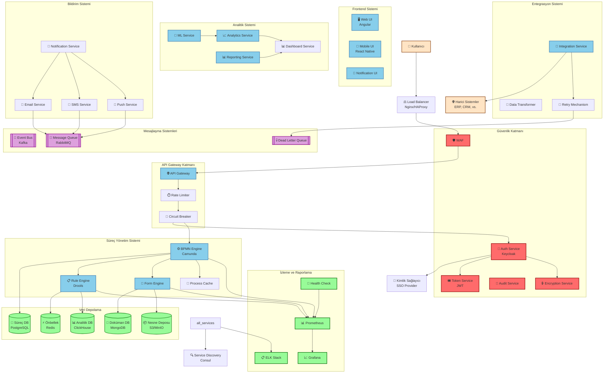

# BPM Platform - Veri Akış Diyagramı

Bu diyagram, BPM Platform'daki veri akışlarını ve sistemler arası ilişkileri gösterir.



## Veri Akışı ve Bileşen Detayları

### Yük Dengeleme ve Service Discovery
- **Load Balancer**: Nginx/HAProxy ile yük dengeleme
- **Service Discovery**: Consul ile servis keşfi ve yönetimi

### Güvenlik Katmanı
- **WAF**: Web uygulama güvenlik duvarı
- **Encryption Service**: Veri şifreleme servisi
- **Audit Service**: Denetim ve log kayıtları
- **Auth Service**: Kimlik doğrulama ve yetkilendirme
- **Token Service**: JWT token yönetimi

### API Gateway Katmanı
- **Rate Limiter**: API istek sınırlama
  ```json
  {
    "limits": {
      "default": {
        "rate": 100,
        "burst": 50,
        "window": "1m"
      },
      "authenticated": {
        "rate": 1000,
        "burst": 100,
        "window": "1m"
      }
    }
  }
  ```
- **Circuit Breaker**: Devre kesici
  ```json
  {
    "thresholds": {
      "errorRate": "50%",
      "timeout": "5s",
      "resetTimeout": "30s"
    }
  }
  ```

### Veri Depolama
- **PostgreSQL**: Aktif-Pasif Replikasyon
  ```json
  {
    "replication": {
      "mode": "async",
      "nodes": ["master", "slave"],
      "failover": "automatic"
    }
  }
  ```
- **MongoDB**: Sharding ve Replikasyon
  ```json
  {
    "sharding": {
      "enabled": true,
      "shards": 3,
      "replicas": 2
    }
  }
  ```

### Mesajlaşma Sistemleri
- **Kafka**: Event Sourcing ve Stream Processing
  ```json
  {
    "kafka": {
      "partitions": 10,
      "replication": 3,
      "retention": "7d"
    }
  }
  ```
- **RabbitMQ**: Asenkron İşlem Kuyruğu
  ```json
  {
    "queues": {
      "notifications": {
        "type": "direct",
        "durable": true
      },
      "deadLetter": {
        "ttl": "24h",
        "retries": 3
      }
    }
  }
  ```

### İzleme ve Raporlama
- **Prometheus & Grafana**: Metrik Toplama ve Görselleştirme
  ```json
  {
    "metrics": {
      "collection": "15s",
      "retention": "30d",
      "alerts": {
        "cpu": "> 80%",
        "memory": "> 90%",
        "latency": "> 500ms"
      }
    }
  }
  ```
- **ELK Stack**: Log Yönetimi
  ```json
  {
    "logging": {
      "retention": "90d",
      "indices": {
        "application": "daily",
        "security": "hourly"
      }
    }
  }
  ```

### Hata Yönetimi
- **Retry Mechanism**: Yeniden Deneme Stratejisi
  ```json
  {
    "retry": {
      "maxAttempts": 3,
      "backoff": {
        "initial": "1s",
        "multiplier": 2,
        "max": "1m"
      }
    }
  }
  ```
- **Dead Letter Queue**: Başarısız İşlem Yönetimi
  ```json
  {
    "dlq": {
      "retention": "7d",
      "alerts": true,
      "autoRetry": false
    }
  }
  ```

### Ölçeklenebilirlik
- **Auto-scaling**: Kubernetes ile Otomatik Ölçeklendirme
  ```json
  {
    "scaling": {
      "min": 2,
      "max": 10,
      "metrics": {
        "cpu": "70%",
        "memory": "80%"
      }
    }
  }
  ```
- **Cache Strategy**: Önbellekleme Stratejisi
  ```json
  {
    "cache": {
      "rules": {
        "ttl": "15m",
        "strategy": "LRU"
      },
      "sessions": {
        "ttl": "24h",
        "distributed": true
      }
    }
  }
  ``` 