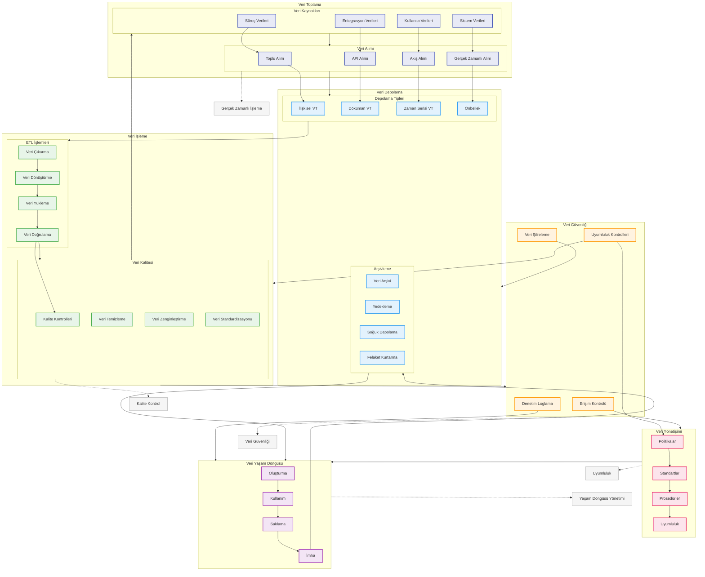

# BPM Platform - Veri Yönetimi Akışı

Bu diyagram, BPM Platform'un veri yönetimi ve veri yaşam döngüsü süreçlerini gösterir.

## Diyagram Açıklaması

### Veri Toplama
#### Veri Kaynakları
- **Süreç Verileri**: İş süreçleri
- **Kullanıcı Verileri**: Kullanıcı aktiviteleri
- **Sistem Verileri**: Sistem logları
- **Entegrasyon Verileri**: Dış sistemler

#### Veri Alımı
- **Toplu Alım**: Batch işlemler
- **Akış Alımı**: Stream işlemler
- **Gerçek Zamanlı Alım**: Real-time
- **API Alımı**: API entegrasyonları

### Veri Depolama
#### Depolama Tipleri
- **İlişkisel VT**: RDBMS
- **Döküman VT**: NoSQL
- **Zaman Serisi VT**: Time-series
- **Önbellek**: Cache

#### Arşivleme
- **Veri Arşivi**: Uzun dönem
- **Yedekleme**: Backup
- **Soğuk Depolama**: Cold storage
- **Felaket Kurtarma**: DR

### Veri İşleme
#### ETL İşlemleri
- **Veri Çıkarma**: Extraction
- **Veri Dönüştürme**: Transformation
- **Veri Yükleme**: Loading
- **Veri Doğrulama**: Validation

#### Veri Kalitesi
- **Kalite Kontrolleri**: Quality checks
- **Veri Temizleme**: Cleansing
- **Veri Zenginleştirme**: Enrichment
- **Veri Standardizasyonu**: Standardization

### Veri Güvenliği
- **Erişim Kontrolü**: Access control
- **Veri Şifreleme**: Encryption
- **Denetim Loglama**: Audit logging
- **Uyumluluk Kontrolleri**: Compliance

### Veri Yönetişimi
- **Politikalar**: Policies
- **Standartlar**: Standards
- **Prosedürler**: Procedures
- **Uyumluluk**: Compliance

### Veri Yaşam Döngüsü
- **Oluşturma**: Creation
- **Kullanım**: Usage
- **Saklama**: Retention
- **İmha**: Disposal

### Önemli Özellikler
- Gerçek zamanlı işleme
- Veri güvenliği
- Yaşam döngüsü yönetimi
- Kalite kontrol
- Uyumluluk