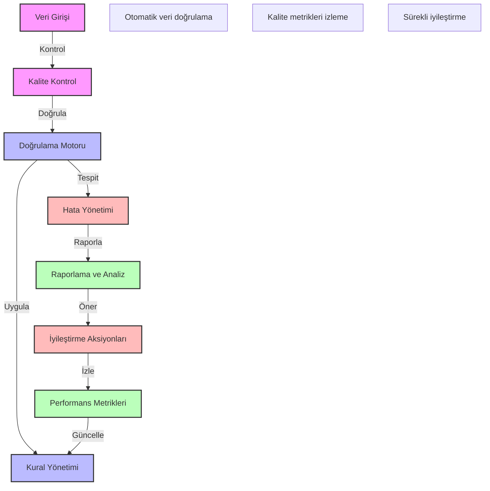

# BPM Platform - Veri Kalitesi Kontrol Akışı

Bu diyagram, BPM platformundaki veri kalitesi kontrol ve doğrulama süreçlerini göstermektedir.

## Önemli Noktalar

1. Veri Kalite Kontrolleri
   - Format doğrulama
   - Tutarlılık kontrolü
   - Bütünlük kontrolü
   - İş kuralları kontrolü

2. Doğrulama Kuralları
   - Veri tipleri
   - Değer aralıkları
   - Zorunlu alanlar
   - İlişkisel bütünlük

3. Hata Yönetimi
   - Hata tespiti
   - Hata sınıflandırma
   - Düzeltme önerileri
   - İstisna yönetimi

4. Kalite Metrikleri
   - Doğruluk oranı
   - Tutarlılık skoru
   - Hata oranları
   - İyileştirme trendleri