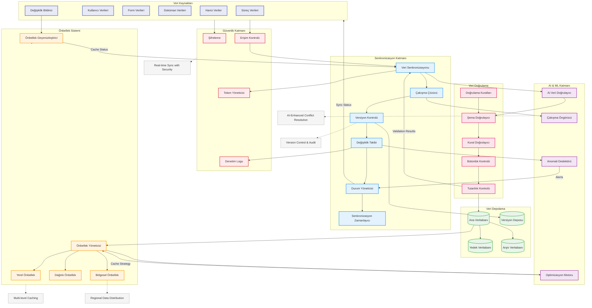

# BPM Platform - Veri Akışı ve Senkronizasyon (Geliştirilmiş)

Bu diyagram, BPM Platform'un veri akışı ve senkronizasyon mekanizmalarını gösterir.

## Diyagram Açıklaması

### Veri Kaynakları
- **Süreç Verileri**: BPMN süreç verileri
- **Kullanıcı Verileri**: Kullanıcı bilgileri
- **Form Verileri**: Form içerikleri
- **Doküman Verileri**: Doküman içerikleri
- **Harici Veriler**: REST/GraphQL/SOAP entegrasyonları
- **Değişiklik Bildirici**: Kaynak değişiklik bildirimleri

### Senkronizasyon Katmanı
- **Veri Senkronizasyonu**: Merkezi senkronizasyon
- **Çakışma Çözücü**: Last-write-wins/User-approval stratejileri
- **Versiyon Kontrolü**: Git-benzeri versiyon yönetimi
- **Değişiklik Takibi**: CRUD ve mutasyon izleme
- **Durum Yöneticisi**: Sync durumu yönetimi
- **Senkronizasyon Zamanlayıcı**: Sync zamanlaması

### AI ve ML Katmanı
- **AI Veri Doğrulayıcı**: Akıllı veri doğrulama
- **Çakışma Öngörücü**: Çakışma tahminleme
- **Anomali Dedektörü**: Veri anomali tespiti
- **Optimizasyon Motoru**: Cache optimizasyonu

### Güvenlik Katmanı
- **Şifreleme**: End-to-end encryption
- **Erişim Kontrolü**: RBAC/ABAC kontrolleri
- **Denetim Logu**: Değişiklik denetimi
- **Token Yöneticisi**: Güvenli token yönetimi

### Veri Doğrulama
- **Şema Doğrulayıcı**: JSON/XML şema validasyonu
- **Kural Doğrulayıcı**: İş kuralları kontrolü
- **Bütünlük Kontrolü**: Veri bütünlüğü
- **Tutarlılık Kontrolü**: Cross-validation
- **Doğrulama Kuralları**: Validasyon kuralları

### Veri Depolama
- **Ana Veritabanı**: Primary storage
- **Yedek Veritabanı**: Read replicas/DR
- **Arşiv Veritabanı**: Long-term storage
- **Versiyon Deposu**: Version history

### Önbellek Sistemi
- **Yerel Önbellek**: Local caching
- **Dağıtık Önbellek**: Distributed caching
- **Önbellek Yöneticisi**: Cache lifecycle
- **Bölgesel Önbellek**: Geo-distributed cache
- **Önbellek Geçersizleştirici**: TTL/Event-based invalidation

### Önemli Özellikler
- Güvenli real-time senkronizasyon
- AI destekli çakışma çözümü
- Çok seviyeli önbellekleme
- Versiyon kontrolü ve denetim
- Bölgesel veri dağıtımı 