# BPM Platform - Deployment Diagram

Bu diyagram, BPM Platform'un dağıtım mimarisini ve bileşenler arası ilişkileri gösterir.

```mermaid
flowchart TB
    %% Stil Tanımlamaları
    classDef loadbalancer fill:#E6E6FA,stroke:#483D8B,stroke-width:2px
    classDef frontend fill:#FFE4E1,stroke:#8B3626,stroke-width:2px
    classDef gateway fill:#E0FFFF,stroke:#104E8B,stroke-width:2px
    classDef core fill:#98FB98,stroke:#006400,stroke-width:2px
    classDef support fill:#F0E68C,stroke:#8B8B00,stroke-width:2px
    classDef monitoring fill:#FFA07A,stroke:#8B4726,stroke-width:2px
    classDef ai fill:#DDA0DD,stroke:#551A8B,stroke-width:2px
    classDef database fill:#87CEEB,stroke:#27408B,stroke-width:2px
    classDef queue fill:#98FB98,stroke:#228B22,stroke-width:2px
    classDef security fill:#FFB6C1,stroke:#8B3A62,stroke-width:2px
    classDef discovery fill:#FFD700,stroke:#8B6914,stroke-width:2px

    %% Load Balancer
    subgraph LoadBalancer["Load Balancer"]
        haproxy1["HAProxy-1"]
        haproxy2["HAProxy-2"]
        nginx["Nginx"]
    end

    %% Frontend
    subgraph Frontend["Frontend"]
        webapp["Web App"]
        mobileapp["Mobile App"]
    end

    %% Service Discovery
    subgraph Discovery["Service Discovery"]
        consul["Consul"]
        health_check["Health Check"]
    end

    %% API Gateway
    subgraph Gateway["API Gateway"]
        route["Route Manager"]
        ratelimit["Rate Limiter"]
        cache["Cache"]
        circuit_breaker["Circuit Breaker"]
    end

    %% Core Services
    subgraph Core["Core Services"]
        process["Process Engine"]
        form["Form Engine"]
        rule["Rule Engine"]
        process_cache["Process Cache"]
    end

    %% Support Services
    subgraph Support["Support Services"]
        document["Document Service"]
        notification["Notification Service"]
        integration["Integration Service"]
        retry_service["Retry Service"]
    end

    %% Monitoring
    subgraph Monitor["Monitoring"]
        metrics["Metrics Service"]
        logs["Log Service"]
        trace["OpenTelemetry"]
        sla["SLA Manager"]
        alerting["Alert Manager"]
    end

    %% AI Services
    subgraph AI["AI Services"]
        ml["ML Service"]
        nlp["NLP Service"]
    end

    %% Databases
    subgraph DB["Databases"]
        subgraph PostgreSQL["PostgreSQL Cluster"]
            postgres_master[("PostgreSQL Master")]
            postgres_replica1[("Replica 1")]
            postgres_replica2[("Replica 2")]
        end
        
        subgraph MongoDB["MongoDB Cluster"]
            mongodb_primary[("MongoDB Primary")]
            mongodb_secondary1[("Secondary 1")]
            mongodb_secondary2[("Secondary 2")]
        end
        
        subgraph ClickHouse["ClickHouse Cluster"]
            clickhouse1[("ClickHouse 1")]
            clickhouse2[("ClickHouse 2")]
        end
        
        subgraph Redis["Redis Cluster"]
            redis_master[("Redis Master")]
            redis_replica[("Redis Replica")]
        end
    end

    %% Message Brokers
    subgraph Queue["Message Brokers"]
        subgraph Kafka["Kafka Cluster"]
            kafka1[["Kafka 1"]]
            kafka2[["Kafka 2"]]
            kafka3[["Kafka 3"]]
            zookeeper["ZooKeeper"]
        end
        
        subgraph RabbitMQ["RabbitMQ Cluster"]
            rabbitmq1[["RabbitMQ 1"]]
            rabbitmq2[["RabbitMQ 2"]]
            rabbitmq_dlq[["Dead Letter Queue"]]
        end
    end

    %% Security
    subgraph Security["Security"]
        waf["WAF"]
        vault["Vault"]
        cert["Cert Manager"]
        encryption["E2E Encryption"]
    end

    %% İlişkiler
    haproxy1 --> webapp
    haproxy2 --> webapp
    nginx --> haproxy1
    nginx --> haproxy2

    webapp --> route
    mobileapp --> route

    route --> circuit_breaker
    circuit_breaker --> process
    circuit_breaker --> form
    circuit_breaker --> rule

    %% Service Discovery İlişkileri
    process & form & rule --> consul
    consul --> health_check
    health_check --> alerting

    %% Database İlişkileri
    process --> postgres_master
    postgres_master --> postgres_replica1 & postgres_replica2
    form --> mongodb_primary
    mongodb_primary --> mongodb_secondary1 & mongodb_secondary2

    %% Cache İlişkileri
    process_cache --> redis_master
    redis_master --> redis_replica

    %% Message Broker İlişkileri
    kafka1 & kafka2 & kafka3 --> zookeeper
    rabbitmq1 --> rabbitmq_dlq
    rabbitmq2 --> rabbitmq_dlq

    %% Monitoring İlişkileri
    process & form & rule --> trace
    trace --> clickhouse1
    metrics --> clickhouse1
    logs --> clickhouse2
    sla --> alerting
    alerting --> notification

    %% Security İlişkileri
    waf --> nginx
    vault --> process
    cert --> nginx
    encryption --> route

    %% Retry Mekanizması
    retry_service --> rabbitmq_dlq
    retry_service --> integration

    %% Stil Atamaları
    class haproxy1,haproxy2,nginx loadbalancer
    class webapp,mobileapp frontend
    class route,ratelimit,cache,circuit_breaker gateway
    class process,form,rule,process_cache core
    class document,notification,integration,retry_service support
    class metrics,logs,trace,sla,alerting monitoring
    class ml,nlp ai
    class postgres_master,postgres_replica1,postgres_replica2,mongodb_primary,mongodb_secondary1,mongodb_secondary2,clickhouse1,clickhouse2,redis_master,redis_replica database
    class kafka1,kafka2,kafka3,rabbitmq1,rabbitmq2,rabbitmq_dlq,zookeeper queue
    class waf,vault,cert,encryption security
    class consul,health_check discovery
```



## Deployment Bileşenleri ve Geliştirmeler

### Service Discovery ve Health Check
- Consul: Servis keşfi ve yapılandırma yönetimi
- Health Check: Servis sağlık kontrolü ve durum izleme

### Yüksek Erişilebilirlik
- PostgreSQL: Master-Replica replikasyonu
- MongoDB: Primary-Secondary replikasyonu
- Redis: Master-Replica yapısı
- Kafka: Multi-broker cluster
- RabbitMQ: Cluster ve DLQ desteği

### Monitoring ve SLA
- OpenTelemetry: Dağıtık izleme
- SLA Manager: Servis seviyesi anlaşması takibi
- Alert Manager: Merkezi alarm yönetimi

### Güvenlik
- E2E Encryption: Uçtan uca şifreleme
- Vault: Gizli bilgi yönetimi
- Cert Manager: SSL/TLS sertifika otomasyonu

### Hata Toleransı
- Circuit Breaker: Servis kesintilerini yönetme
- Retry Service: Başarısız işlemleri yeniden deneme
- Dead Letter Queue: Başarısız mesajları saklama

### Ölçeklenebilirlik
- Database Clustering: Veritabanı kümeleme
- Message Broker Clustering: Mesajlaşma sistemi kümeleme
- Cache Clustering: Önbellek kümeleme

### Konfigürasyon Detayları

#### Database Replikasyon
```json
{
  "postgresql": {
    "replication": "async",
    "failover": "automatic",
    "nodes": ["master", "replica1", "replica2"]
  },
  "mongodb": {
    "replicaSet": true,
    "sharding": true,
    "nodes": ["primary", "secondary1", "secondary2"]
  }
}
```

#### Message Broker Yapılandırması
```json
{
  "kafka": {
    "brokers": 3,
    "replicationFactor": 3,
    "partitions": 10
  },
  "rabbitmq": {
    "cluster": true,
    "dlq": {
      "enabled": true,
      "retryCount": 3
    }
  }
}
```

#### Monitoring ve Alerting
```json
{
  "opentelemetry": {
    "samplingRate": 0.1,
    "exporters": ["jaeger", "prometheus"]
  },
  "sla": {
    "thresholds": {
      "availability": "99.9%",
      "responseTime": "500ms"
    }
  }
}
```

#### Security
```json
{
  "encryption": {
    "tls": "1.3",
    "certificateManager": "cert-manager",
    "secretsManager": "vault"
  }
}