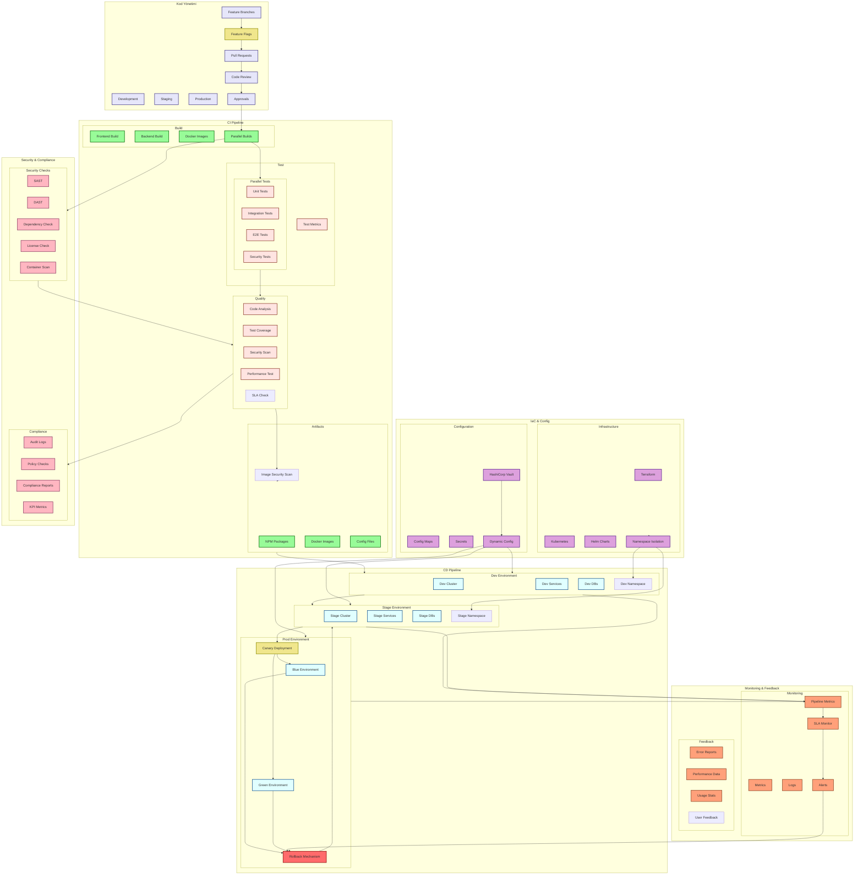

# BPM Platform - DevOps Pipeline

Bu diyagram, BPM Platform'un DevOps süreçlerini ve CI/CD pipeline'ını gösterir.



## DevOps Pipeline Geliştirmeleri

### Feature Management
```json
{
  "feature_flags": {
    "tool": "LaunchDarkly",
    "environments": {
      "dev": { "auto_enable": true },
      "stage": { "approval_required": true },
      "prod": { "gradual_rollout": true }
    }
  },
  "canary_deployment": {
    "strategy": "progressive",
    "phases": [
      { "users": "5%", "duration": "1h" },
      { "users": "20%", "duration": "2h" },
      { "users": "50%", "duration": "4h" },
      { "users": "100%", "duration": "auto" }
    ]
  }
}
```

### Pipeline Optimization
```json
{
  "parallelization": {
    "builds": {
      "max_concurrent": 4,
      "timeout": "15m"
    },
    "tests": {
      "unit": { "shards": 4 },
      "integration": { "shards": 2 },
      "e2e": { "shards": 2 }
    }
  },
  "caching": {
    "dependencies": true,
    "test_results": true,
    "docker_layers": true
  }
}
```

### Deployment Strategies
```json
{
  "blue_green": {
    "enabled": true,
    "health_check": {
      "path": "/health",
      "timeout": "5m"
    },
    "traffic_shift": {
      "method": "gradual",
      "duration": "10m"
    }
  },
  "rollback": {
    "triggers": [
      { "error_rate": "> 1%" },
      { "latency": "> 500ms" },
      { "availability": "< 99.9%" }
    ],
    "strategy": "automated",
    "notification": ["slack", "email"]
  }
}
```

### SLA & KPI Monitoring
```json
{
  "sla": {
    "pipeline": {
      "total_time": "< 30m",
      "success_rate": "> 95%"
    },
    "deployment": {
      "time": "< 10m",
      "rollback_time": "< 5m"
    }
  },
  "kpi": {
    "deployment_frequency": "daily",
    "lead_time": "< 24h",
    "mttr": "< 1h",
    "change_failure_rate": "< 5%"
  }
}
```

### Security Integration
```json
{
  "security_gates": {
    "sast": {
      "high": 0,
      "medium": 5,
      "low": 10
    },
    "container_scan": {
      "critical": 0,
      "high": 0
    },
    "dependency_check": {
      "critical": 0,
      "high": 0
    }
  },
  "compliance": {
    "audit_frequency": "real-time",
    "retention": "1y",
    "automated_checks": [
      "pci_dss",
      "hipaa",
      "gdpr"
    ]
  }
}
```

### Dynamic Configuration
```json
{
  "vault": {
    "auto_rotation": true,
    "ttl": {
      "dev": "1d",
      "stage": "7d",
      "prod": "30d"
    }
  },
  "config_management": {
    "strategy": "hierarchical",
    "sources": [
      "vault",
      "config_maps",
      "environment"
    ],
    "refresh": "60s"
  }
}
``` 