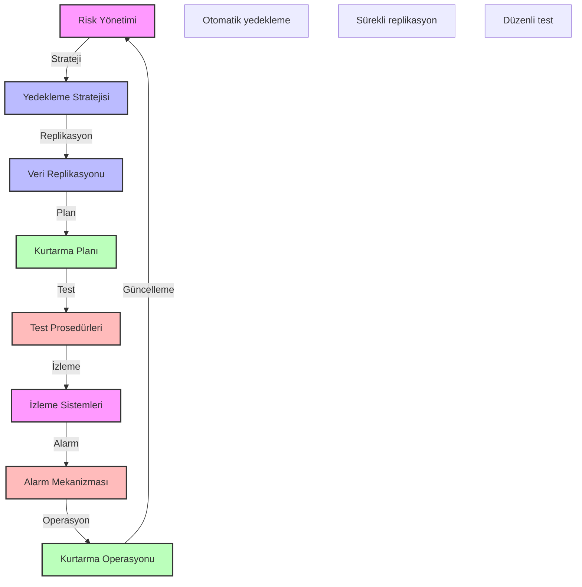

# BPM Platform - Felaket Kurtarma Planı

Bu diyagram, BPM platformunun felaket kurtarma süreçlerini göstermektedir.

## Önemli Noktalar

1. Risk Yönetimi
   - Risk değerlendirmesi
   - Etki analizi
   - Önleme stratejileri
   - Risk azaltma

2. Yedekleme Stratejisi
   - Tam yedekleme
   - Artımlı yedekleme
   - Diferansiyel yedekleme
   - Anlık görüntüler

3. Veri Replikasyonu
   - Senkron replikasyon
   - Asenkron replikasyon
   - Çoklu lokasyon
   - Veri tutarlılığı

4. Kurtarma Planı
   - RTO (Recovery Time Objective)
   - RPO (Recovery Point Objective)
   - Failover prosedürleri
   - Fallback planları

5. Test ve İzleme
   - Düzenli testler
   - Performans izleme
   - Başarı metrikleri
   - İyileştirme önerileri