# Document-Form Flow

Bu diyagram, doküman yönetimi ve form sistemleri arasındaki entegrasyonu gösterir.

```mermaid
flowchart TD
    subgraph Document Management
        DM[Document Manager] --> DT[Document Templates]
        DM --> DV[Document Versions]
        DM --> DS[Document Storage]
        DM --> DI[Document Index]
        DM --> DC[Document Converter]
        
        %% Document Processing
        DS --> DP[Document Processor]
        DP --> OCR[OCR Engine]
        DP --> PE[PDF Engine]
        DP --> DE[Data Extractor]
        DP --> ML[ML Validator]
    end

    subgraph Form System
        FM[Form Manager] --> FT[Form Templates]
        FM --> FV[Form Versions]
        FM --> FB[Form Builder]
        FM --> FE[Form Engine]
        
        %% Form Components
        FB --> FC[Form Controls]
        FB --> FV[Form Validator]
        FB --> FR[Form Rules]
        FB --> FD[Form Designer]
    end

    subgraph Integration Layer
        IL[Integration Layer] --> DI[Document Integrator]
        IL --> FI[Form Integrator]
        IL --> TI[Template Integrator]
        IL --> VI[Version Controller]
        IL --> API[API Gateway]
        
        %% Data Flow
        DI --> DF[Data Flow Manager]
        FI --> DF
        DF --> DT[Data Transformer]
        DF --> MQ[Message Queue]
    end

    subgraph Validation System
        VS[Validation Service] --> VR[Validation Rules]
        VS --> VC[Validation Cache]
        VS --> VL[Validation Logger]
        VS --> VH[Validation History]
        VS --> VM[ML Validation]
        VS --> VB[Rule Builder]
    end

    subgraph Storage System
        SS[Storage Service] --> SF[File Storage]
        SS --> SM[Metadata Storage]
        SS --> SV[Version Control]
        SS --> SI[Search Index]
        SS --> SA[Archive Manager]
        SS --> SC[Cache Manager]
    end

    subgraph Security Layer
        SL[Security Manager] --> AU[Authentication]
        SL --> AZ[Authorization]
        SL --> EN[Encryption]
        SL --> DM[Data Masking]
        SL --> AL[Audit Logger]
    end

    subgraph Performance Layer
        PL[Performance Manager] --> PC[Cache System]
        PL --> PQ[Queue Manager]
        PL --> PM[Metrics Collector]
        PL --> PA[Analytics Engine]
    end

    subgraph Test System
        TS[Test Manager] --> TU[Unit Tests]
        TS --> TI[Integration Tests]
        TS --> TP[Performance Tests]
        TS --> TL[Load Tests]
        TS --> TE[E2E Tests]
    end

    %% Document to Form Flow
    DM -->|Document Data| IL
    IL -->|Transformed Data| FM
    FM -->|Form Instance| FE

    %% Form to Document Flow
    FM -->|Form Data| IL
    IL -->|Processed Data| DM
    DM -->|Generated Document| DS

    %% Validation Flow
    DM -.->|Validate| VS
    FM -.->|Validate| VS
    IL -.->|Validate| VS

    %% Storage Integration
    DM -->|Store| SS
    FM -->|Store| SS
    IL -->|Cache| SS

    %% Security Integration
    SL -.->|Secure| DM
    SL -.->|Secure| FM
    SL -.->|Secure| IL
    SL -.->|Secure| SS

    %% Performance Monitoring
    PL -.->|Monitor| DM
    PL -.->|Monitor| FM
    PL -.->|Monitor| IL
    PL -.->|Monitor| SS

    %% Test Coverage
    TS -.->|Test| DM
    TS -.->|Test| FM
    TS -.->|Test| IL
    TS -.->|Test| VS

    %% States and Styling
    classDef document fill:#f9f,stroke:#333,stroke-width:2px
    classDef form fill:#bbf,stroke:#333,stroke-width:2px
    classDef integration fill:#bfb,stroke:#333,stroke-width:2px
    classDef validation fill:#fdb,stroke:#333,stroke-width:2px
    classDef storage fill:#dff,stroke:#333,stroke-width:2px
    classDef security fill:#fdd,stroke:#333,stroke-width:2px
    classDef performance fill:#dfd,stroke:#333,stroke-width:2px
    classDef test fill:#ffd,stroke:#333,stroke-width:2px
    
    class DM,DT,DV,DS,DI,DC,DP,OCR,PE,DE,ML document
    class FM,FT,FV,FB,FE,FC,FR,FD form
    class IL,DI,FI,TI,VI,DF,DT,API,MQ integration
    class VS,VR,VC,VL,VH,VM,VB validation
    class SS,SF,SM,SV,SI,SA,SC storage
    class SL,AU,AZ,EN,DM,AL security
    class PL,PC,PQ,PM,PA performance
    class TS,TU,TI,TP,TL,TE test
```



## Detaylı Açıklama

### Ana Bileşenler

1. **Document Management**
   - Document Manager (DM): Doküman yönetim sistemi
   - Document Templates (DT): Doküman şablonları
   - Document Versions (DV): Doküman versiyonları
   - Document Storage (DS): Doküman depolama
   - Document Index (DI): Doküman indeksleme
   - Document Converter (DC): Doküman dönüştürme
   - Document Processor (DP): Doküman işleme
   - OCR Engine (OCR): Optik karakter tanıma
   - PDF Engine (PE): PDF işleme motoru
   - Data Extractor (DE): Veri çıkarma
   - ML Validator (ML): Makine öğrenimi doğrulama

2. **Form System**
   - Form Manager (FM): Form yönetim sistemi
   - Form Templates (FT): Form şablonları
   - Form Versions (FV): Form versiyonları
   - Form Builder (FB): Form oluşturucu
   - Form Engine (FE): Form motoru
   - Form Controls (FC): Form kontrolleri
   - Form Validator (FV): Form doğrulayıcı
   - Form Rules (FR): Form kuralları
   - Form Designer (FD): Form tasarımcı

3. **Integration Layer**
   - Integration Layer (IL): Entegrasyon katmanı
   - Document Integrator (DI): Doküman entegratörü
   - Form Integrator (FI): Form entegratörü
   - Template Integrator (TI): Şablon entegratörü
   - Version Controller (VI): Versiyon kontrolü
   - API Gateway (API): API ağ geçidi
   - Message Queue (MQ): Mesaj kuyusu
   - Data Flow Manager (DF): Veri akış yöneticisi
   - Data Transformer (DT): Veri dönüştürücü

4. **Validation System**
   - Validation Service (VS): Doğrulama servisi
   - Validation Rules (VR): Doğrulama kuralları
   - Validation Cache (VC): Doğrulama önbelleği
   - Validation Logger (VL): Doğrulama kaydı
   - Validation History (VH): Doğrulama geçmişi
   - ML Validation (VM): Makine öğrenimi doğrulama
   - Rule Builder (VB): Kural oluşturucu

5. **Storage System**
   - Storage Service (SS): Depolama servisi
   - File Storage (SF): Dosya depolama
   - Metadata Storage (SM): Metadata depolama
   - Version Control (SV): Versiyon kontrolü
   - Search Index (SI): Arama indeksi
   - Archive Manager (SA): Arşiv yöneticisi
   - Cache Manager (SC): Önbellek yöneticisi

6. **Security Layer**
   - Security Manager (SL): Güvenlik yöneticisi
   - Authentication (AU): Kimlik doğrulama
   - Authorization (AZ): Yetkilendirme
   - Encryption (EN): Şifreleme
   - Data Masking (DM): Veri maskeleme
   - Audit Logger (AL): Denetim kaydı

7. **Performance Layer**
   - Performance Manager (PL): Performans yöneticisi
   - Cache System (PC): Önbellek sistemi
   - Queue Manager (PQ): Mesaj kuyusu yöneticisi
   - Metrics Collector (PM): Metrik toplayıcı
   - Analytics Engine (PA): Analiz motoru

8. **Test System**
   - Test Manager (TS): Test yöneticisi
   - Unit Tests (TU): Birim testleri
   - Integration Tests (TI): Entegrasyon testleri
   - Performance Tests (TP): Performans testleri
   - Load Tests (TL): Yük testleri
   - E2E Tests (TE): Uçtan uca testleri

### Kritik Akışlar

1. **Doküman-Form Dönüşümü**
```json
{
  "documentToForm": {
    "source": "document",
    "steps": [
      {
        "type": "extraction",
        "method": "OCR",
        "format": "structured"
      },
      {
        "type": "transformation",
        "mapping": "templateBased",
        "validation": true
      },
      {
        "type": "formGeneration",
        "template": "dynamic",
        "prefill": true
      }
    ]
  }
}
```

2. **Form-Doküman Dönüşümü**
```json
{
  "formToDocument": {
    "source": "form",
    "steps": [
      {
        "type": "dataCollection",
        "validate": true,
        "format": "structured"
      },
      {
        "type": "documentGeneration",
        "template": "predefined",
        "format": "pdf"
      },
      {
        "type": "postProcessing",
        "actions": ["sign", "stamp", "archive"]
      }
    ]
  }
}
```

### Kullanım Senaryoları

1. **Doküman İşleme**
   - OCR ile doküman tarama
   - Metadata çıkarma
   - Form verisi dönüştürme

2. **Form Yönetimi**
   - Dinamik form oluşturma
   - Şablon tabanlı formlar
   - Veri doğrulama ve kontrol

3. **Entegrasyon**
   - Çift yönlü veri akışı
   - Format dönüşümleri
   - Versiyon kontrolü 