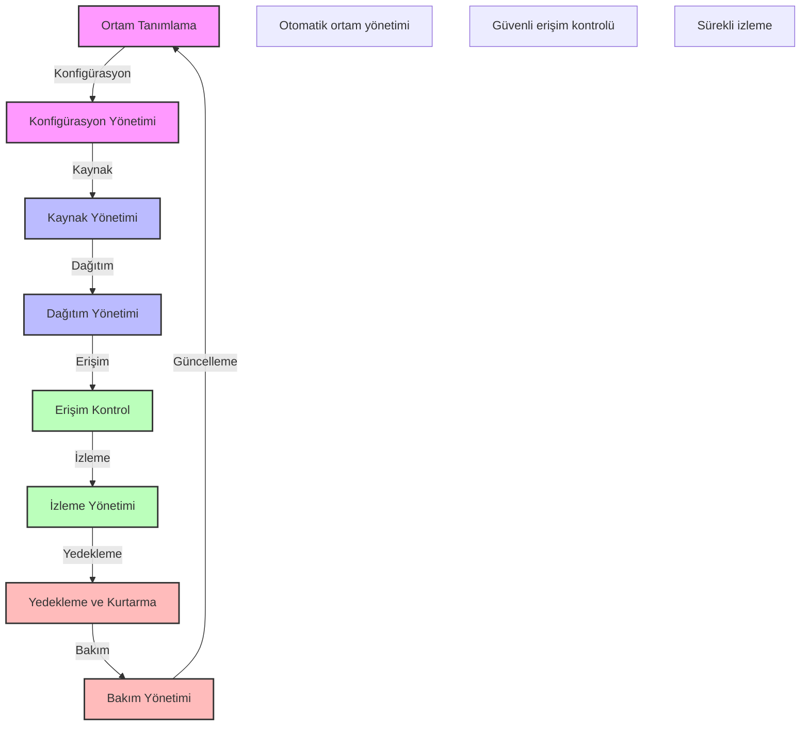

# BPM Platform - Ortam Yönetimi Stratejileri

Bu diyagram, BPM platformunun ortam yönetimi stratejilerini ve süreçlerini göstermektedir.

## Önemli Noktalar

1. Ortam Tanımlama
   - Geliştirme ortamı
   - Test ortamı
   - Staging ortamı
   - Üretim ortamı

2. Konfigürasyon Yönetimi
   - Ortam değişkenleri
   - Servis konfigürasyonları
   - Bağımlılık yönetimi
   - Versiyon kontrolü

3. Kaynak Yönetimi
   - Altyapı kaynakları
   - Konteyner kaynakları
   - Depolama kaynakları
   - Network kaynakları

4. Dağıtım Yönetimi
   - Dağıtım stratejileri
   - Ortam geçişleri
   - Rollback planları
   - Release yönetimi

5. Erişim Kontrol
   - Kullanıcı yönetimi
   - Rol tabanlı erişim
   - IP kısıtlamaları
   - VPN erişimi

6. İzleme Yönetimi
   - Performans izleme
   - Kaynak izleme
   - Log izleme
   - Alarm yönetimi

7. Yedekleme ve Kurtarma
   - Yedekleme stratejisi
   - Kurtarma planları
   - Veri tutarlılığı
   - Felaket kurtarma

8. Bakım Yönetimi
   - Planlı bakımlar
   - Güncelleme yönetimi
   - Patch yönetimi
   - Kapasite planlama 