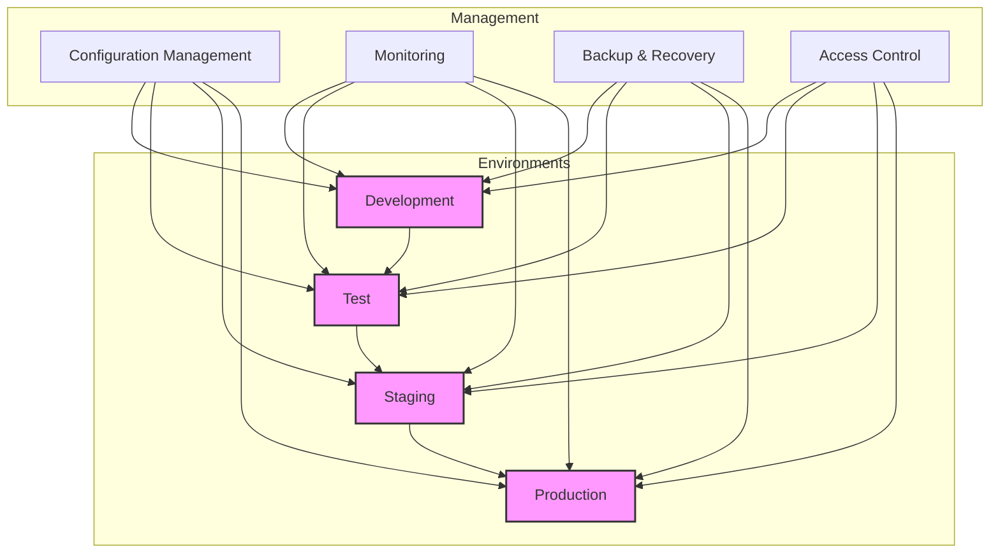
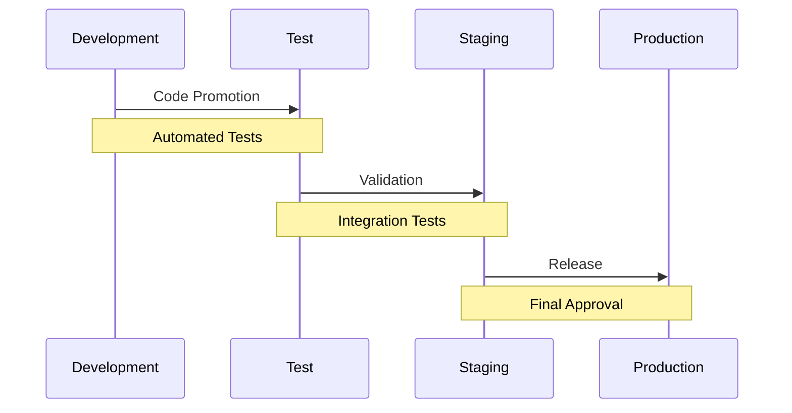
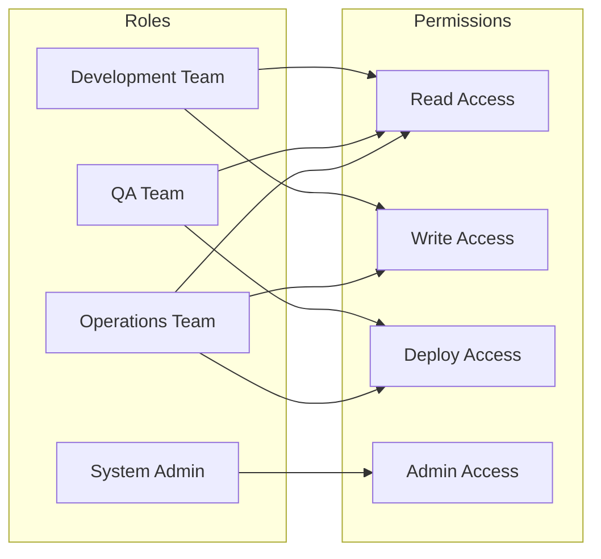
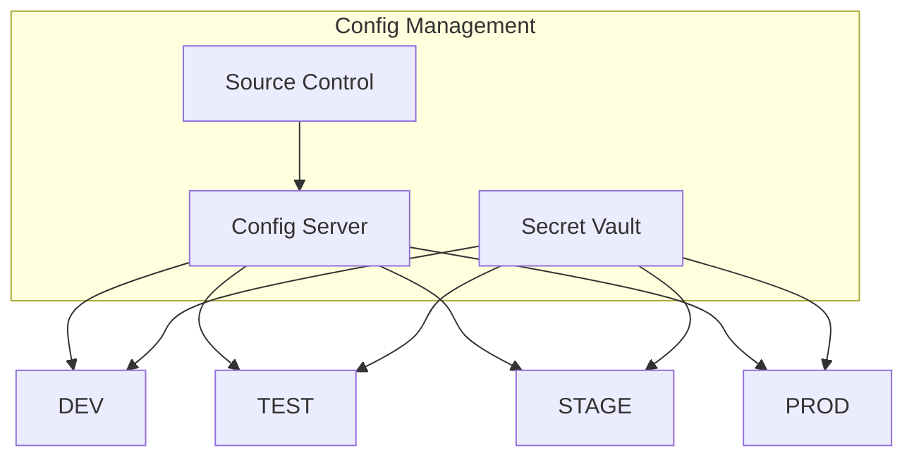

# Environment Management Strategy

## Overview Diagram

## Environment Promotion Flow

## Access Control Matrix

## Configuration Management

## Notes
- Each environment has isolated resources and configurations
- Automated promotion between environments
- Role-based access control implementation
- Configuration versioning and tracking
- Regular security audits and compliance checks