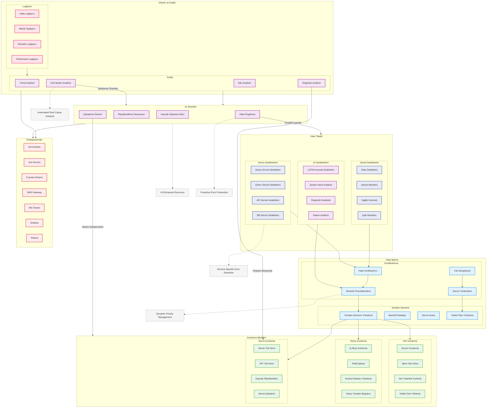

# BPM Platform - Hata Yönetimi ve Kurtarma Akışı (Geliştirilmiş)

Bu diyagram, BPM Platform'un hata yönetimi ve kurtarma mekanizmalarını gösterir.

## Diyagram Açıklaması

### Hata Tespiti
#### Genel Dedektörler
- **Hata Dedektörü**: Genel sistem hataları
- **İstisna Monitörü**: Exception yönetimi
- **Sağlık Kontrolü**: Sistem sağlığı
- **Eşik Monitörü**: Performans eşikleri

#### Servis Dedektörleri
- **Süreç Servisi Dedektörü**: BPMN süreç hataları
- **Görev Servisi Dedektörü**: Task hataları
- **API Servisi Dedektörü**: API hataları
- **DB Servisi Dedektörü**: Veritabanı hataları

#### AI Dedektörleri
- **LSTM Anomali Dedektörü**: Derin öğrenme
- **Zaman Serisi Analizör**: Trend analizi
- **Öngörülü Dedektör**: Hata tahmini
- **Patern Analizör**: Davranış analizi

### Hata İşleme
#### Sınıflandırma
- **Hata Sınıflandırıcı**: Hata kategorileri
- **Dinamik Önceliklendirici**: Yük bazlı öncelik
- **Yük Dengeleyici**: Load balancing
- **Servis Yönlendirici**: Service routing

#### Yeniden Deneme
- **Yeniden Deneme Yöneticisi**: Retry politikaları
- **Backoff Stratejisi**: Exponential backoff
- **Devre Kesici**: Circuit breaking
- **Yedek Plan Yöneticisi**: Fallback senaryoları

### Kurtarma İşlemleri
#### Veri Kurtarma
- **Durum Kurtarma**: State recovery
- **İşlem Geri Alma**: Transaction rollback
- **Veri Tutarlılık Kontrolü**: Consistency check
- **Yedek Geri Yükleme**: Backup restore

#### Süreç Kurtarma
- **İş Akışı Kurtarma**: Workflow recovery
- **Telafi İşleyici**: Compensation handling
- **Kontrol Noktası Yöneticisi**: Checkpoint management
- **Süreç Yeniden Başlatıcı**: Process restart

#### Servis Kurtarma
- **Servis Yük Devri**: Service failover
- **API Yük Devri**: API failover
- **Kaynak Ölçeklendirici**: Resource scaling
- **Servis İyileştirici**: Service healing

### İzleme ve Analiz
#### Loglama
- **Hata Loglayıcı**: Error logging
- **Metrik Toplayıcı**: Metrics collection
- **Denetim Loglayıcı**: Audit logging
- **Performans Loglayıcı**: Performance logging

#### Analiz
- **Kök Neden Analizör**: Root cause analysis
- **Trend Analizör**: Trend analysis
- **Etki Analizör**: Impact analysis
- **Öngörülü Analizör**: Predictive analysis

### Entegrasyonlar
- **ServiceNow**: ITSM entegrasyonu
- **Jira Service**: Issue tracking
- **E-posta/SMS/Teams**: Bildirimler
- **Grafana/Kibana**: Görselleştirme

### AI Önerileri
- **Kaynak Optimize Edici**: Resource optimization
- **Ölçeklendirme Danışmanı**: Scaling advice
- **Hata Öngörücü**: Error prediction
- **İyileştirme Önerici**: System improvements

### Önemli Özellikler
- Servis bazlı hata tespiti
- Dinamik önceliklendirme
- AI destekli kurtarma
- Proaktif hata önleme
- Otomatik kök neden analizi 