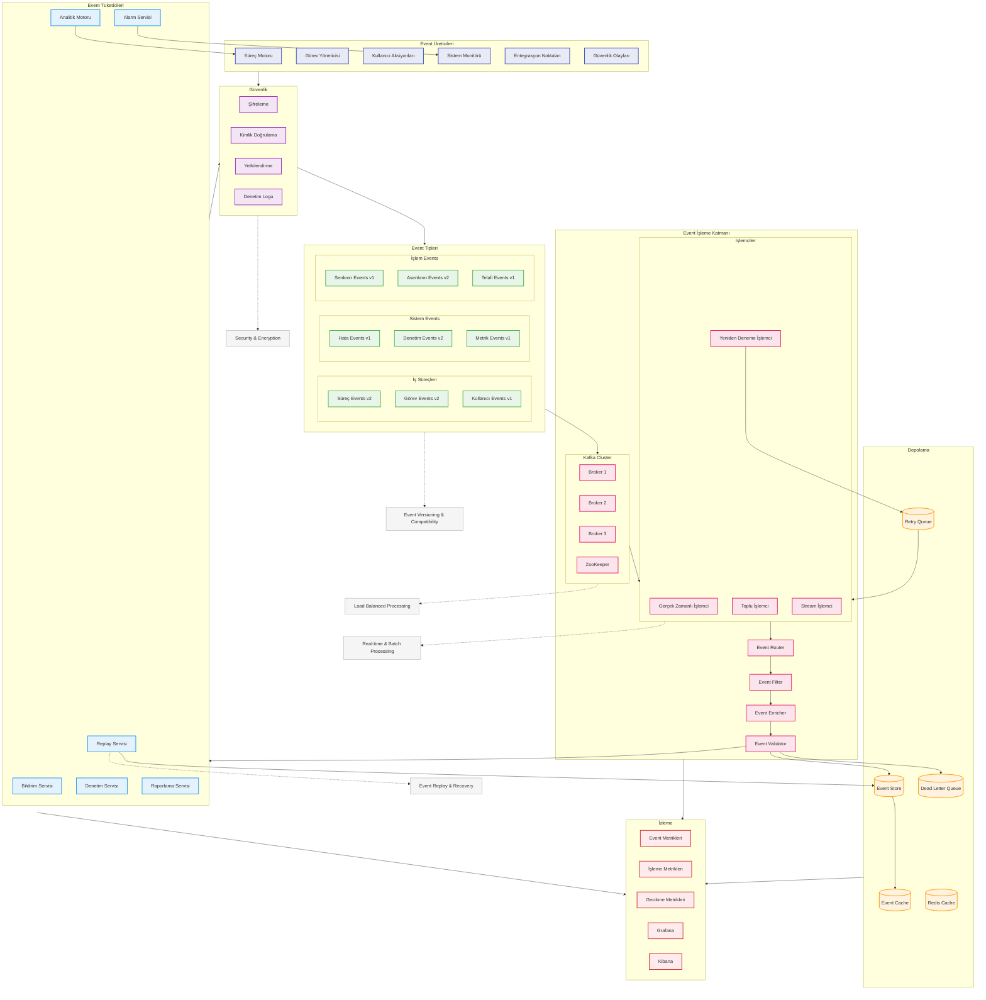

# BPM Platform - Event-Driven Mimari Akışı (Geliştirilmiş)

Bu diyagram, BPM Platform'un event-driven mimarisini ve event akışlarını gösterir.

## Diyagram Açıklaması

### Event Üreticileri
- **Süreç Motoru**: BPMN süreç eventleri
- **Görev Yöneticisi**: Task eventleri
- **Kullanıcı Aksiyonları**: Kullanıcı eventleri
- **Sistem Monitörü**: Sistem eventleri
- **Entegrasyon Noktaları**: Dış sistem eventleri
- **Güvenlik Olayları**: Güvenlik eventleri

### Event Tipleri ve Sürümleme
#### İş Süreçleri
- **Süreç Events v2**: Süreç yaşam döngüsü
- **Görev Events v2**: Task yönetimi
- **Kullanıcı Events v1**: Kullanıcı etkileşimleri

#### Sistem Events
- **Hata Events v1**: Sistem hataları
- **Denetim Events v2**: Audit logging
- **Metrik Events v1**: Performans metrikleri

#### İşlem Events
- **Senkron Events v1**: Anlık işlemler
- **Asenkron Events v2**: Gecikmeli işlemler
- **Telafi Events v1**: Compensation events

### Event İşleme Katmanı
#### Kafka Cluster
- **Broker 1/2/3**: Dağıtık event yönetimi
- **ZooKeeper**: Cluster koordinasyonu

#### İşlemciler
- **Gerçek Zamanlı İşlemci**: Anlık işlemler
- **Toplu İşlemci**: Batch processing
- **Stream İşlemci**: Stream processing
- **Yeniden Deneme İşlemci**: Retry mekanizması

### Güvenlik
- **Şifreleme**: Event encryption
- **Kimlik Doğrulama**: Producer/Consumer auth
- **Yetkilendirme**: RBAC/ABAC
- **Denetim Logu**: Security audit

### Depolama
- **Event Store**: Event veritabanı
- **Dead Letter Queue**: Başarısız eventler
- **Retry Queue**: Yeniden deneme kuyruğu
- **Event Cache**: Önbellek
- **Redis Cache**: Dağıtık önbellek

### İzleme
- **Event Metrikleri**: Event istatistikleri
- **İşleme Metrikleri**: Processing metrics
- **Gecikme Metrikleri**: Latency tracking
- **Grafana/Kibana**: Görselleştirme

### Event Tüketicileri
- **Bildirim Servisi**: Notification handling
- **Analitik Motoru**: Event analizi
- **Denetim Servisi**: Audit logging
- **Raporlama Servisi**: Reporting
- **Alarm Servisi**: Alerting
- **Replay Servisi**: Event replay

### Önemli Özellikler
- Event sürümleme ve geriye uyumluluk
- Yük dengelemeli işleme
- Güvenlik ve şifreleme
- Gerçek zamanlı ve toplu işleme
- Event replay ve kurtarma 