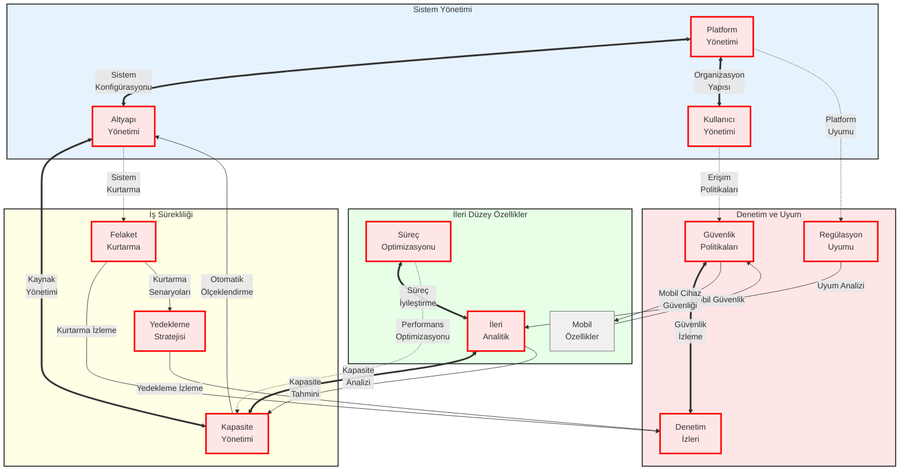

# BPM Platform İleri Düzey Özellik İlişkileri

Bu diyagram, BPM Platform'un ileri düzey özelliklerini ve bunlar arasındaki ilişkileri gösterir.

## Diyagram Açıklaması

### Sistem Yönetimi
- **Platform Yönetimi** 🔴: Platform konfigürasyonu ve yönetimi
- **Altyapı Yönetimi** 🔴: Sistem altyapısı ve kaynak yönetimi
- **Kullanıcı Yönetimi** 🔴: Kullanıcı ve organizasyon yapısı yönetimi

### İleri Düzey Özellikler
- **Süreç Optimizasyonu** 🔴: Süreç iyileştirme ve performans optimizasyonu
- **İleri Analitik** 🔴: Gelişmiş analiz ve raporlama özellikleri
- **Mobil Özellikler** ⚪: Mobil cihaz desteği ve mobil süreç yönetimi

### Denetim ve Uyum
- **Regülasyon Uyumu** 🔴: Yasal düzenlemeler ve standartlara uyum
- **Güvenlik Politikaları** 🔴: Sistem ve veri güvenliği politikaları
- **Denetim İzleri** 🔴: Sistem ve kullanıcı aktivitelerinin izlenmesi

### İş Sürekliliği
- **Yedekleme Stratejisi** 🔴: Veri yedekleme ve koruma
- **Felaket Kurtarma** 🔴: Sistem kesintilerinde kurtarma planları
- **Kapasite Yönetimi** 🔴: Sistem kaynakları ve performans yönetimi

### İlişki Türleri
- **Doğrudan İlişkiler** (<==>): Birincil ve kritik bağlantılar
- **Dolaylı İlişkiler** (-->): İkincil ve destekleyici bağlantılar
- **Çapraz İlişkiler** (-..->): Modüller arası etkileşimler

### Kritiklik Seviyeleri
- 🔴 **Kritik Bileşenler**: Sistem için hayati öneme sahip
- ⚪ **İkincil Bileşenler**: Destekleyici ve tamamlayıcı özellikler 