# BPM Platform İleri Düzey Özellik İlişkileri

Bu diyagram, BPM Platform'un ileri düzey özelliklerini ve bunlar arasındaki ilişkileri gösterir.

```mermaid
graph TB
    %% Stil Tanımları
    classDef systemManagement fill:#E6F3FF,stroke:#333,stroke-width:2px
    classDef advancedFeatures fill:#E6FFE6,stroke:#333,stroke-width:2px
    classDef complianceAudit fill:#FFE6E6,stroke:#333,stroke-width:2px
    classDef businessContinuity fill:#FFFFE6,stroke:#333,stroke-width:2px
    classDef critical fill:#FFE6E6,stroke:#FF0000,stroke-width:3px
    classDef secondary fill:#F0F0F0,stroke:#666,stroke-width:1px

    %% Ana Bileşenler - Sistem Yönetimi
    subgraph SystemManagement["Sistem Yönetimi"]
        PlatformManagement["Platform<br/>Yönetimi"]:::critical
        InfrastructureManagement["Altyapı<br/>Yönetimi"]:::critical
        UserManagement["Kullanıcı<br/>Yönetimi"]:::critical
    end

    %% İleri Düzey Özellikler
    subgraph AdvancedFeatures["İleri Düzey Özellikler"]
        ProcessOptimization["Süreç<br/>Optimizasyonu"]:::critical
        AdvancedAnalytics["İleri<br/>Analitik"]:::critical
        MobileFeatures["Mobil<br/>Özellikler"]:::secondary
    end

    %% Denetim ve Uyum
    subgraph ComplianceAudit["Denetim ve Uyum"]
        RegulatoryCompliance["Regülasyon<br/>Uyumu"]:::critical
        SecurityPolicies["Güvenlik<br/>Politikaları"]:::critical
        AuditTrails["Denetim<br/>İzleri"]:::critical
    end

    %% İş Sürekliliği
    subgraph BusinessContinuity["İş Sürekliliği"]
        BackupStrategy["Yedekleme<br/>Stratejisi"]:::critical
        DisasterRecovery["Felaket<br/>Kurtarma"]:::critical
        CapacityManagement["Kapasite<br/>Yönetimi"]:::critical
    end

    %% Doğrudan İlişkiler (Kalın çizgi)
    PlatformManagement <==> |"Sistem<br/>Konfigürasyonu"| InfrastructureManagement
    InfrastructureManagement <==> |"Kaynak<br/>Yönetimi"| CapacityManagement
    PlatformManagement <==> |"Organizasyon<br/>Yapısı"| UserManagement

    ProcessOptimization <==> |"Süreç<br/>İyileştirme"| AdvancedAnalytics
    AdvancedAnalytics <==> |"Kapasite<br/>Analizi"| CapacityManagement
    SecurityPolicies <==> |"Güvenlik<br/>İzleme"| AuditTrails

    %% Dolaylı İlişkiler (İnce çizgi)
    MobileFeatures --> |"Mobil Güvenlik"| SecurityPolicies
    RegulatoryCompliance --> |"Uyum Analizi"| AdvancedAnalytics
    BackupStrategy --> |"Yedekleme İzleme"| AuditTrails
    DisasterRecovery --> |"Kurtarma İzleme"| AuditTrails
    
    %% Çapraz İlişkiler (Kesikli çizgi)
    ProcessOptimization -.-> |"Performans<br/>Optimizasyonu"| CapacityManagement
    UserManagement -.-> |"Erişim<br/>Politikaları"| SecurityPolicies
    InfrastructureManagement -.-> |"Sistem<br/>Kurtarma"| DisasterRecovery
    PlatformManagement -.-> |"Platform<br/>Uyumu"| RegulatoryCompliance

    %% Yeni İlişkiler
    CapacityManagement --> |"Otomatik<br/>Ölçeklendirme"| InfrastructureManagement
    AdvancedAnalytics --> |"Kapasite<br/>Tahmini"| CapacityManagement
    DisasterRecovery --> |"Kurtarma<br/>Senaryoları"| BackupStrategy
    SecurityPolicies --> |"Mobil Cihaz<br/>Güvenliği"| MobileFeatures

    %% Stil Uygulama
    class SystemManagement systemManagement
    class AdvancedFeatures advancedFeatures
    class ComplianceAudit complianceAudit
    class BusinessContinuity businessContinuity
```

## Diyagram Açıklaması

### Sistem Yönetimi
- **Platform Yönetimi** 🔴: Platform konfigürasyonu ve yönetimi
- **Altyapı Yönetimi** 🔴: Sistem altyapısı ve kaynak yönetimi
- **Kullanıcı Yönetimi** 🔴: Kullanıcı ve organizasyon yapısı yönetimi

### İleri Düzey Özellikler
- **Süreç Optimizasyonu** 🔴: Süreç iyileştirme ve performans optimizasyonu
- **İleri Analitik** 🔴: Gelişmiş analiz ve raporlama özellikleri
- **Mobil Özellikler** ⚪: Mobil cihaz desteği ve mobil süreç yönetimi

### Denetim ve Uyum
- **Regülasyon Uyumu** 🔴: Yasal düzenlemeler ve standartlara uyum
- **Güvenlik Politikaları** 🔴: Sistem ve veri güvenliği politikaları
- **Denetim İzleri** 🔴: Sistem ve kullanıcı aktivitelerinin izlenmesi

### İş Sürekliliği
- **Yedekleme Stratejisi** 🔴: Veri yedekleme ve koruma
- **Felaket Kurtarma** 🔴: Sistem kesintilerinde kurtarma planları
- **Kapasite Yönetimi** 🔴: Sistem kaynakları ve performans yönetimi

### İlişki Türleri
- **Doğrudan İlişkiler** (<==>): Birincil ve kritik bağlantılar
- **Dolaylı İlişkiler** (-->): İkincil ve destekleyici bağlantılar
- **Çapraz İlişkiler** (-..->): Modüller arası etkileşimler

### Kritiklik Seviyeleri
- 🔴 **Kritik Bileşenler**: Sistem için hayati öneme sahip
- ⚪ **İkincil Bileşenler**: Destekleyici ve tamamlayıcı özellikler 