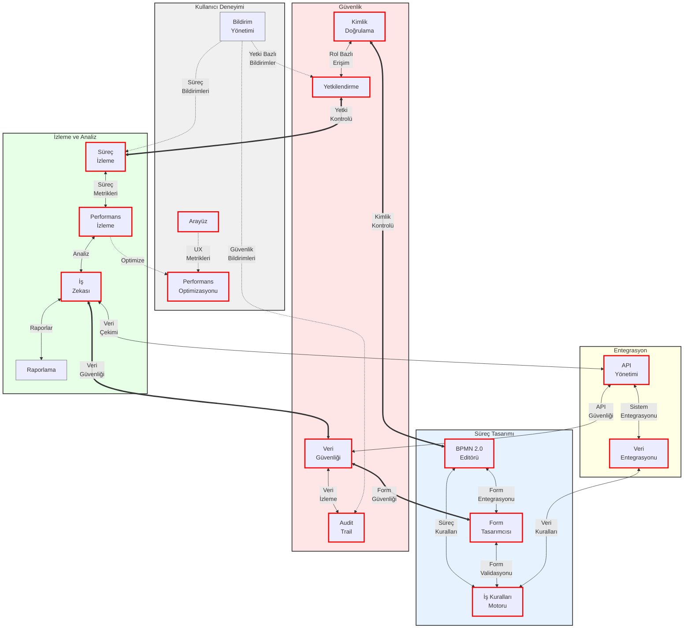

# BPM Platform Özellik İlişkileri

Bu diyagram, BPM Platform'un temel özelliklerini ve bunlar arasındaki ilişkileri gösterir.

## Diyagram Açıklaması

### Bileşen Kategorileri

#### Süreç Tasarımı 🔴
- **BPMN 2.0 Editörü**: İş süreçlerinin görsel tasarımı ve modellenmesi
- **Form Tasarımcısı**: Dinamik form tasarımı ve validasyon kuralları
- **İş Kuralları Motoru**: Süreç ve iş kurallarının yönetimi

#### İzleme ve Analiz 🔴
- **Süreç İzleme**: Gerçek zamanlı süreç takibi ve analizi
- **Performans İzleme**: Sistem ve süreç performans metrikleri
- **İş Zekası**: Veri analizi ve karar destek sistemleri
- **Raporlama** ⚪: Özelleştirilebilir raporlar ve dashboardlar

#### Güvenlik 🔴
- **Kimlik Doğrulama**: Merkezi kimlik yönetimi ve doğrulama
- **Yetkilendirme**: Detaylı rol ve yetki yönetimi
- **Veri Güvenliği**: Veri şifreleme ve güvenlik politikaları
- **Audit Trail**: Kapsamlı sistem ve kullanıcı aktivite izleme

#### Entegrasyon 🔴
- **API Yönetimi**: API yaşam döngüsü ve güvenlik yönetimi
- **Veri Entegrasyonu**: Harici sistemlerle veri alışverişi

#### Kullanıcı Deneyimi
- **Arayüz** 🔴: Modern ve responsive kullanıcı arayüzü
- **Bildirim Yönetimi** ⚪: Akıllı bildirim sistemi
- **Performans Optimizasyonu** 🔴: UX ve sistem performans iyileştirmeleri

### İlişki Türleri

#### Kritik İlişkiler (<==>)
- Sistem güvenliği ve veri bütünlüğü için kritik öneme sahip bağlantılar
- Kalın kırmızı çizgilerle gösterilir
- Örnek: Kimlik Doğrulama ↔ BPMN Editörü

#### Birincil İlişkiler (<-->)
- Temel sistem işlevselliği için gerekli bağlantılar
- Normal çizgilerle gösterilir
- Örnek: Süreç İzleme ↔ Performans İzleme

#### İkincil İlişkiler (-.->)
- Destekleyici ve tamamlayıcı bağlantılar
- Kesikli çizgilerle gösterilir
- Örnek: Bildirim Yönetimi → Audit Trail

### Kritiklik Seviyeleri
- 🔴 **Kritik Bileşenler**: Sistem çekirdeği için vazgeçilmez
- ⚪ **İkincil Bileşenler**: Destekleyici işlevsellik 