# BPM Platform - Form Yönetimi Akışı

Bu diyagram, BPM Platform'un form yönetimi ve yaşam döngüsü süreçlerini gösterir.

```mermaid
graph TB
    %% Stil Tanımlamaları
    classDef design fill:#E8EAF6,stroke:#3F51B5,stroke-width:2px
    classDef builder fill:#E3F2FD,stroke:#2196F3,stroke-width:2px
    classDef validation fill:#E8F5E9,stroke:#4CAF50,stroke-width:2px
    classDef storage fill:#FFF3E0,stroke:#FF9800,stroke-width:2px
    classDef integration fill:#FCE4EC,stroke:#E91E63,stroke-width:2px
    classDef runtime fill:#F3E5F5,stroke:#9C27B0,stroke-width:2px

    %% Form Tasarımı
    subgraph FormDesign["Form Tasarımı"]
        %% Tasarım Araçları
        subgraph DesignTools["Tasarım Araçları"]
            VisualDesigner[Görsel Tasarımcı]:::design
            TemplateManager[Şablon Yöneticisi]:::design
            StyleEditor[Stil Düzenleyici]:::design
            ResponsiveTools[Responsive Araçlar]:::design
        end

        %% Tasarım Özellikleri
        subgraph DesignFeatures["Tasarım Özellikleri"]
            Layout[Düzen]:::design
            Themes[Temalar]:::design
            Branding[Markalama]:::design
            Accessibility[Erişilebilirlik]:::design
        end
    end

    %% Form Oluşturucu
    subgraph FormBuilder["Form Oluşturucu"]
        %% Form Bileşenleri
        subgraph FormComponents["Form Bileşenleri"]
            InputFields[Giriş Alanları]:::builder
            Validation[Doğrulama]:::builder
            DynamicBehavior[Dinamik Davranış]:::builder
            CustomWidgets[Özel Bileşenler]:::builder
        end

        %% Form Özellikleri
        subgraph FormFeatures["Form Özellikleri"]
            DataBinding[Veri Bağlama]:::builder
            EventHandling[Olay İşleme]:::builder
            Calculations[Hesaplamalar]:::builder
            Conditions[Koşullar]:::builder
        end
    end

    %% Doğrulama ve Kontrol
    subgraph ValidationControl["Doğrulama ve Kontrol"]
        %% Doğrulama İşlemleri
        FieldValidation[Alan Doğrulama]:::validation
        BusinessRules[İş Kuralları]:::validation
        CrossValidation[Çapraz Doğrulama]:::validation
        ErrorHandling[Hata İşleme]:::validation
    end

    %% Form Depolama
    subgraph FormStorage["Form Depolama"]
        %% Depolama İşlemleri
        VersionManager[Versiyon Yöneticisi]:::storage
        FormRepository[Form Deposu]:::storage
        DataStore[Veri Deposu]:::storage
        TemplateStore[Şablon Deposu]:::storage
    end

    %% Form Entegrasyonu
    subgraph FormIntegration["Form Entegrasyonu"]
        %% Entegrasyon İşlemleri
        ProcessIntegration[Süreç Entegrasyonu]:::integration
        APIIntegration[API Entegrasyonu]:::integration
        DataIntegration[Veri Entegrasyonu]:::integration
        ServiceIntegration[Servis Entegrasyonu]:::integration
    end

    %% Form Çalışma Zamanı
    subgraph FormRuntime["Form Çalışma Zamanı"]
        %% Çalışma Zamanı İşlemleri
        Rendering[Görüntüleme]:::runtime
        DataHandling[Veri İşleme]:::runtime
        StateManagement[Durum Yönetimi]:::runtime
        UserInteraction[Kullanıcı Etkileşimi]:::runtime
    end

    %% Bağlantılar - Tasarım
    DesignTools --> DesignFeatures
    VisualDesigner --> Layout
    TemplateManager --> Themes
    StyleEditor --> Branding
    ResponsiveTools --> Accessibility

    %% Bağlantılar - Oluşturucu
    FormComponents --> FormFeatures
    InputFields --> DataBinding
    Validation --> EventHandling
    DynamicBehavior --> Calculations
    CustomWidgets --> Conditions

    %% Bağlantılar - Doğrulama
    FormFeatures --> ValidationControl
    DataBinding --> FieldValidation
    EventHandling --> BusinessRules
    Calculations --> CrossValidation
    Conditions --> ErrorHandling

    %% Bağlantılar - Depolama
    ValidationControl --> FormStorage
    FieldValidation --> VersionManager
    BusinessRules --> FormRepository
    CrossValidation --> DataStore
    ErrorHandling --> TemplateStore

    %% Bağlantılar - Entegrasyon
    FormStorage --> FormIntegration
    VersionManager --> ProcessIntegration
    FormRepository --> APIIntegration
    DataStore --> DataIntegration
    TemplateStore --> ServiceIntegration

    %% Bağlantılar - Çalışma Zamanı
    FormIntegration --> FormRuntime
    ProcessIntegration --> Rendering
    APIIntegration --> DataHandling
    DataIntegration --> StateManagement
    ServiceIntegration --> UserInteraction

    %% Geri Bildirim Döngüleri
    FormRuntime --> FormDesign
    Rendering --> DesignTools
    DataHandling --> FormBuilder
    StateManagement --> ValidationControl
    UserInteraction --> FormStorage

    %% Notlar
    note1[Form Tasarımı]:::note
    note2[Form Oluşturucu]:::note
    note3[Doğrulama ve Kontrol]:::note
    note4[Form Depolama]:::note
    note5[Form Entegrasyonu]:::note
    note6[Form Çalışma Zamanı]:::note

    %% Not Bağlantıları
    FormDesign -.-> note1
    FormBuilder -.-> note2
    ValidationControl -.-> note3
    FormStorage -.-> note4
    FormIntegration -.-> note5
    FormRuntime -.-> note6

    classDef note fill:#F5F5F5,stroke:#9E9E9E,stroke-width:1px
```



## Diyagram Açıklaması

### Form Tasarımı
#### Tasarım Araçları
- **Görsel Tasarımcı**: Visual designer
- **Şablon Yöneticisi**: Template manager
- **Stil Düzenleyici**: Style editor
- **Responsive Araçlar**: Responsive tools

#### Tasarım Özellikleri
- **Düzen**: Layout
- **Temalar**: Themes
- **Markalama**: Branding
- **Erişilebilirlik**: Accessibility

### Form Oluşturucu
#### Form Bileşenleri
- **Giriş Alanları**: Input fields
- **Doğrulama**: Validation
- **Dinamik Davranış**: Dynamic behavior
- **Özel Bileşenler**: Custom widgets

#### Form Özellikleri
- **Veri Bağlama**: Data binding
- **Olay İşleme**: Event handling
- **Hesaplamalar**: Calculations
- **Koşullar**: Conditions

### Doğrulama ve Kontrol
- **Alan Doğrulama**: Field validation
- **İş Kuralları**: Business rules
- **Çapraz Doğrulama**: Cross validation
- **Hata İşleme**: Error handling

### Form Depolama
- **Versiyon Yöneticisi**: Version manager
- **Form Deposu**: Form repository
- **Veri Deposu**: Data store
- **Şablon Deposu**: Template store

### Form Entegrasyonu
- **Süreç Entegrasyonu**: Process integration
- **API Entegrasyonu**: API integration
- **Veri Entegrasyonu**: Data integration
- **Servis Entegrasyonu**: Service integration

### Form Çalışma Zamanı
- **Görüntüleme**: Rendering
- **Veri İşleme**: Data handling
- **Durum Yönetimi**: State management
- **Kullanıcı Etkileşimi**: User interaction

### Önemli Özellikler
- Form tasarımı
- Form oluşturucu
- Doğrulama ve kontrol
- Form depolama
- Form entegrasyonu
- Form çalışma zamanı
``` 