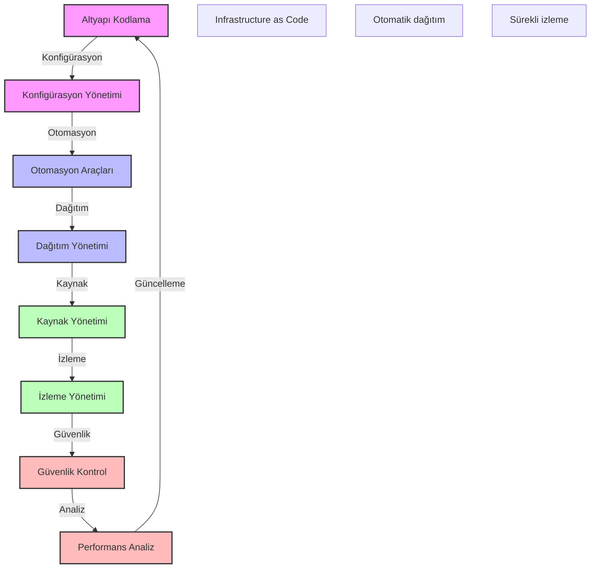

# BPM Platform - Altyapı Otomasyon Akışı

Bu diyagram, BPM platformunun altyapı otomasyon süreçlerini göstermektedir.

## Önemli Noktalar

1. Altyapı Kodlama
   - Terraform kodları
   - Ansible playbook'ları
   - CloudFormation şablonları
   - Kubernetes manifest'leri

2. Konfigürasyon Yönetimi
   - Versiyon kontrolü
   - Değişiklik yönetimi
   - Ortam yönetimi
   - Parametre yönetimi

3. Otomasyon Araçları
   - CI/CD araçları
   - Konteyner orkestrasyon
   - Konfigürasyon yönetimi
   - Test otomasyonu

4. Dağıtım Yönetimi
   - Dağıtım stratejileri
   - Rollback planları
   - Ortam yönetimi
   - Release yönetimi

5. Kaynak Yönetimi
   - Kapasite planlama
   - Ölçeklendirme
   - Kaynak optimizasyonu
   - Maliyet kontrolü

6. İzleme Yönetimi
   - Altyapı izleme
   - Log yönetimi
   - Metrik toplama
   - Alarm yönetimi

7. Güvenlik Kontrol
   - Güvenlik taramaları
   - Uyumluluk kontrolleri
   - Erişim yönetimi
   - Güvenlik politikaları

8. Performans Analiz
   - Performans metrikleri
   - Kaynak kullanımı
   - Optimizasyon önerileri
   - Trend analizi 