# BPM Platform - Entegrasyon Mimarisi

Bu diyagram, BPM Platform'un harici sistemlerle olan entegrasyon mimarisini gösterir.

```mermaid
graph TB
    %% Stil Tanımları
    classDef platform fill:#E6F3FF,stroke:#333,stroke-width:2px
    classDef business fill:#E6FFE6,stroke:#333,stroke-width:2px
    classDef communication fill:#FFE6E6,stroke:#333,stroke-width:2px
    classDef identity fill:#FFFFE6,stroke:#333,stroke-width:2px
    classDef payment fill:#F0F0F0,stroke:#333,stroke-width:2px
    classDef cloud fill:#E6E6FF,stroke:#333,stroke-width:2px
    classDef cache fill:#FFF5E6,stroke:#333,stroke-width:2px
    classDef orchestration fill:#FFE6CC,stroke:#333,stroke-width:2px
    classDef interface fill:#FFE6FF,stroke:#333,stroke-width:1px
    classDef event fill:#F0FFF0,stroke:#333,stroke-width:2px

    %% BPM Platform
    subgraph Platform["BPM Platform"]
        subgraph Gateway["Integration Gateway"]
            APIRouter["API Router"]:::platform
            ProtocolConverter["Protocol<br/>Converter"]:::platform
            MessageTransformer["Message<br/>Transformer"]:::platform
            SecurityGateway["Security<br/>Gateway"]:::platform
        end

        subgraph IntegrationService["Integration Service"]
            APIAdapters["API<br/>Adapters"]:::platform
            DataMappers["Data<br/>Mappers"]:::platform
            SyncManager["Sync<br/>Manager"]:::platform
            EventListener["Event<br/>Listener"]:::event
        end

        subgraph MessageBus["Message Bus"]
            EventTopics["Event<br/>Topics"]:::event
            MessageQueues["Message<br/>Queues"]:::event
            DeadLetterQueue["Dead Letter<br/>Queue"]:::event
        end

        subgraph IntDB["Integration DB"]
            IntegrationConfigs["Integration<br/>Configs"]:::platform
            MappingRules["Mapping<br/>Rules"]:::platform
            SyncStatus["Sync<br/>Status"]:::platform
            AuditLogs["Audit<br/>Logs"]:::platform
        end

        OrchestrationService["Orchestration<br/>Service"]:::orchestration
        CachingLayer["Caching<br/>Layer"]:::cache
        CircuitBreaker["Circuit<br/>Breaker"]:::platform
        RateLimiter["Rate<br/>Limiter"]:::platform
    end

    %% İş Sistemleri
    subgraph Business["İş Sistemleri"]
        subgraph ERP["ERP"]
            SAP["SAP"]:::business
            OracleEBS["Oracle<br/>EBS"]:::business
            MSDynamics["MS<br/>Dynamics"]:::business
        end

        subgraph CRM["CRM"]
            Salesforce["Salesforce"]:::business
            DynamicsCRM["MS Dynamics<br/>CRM"]:::business
            HubSpot["HubSpot"]:::business
        end

        subgraph ECM["ECM"]
            SharePoint["SharePoint"]:::business
            Alfresco["Alfresco"]:::business
            OpenText["OpenText"]:::business
        end
    end

    %% İletişim Sistemleri
    subgraph Communication["İletişim Sistemleri"]
        subgraph Email["Email"]
            SMTP["SMTP<br/>Sunucuları"]:::communication
            Exchange["Exchange"]:::communication
            Gmail["Gmail"]:::communication
        end

        subgraph SMS["SMS"]
            SMSGateway["SMS<br/>Gateway"]:::communication
            Twilio["Twilio"]:::communication
            Nexmo["Nexmo"]:::communication
        end

        subgraph Push["Push"]
            Firebase["Firebase"]:::communication
            APNs["APNs"]:::communication
            OneSignal["OneSignal"]:::communication
        end
    end

    %% Kimlik Sistemleri
    subgraph Identity["Kimlik Sistemleri"]
        subgraph IDP["Identity Providers"]
            AzureAD["Azure AD"]:::identity
            Okta["Okta"]:::identity
            Auth0["Auth0"]:::identity
        end

        subgraph SSO["SSO"]
            SAML["SAML"]:::identity
            OAuth["OAuth"]:::identity
            OIDC["OpenID<br/>Connect"]:::identity
        end
    end

    %% Cloud Servisleri
    subgraph Cloud["Cloud Services"]
        subgraph Storage["Storage"]
            S3["AWS S3"]:::cloud
            AzureBlob["Azure<br/>Blob"]:::cloud
            GCS["Google Cloud<br/>Storage"]:::cloud
        end

        subgraph AI["AI/ML"]
            AWSAIServices["AWS AI<br/>Services"]:::cloud
            AzureCognitive["Azure<br/>Cognitive"]:::cloud
            GoogleAI["Google<br/>AI"]:::cloud
        end

        subgraph Analytics["Analytics"]
            BigQuery["BigQuery"]:::cloud
            Redshift["Redshift"]:::cloud
            Snowflake["Snowflake"]:::cloud
        end
    end

    %% Protokol Arayüzleri
    REST[("REST API")]:::interface
    SOAP[("SOAP API")]:::interface
    GraphQL[("GraphQL API")]:::interface
    SFTP[("SFTP")]:::interface
    WebSocket[("WebSocket")]:::interface
    gRPC[("gRPC")]:::interface

    %% Platform İçi İlişkiler
    Gateway --> IntegrationService
    IntegrationService --> MessageBus
    IntegrationService --> IntDB
    OrchestrationService --> Gateway
    OrchestrationService --> MessageBus
    CachingLayer --> IntegrationService
    EventListener --> EventTopics
    CircuitBreaker --> IntegrationService
    RateLimiter --> APIRouter

    %% İş Sistemleri Entegrasyonları
    IntegrationService --> REST
    REST --> ERP
    REST --> CRM
    SOAP --> ERP
    GraphQL --> CRM
    gRPC --> AI

    %% Event-Driven İlişkiler
    EventTopics --> ERP
    EventTopics --> CRM
    MessageQueues --> DeadLetterQueue
    EventListener --> Business

    %% Cache İlişkileri
    CachingLayer --> REST
    CachingLayer --> GraphQL

    %% Güvenlik İlişkileri
    SecurityGateway --> IDP
    SecurityGateway --> SSO
    AuditLogs --> IntegrationService

    %% Cloud Entegrasyonları
    IntegrationService --> Storage
    IntegrationService --> AI
    AI --> Analytics
    Storage --> ECM

    %% Gerçek Zamanlı İlişkiler
    WebSocket --> Push
    WebSocket --> CRM

    %% Stil Uygulama
    class Platform platform
    class Business business
    class Communication communication
    class Identity identity
    class Cloud cloud
    class Cache cache
    class Orchestration orchestration
```

## Diyagram Açıklaması

### Yeni ve Geliştirilen Bileşenler

#### Orchestration Service
- Karmaşık iş akışlarının koordinasyonu
- Çoklu sistem entegrasyonlarının yönetimi
- İş kuralları ve süreç akışlarının kontrolü

#### Caching Layer
- Sık kullanılan entegrasyon verilerinin önbelleklenmesi
- Performans optimizasyonu
- Sistem yükünün azaltılması

#### Event-Driven Architecture
- **Event Listener**: Sistem olaylarının dinlenmesi
- **Event Topics**: Olay bazlı mesajlaşma
- **Dead Letter Queue**: Başarısız mesajların yönetimi

#### Güvenlik Katmanı
- **Security Gateway**: Merkezi güvenlik kontrolü
- **Circuit Breaker**: Hata toleransı
- **Rate Limiter**: API kullanım kontrolü

### Protokol ve İletişim

#### REST/SOAP/GraphQL
- Modern API entegrasyonları
- Legacy sistem desteği
- Esnek veri sorgulama

#### WebSocket/gRPC
- Gerçek zamanlı iletişim
- Yüksek performanslı veri akışı
- İki yönlü iletişim desteği

### Cloud Entegrasyonları

#### Storage Services
- Doküman yönetimi
- Yedekleme ve arşivleme
- Ölçeklenebilir depolama

#### AI/ML Services
- Akıllı süreç otomasyonu
- Tahminsel analitik
- Doğal dil işleme

#### Analytics
- Veri ambarı entegrasyonu
- İş zekası ve raporlama
- Büyük veri analizi 