# BPM Platform - Entegrasyon Yönetimi Akışı

Bu diyagram, BPM Platform'un entegrasyon yönetimi ve dış sistem bağlantı süreçlerini gösterir.

```mermaid
graph TB
    %% Stil Tanımlamaları
    classDef config fill:#E8EAF6,stroke:#3F51B5,stroke-width:2px
    classDef connector fill:#E3F2FD,stroke:#2196F3,stroke-width:2px
    classDef protocol fill:#E8F5E9,stroke:#4CAF50,stroke-width:2px
    classDef security fill:#FFF3E0,stroke:#FF9800,stroke-width:2px
    classDef monitoring fill:#FCE4EC,stroke:#E91E63,stroke-width:2px
    classDef management fill:#F3E5F5,stroke:#9C27B0,stroke-width:2px

    %% Entegrasyon Konfigürasyonu
    subgraph IntegrationConfig["Entegrasyon Konfigürasyonu"]
        %% Konfigürasyon Araçları
        subgraph ConfigTools["Konfigürasyon Araçları"]
            ConnectionBuilder[Bağlantı Oluşturucu]:::config
            EndpointManager[Endpoint Yöneticisi]:::config
            CredentialManager[Kimlik Yöneticisi]:::config
            ConfigValidator[Konfig Doğrulayıcı]:::config
        end

        %% Entegrasyon Tipleri
        subgraph IntegrationTypes["Entegrasyon Tipleri"]
            APIIntegration[API Entegrasyonu]:::config
            DatabaseIntegration[Veritabanı Entegrasyonu]:::config
            MessageQueueIntegration[Mesaj Kuyruğu]:::config
            FileSystemIntegration[Dosya Sistemi]:::config
        end
    end

    %% Bağlantı Yönetimi
    subgraph ConnectorManagement["Bağlantı Yönetimi"]
        %% Bağlantı Bileşenleri
        subgraph ConnectorComponents["Bağlantı Bileşenleri"]
            ConnectorFactory[Bağlayıcı Fabrikası]:::connector
            ConnectorPool[Bağlantı Havuzu]:::connector
            ConnectorCache[Bağlantı Önbelleği]:::connector
            ConnectorMonitor[Bağlantı İzleyici]:::connector
        end

        %% Bağlantı Özellikleri
        subgraph ConnectorFeatures["Bağlantı Özellikleri"]
            LoadBalancing[Yük Dengeleme]:::connector
            FailoverSupport[Yedekleme Desteği]:::connector
            CircuitBreaker[Devre Kesici]:::connector
            RetryMechanism[Yeniden Deneme]:::connector
        end
    end

    %% Protokol Yönetimi
    subgraph ProtocolManagement["Protokol Yönetimi"]
        %% Protokol İşlemleri
        RESTProtocol[REST Protokolü]:::protocol
        SOAPProtocol[SOAP Protokolü]:::protocol
        GraphQLProtocol[GraphQL Protokolü]:::protocol
        GRPCProtocol[gRPC Protokolü]:::protocol
    end

    %% Güvenlik Yönetimi
    subgraph SecurityManagement["Güvenlik Yönetimi"]
        %% Güvenlik İşlemleri
        Authentication[Kimlik Doğrulama]:::security
        Authorization[Yetkilendirme]:::security
        Encryption[Şifreleme]:::security
        CertificateManager[Sertifika Yönetimi]:::security
    end

    %% İzleme ve Metrikler
    subgraph MonitoringMetrics["İzleme ve Metrikler"]
        %% İzleme İşlemleri
        PerformanceMonitor[Performans İzleme]:::monitoring
        ErrorTracking[Hata Takibi]:::monitoring
        MetricsCollection[Metrik Toplama]:::monitoring
        AlertingSystem[Alarm Sistemi]:::monitoring
    end

    %% Entegrasyon Yönetimi
    subgraph IntegrationManagement["Entegrasyon Yönetimi"]
        %% Yönetim İşlemleri
        VersionControl[Versiyon Kontrolü]:::management
        LifecycleManager[Yaşam Döngüsü]:::management
        DocumentationManager[Dokümantasyon]:::management
        MaintenanceManager[Bakım Yönetimi]:::management
    end

    %% Bağlantılar - Konfigürasyon
    ConfigTools --> IntegrationTypes
    ConnectionBuilder --> APIIntegration
    EndpointManager --> DatabaseIntegration
    CredentialManager --> MessageQueueIntegration
    ConfigValidator --> FileSystemIntegration

    %% Bağlantılar - Bağlayıcı
    IntegrationTypes --> ConnectorComponents
    APIIntegration --> ConnectorFactory
    DatabaseIntegration --> ConnectorPool
    MessageQueueIntegration --> ConnectorCache
    FileSystemIntegration --> ConnectorMonitor

    %% Bağlantılar - Protokol
    ConnectorComponents --> ProtocolManagement
    ConnectorFactory --> RESTProtocol
    ConnectorPool --> SOAPProtocol
    ConnectorCache --> GraphQLProtocol
    ConnectorMonitor --> GRPCProtocol

    %% Bağlantılar - Güvenlik
    ProtocolManagement --> SecurityManagement
    RESTProtocol --> Authentication
    SOAPProtocol --> Authorization
    GraphQLProtocol --> Encryption
    GRPCProtocol --> CertificateManager

    %% Bağlantılar - İzleme
    SecurityManagement --> MonitoringMetrics
    Authentication --> PerformanceMonitor
    Authorization --> ErrorTracking
    Encryption --> MetricsCollection
    CertificateManager --> AlertingSystem

    %% Bağlantılar - Yönetim
    MonitoringMetrics --> IntegrationManagement
    PerformanceMonitor --> VersionControl
    ErrorTracking --> LifecycleManager
    MetricsCollection --> DocumentationManager
    AlertingSystem --> MaintenanceManager

    %% Geri Bildirim Döngüleri
    IntegrationManagement --> IntegrationConfig
    LifecycleManager --> ConnectorManagement
    DocumentationManager --> ProtocolManagement
    MaintenanceManager --> SecurityManagement

    %% Notlar
    note1[Entegrasyon Konfigürasyonu]:::note
    note2[Bağlantı Yönetimi]:::note
    note3[Protokol Yönetimi]:::note
    note4[Güvenlik Yönetimi]:::note
    note5[İzleme ve Metrikler]:::note
    note6[Entegrasyon Yönetimi]:::note

    %% Not Bağlantıları
    IntegrationConfig -.-> note1
    ConnectorManagement -.-> note2
    ProtocolManagement -.-> note3
    SecurityManagement -.-> note4
    MonitoringMetrics -.-> note5
    IntegrationManagement -.-> note6

    classDef note fill:#F5F5F5,stroke:#9E9E9E,stroke-width:1px
```



## Diyagram Açıklaması

### Entegrasyon Konfigürasyonu
#### Konfigürasyon Araçları
- **Bağlantı Oluşturucu**: Connection builder
- **Endpoint Yöneticisi**: Endpoint manager
- **Kimlik Yöneticisi**: Credential manager
- **Konfig Doğrulayıcı**: Config validator

#### Entegrasyon Tipleri
- **API Entegrasyonu**: REST/SOAP API
- **Veritabanı Entegrasyonu**: Database
- **Mesaj Kuyruğu**: Message queue
- **Dosya Sistemi**: File system

### Bağlantı Yönetimi
#### Bağlantı Bileşenleri
- **Bağlayıcı Fabrikası**: Connector factory
- **Bağlantı Havuzu**: Connection pool
- **Bağlantı Önbelleği**: Connection cache
- **Bağlantı İzleyici**: Connection monitor

#### Bağlantı Özellikleri
- **Yük Dengeleme**: Load balancing
- **Yedekleme Desteği**: Failover support
- **Devre Kesici**: Circuit breaker
- **Yeniden Deneme**: Retry mechanism

### Protokol Yönetimi
- **REST Protokolü**: REST API
- **SOAP Protokolü**: SOAP API
- **GraphQL Protokolü**: GraphQL API
- **gRPC Protokolü**: gRPC API

### Güvenlik Yönetimi
- **Kimlik Doğrulama**: Authentication
- **Yetkilendirme**: Authorization
- **Şifreleme**: Encryption
- **Sertifika Yönetimi**: Certificate management

### İzleme ve Metrikler
- **Performans İzleme**: Performance monitoring
- **Hata Takibi**: Error tracking
- **Metrik Toplama**: Metrics collection
- **Alarm Sistemi**: Alerting system

### Entegrasyon Yönetimi
- **Versiyon Kontrolü**: Version control
- **Yaşam Döngüsü**: Lifecycle management
- **Dokümantasyon**: Documentation
- **Bakım Yönetimi**: Maintenance management

### Önemli Özellikler
- Entegrasyon konfigürasyonu
- Bağlantı yönetimi
- Protokol yönetimi
- Güvenlik yönetimi
- İzleme ve metrikler
- Entegrasyon yönetimi
``` 