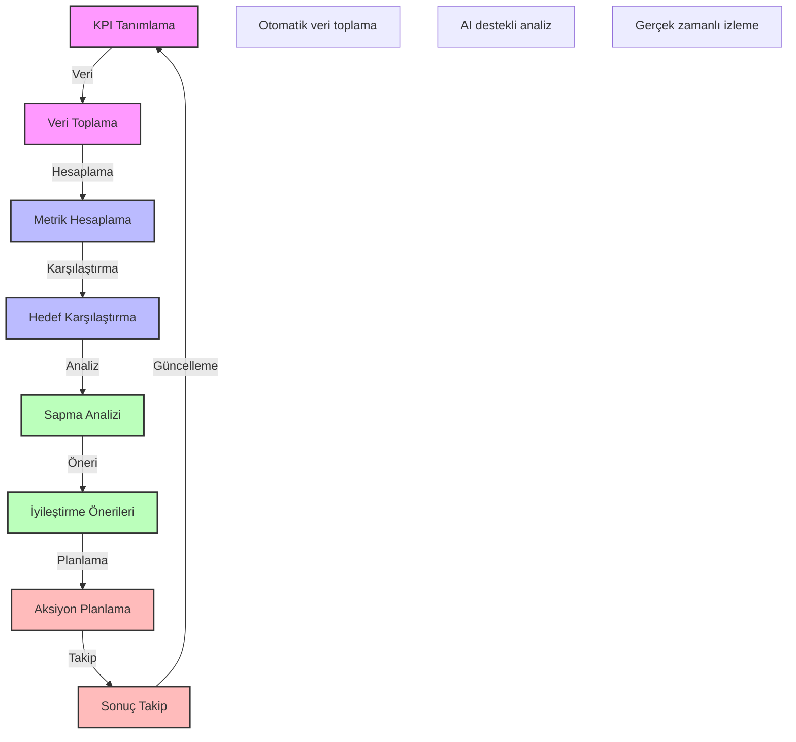

# BPM Platform - KPI İzleme ve İyileştirme

Bu diyagram, BPM platformunun KPI izleme ve iyileştirme süreçlerini göstermektedir.

## Önemli Noktalar

1. KPI Tanımlama
   - Metrik tanımları
   - Hedef belirleme
   - Ölçüm yöntemi
   - Veri kaynakları

2. Veri Toplama
   - Otomatik toplama
   - Manuel giriş
   - Veri doğrulama
   - Veri temizleme

3. Metrik Hesaplama
   - Formül tanımları
   - Hesaplama yöntemi
   - Normalizasyon
   - Ağırlıklandırma

4. Hedef Karşılaştırma
   - Hedef analizi
   - Trend analizi
   - Benchmark analizi
   - Gap analizi

5. Sapma Analizi
   - Sapma tespiti
   - Root cause analizi
   - Etki analizi
   - Risk değerlendirme

6. İyileştirme Önerileri
   - Öneri geliştirme
   - Önceliklendirme
   - Fayda analizi
   - Kaynak planlama

7. Aksiyon Planlama
   - Plan oluşturma
   - Sorumluluk atama
   - Zaman planlama
   - Kaynak tahsisi

8. Sonuç Takip
   - İlerleme takibi
   - Etki ölçümü
   - Başarı kriterleri
   - Geri bildirim