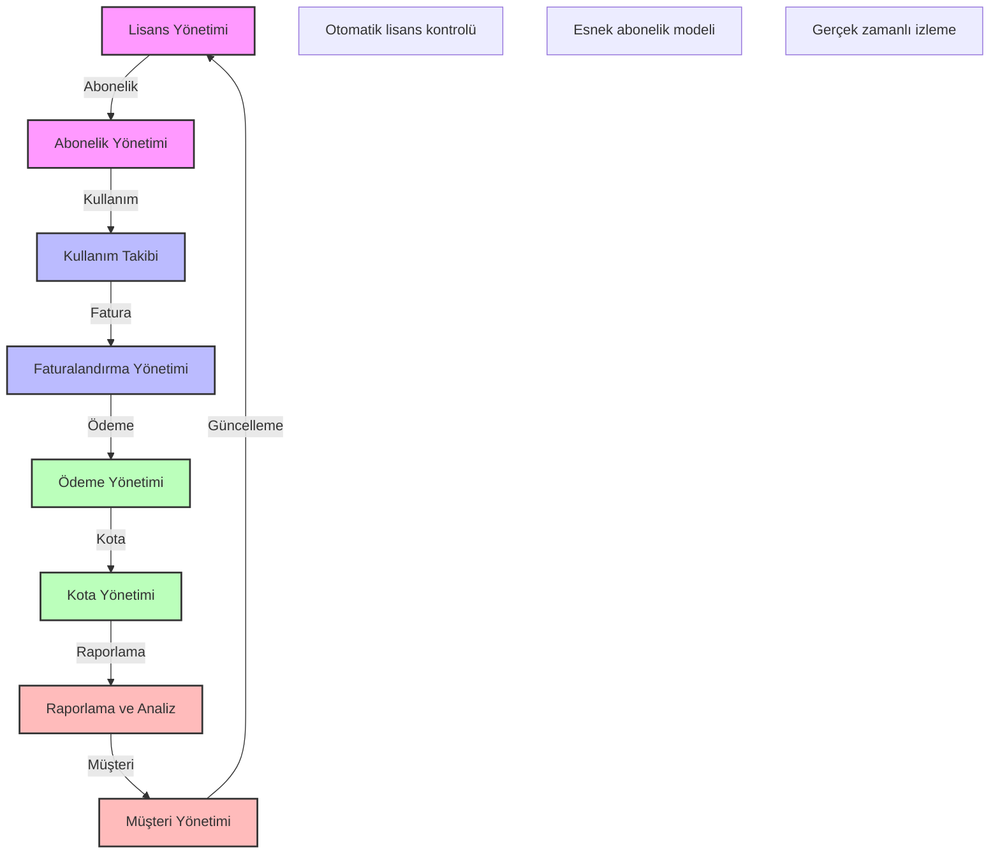

# BPM Platform - Lisans ve Abonelik Yönetimi

Bu diyagram, BPM platformunun lisans ve abonelik yönetimi süreçlerini göstermektedir.

## Önemli Noktalar

1. Lisans Yönetimi
   - Lisans tipleri
   - Lisans doğrulama
   - Lisans yenileme
   - Lisans kısıtlamaları

2. Abonelik Yönetimi
   - Abonelik paketleri
   - Abonelik süreleri
   - Yükseltme/düşürme
   - Otomatik yenileme

3. Kullanım Takibi
   - Kullanım metrikleri
   - Kullanım limitleri
   - Kullanım raporları
   - Trend analizi

4. Faturalandırma Yönetimi
   - Fatura oluşturma
   - Fatura dönemleri
   - Fatura detayları
   - Fatura arşivi

5. Ödeme Yönetimi
   - Ödeme yöntemleri
   - Ödeme takibi
   - Ödeme geçmişi
   - Gecikme yönetimi

6. Kota Yönetimi
   - Kota tanımları
   - Kota izleme
   - Kota uyarıları
   - Kota aşım politikaları

7. Raporlama ve Analiz
   - Gelir raporları
   - Kullanım raporları
   - Trend analizleri
   - Tahminsel analizler

8. Müşteri Yönetimi
   - Müşteri bilgileri
   - Müşteri segmentasyonu
   - Müşteri iletişimi
   - Müşteri desteği 