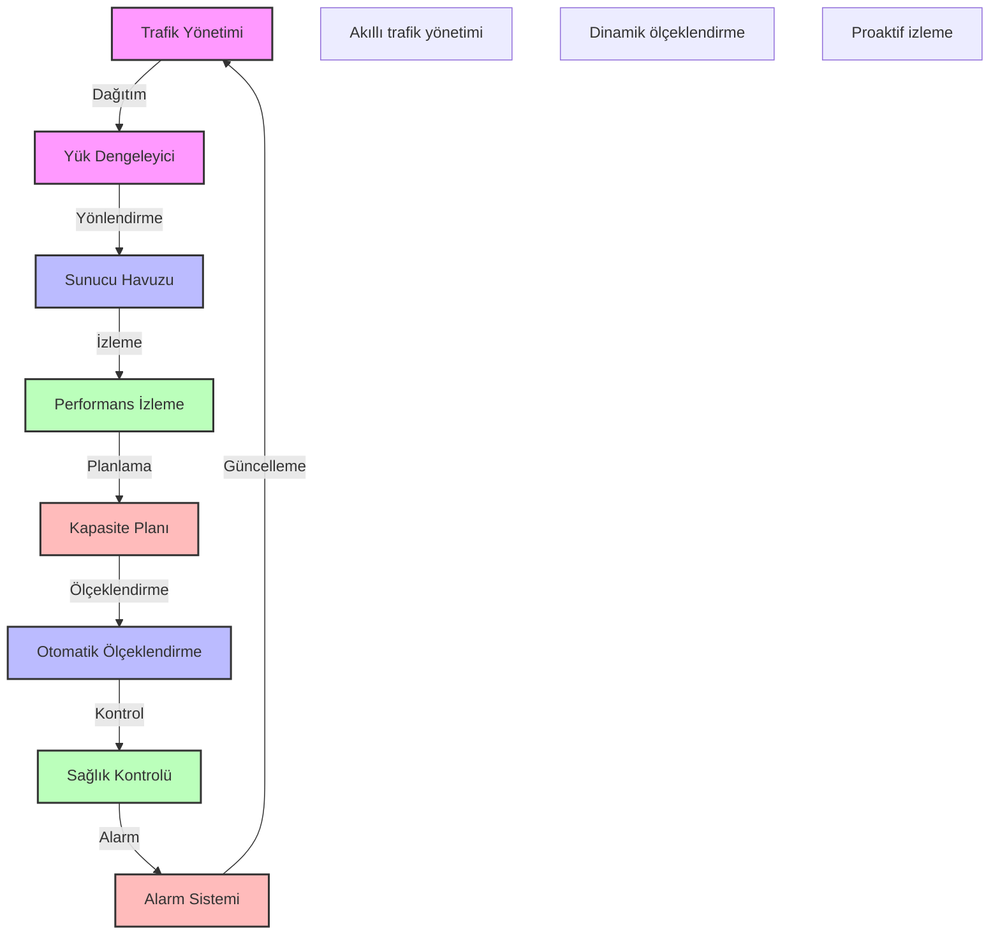

# BPM Platform - Yük Dengeleme Stratejisi

Bu diyagram, BPM platformunun yük dengeleme stratejisini göstermektedir.

## Önemli Noktalar

1. Trafik Yönetimi
   - İstek yönlendirme
   - Trafik şekillendirme
   - Önceliklendirme
   - DDoS koruması

2. Yük Dengeleme
   - Round Robin
   - En az bağlantı
   - Ağırlıklı dağıtım
   - Coğrafi dağıtım

3. Sunucu Yönetimi
   - Sunucu havuzu
   - Sağlık kontrolü
   - Otomatik düzeltme
   - Kapasite yönetimi

4. Performans İzleme
   - Gerçek zamanlı metrikler
   - Kaynak kullanımı
   - Yanıt süreleri
   - Hata oranları

5. Ölçeklendirme Stratejisi
   - Otomatik ölçeklendirme
   - Yatay/dikey büyüme
   - Eşik değerleri
   - Ölçeklendirme politikaları