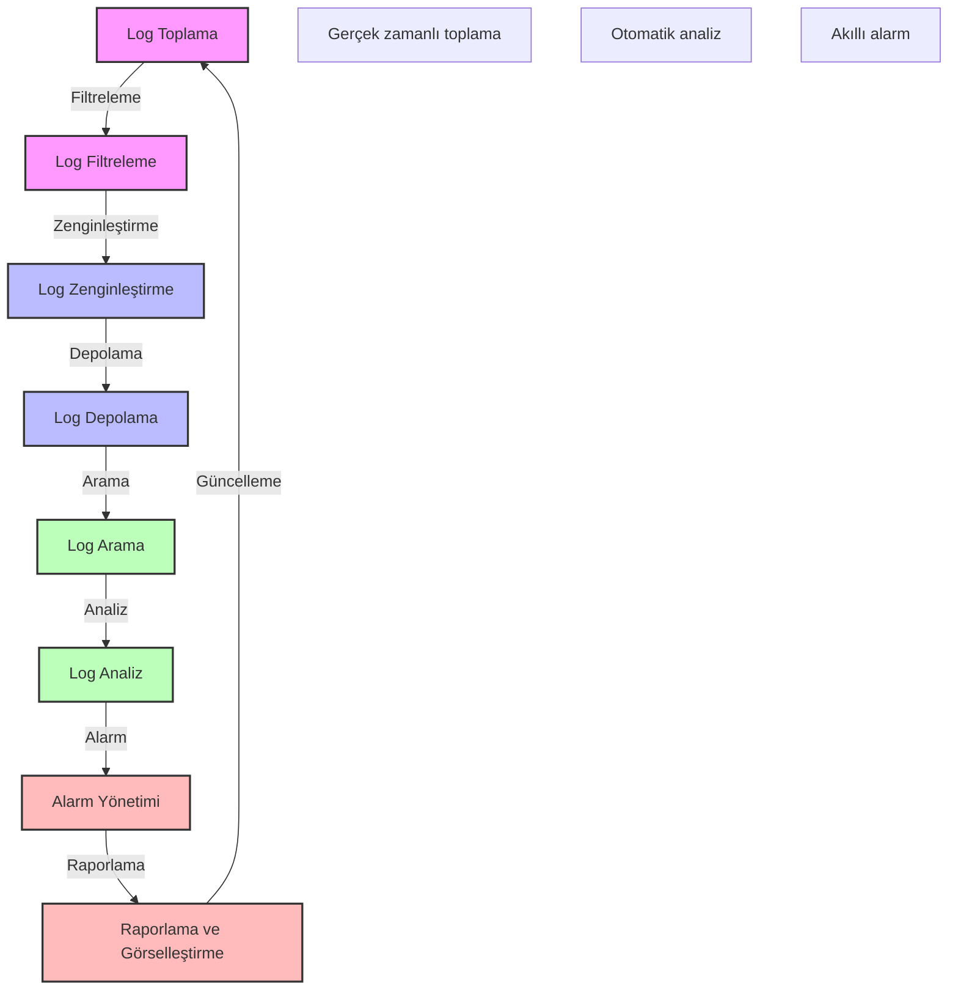

# BPM Platform - Log Yönetimi ve Analiz

Bu diyagram, BPM platformunun log yönetimi ve analiz süreçlerini göstermektedir.

## Önemli Noktalar

1. Log Toplama
   - Uygulama logları
   - Sistem logları
   - Güvenlik logları
   - Performans logları

2. Log Filtreleme
   - Log seviyesi
   - Log kaynağı
   - Log formatı
   - Log önceliklendirme

3. Log Zenginleştirme
   - Metadata ekleme
   - Korelasyon ID
   - Zaman damgası
   - Kaynak bilgisi

4. Log Depolama
   - Sıcak depolama
   - Soğuk depolama
   - Arşivleme
   - Yedekleme

5. Log Arama
   - Full-text arama
   - Pattern arama
   - Gelişmiş sorgular
   - Filtreleme

6. Log Analiz
   - Pattern analizi
   - Anomali tespiti
   - Trend analizi
   - Root cause analizi

7. Alarm Yönetimi
   - Alarm kuralları
   - Alarm seviyeleri
   - Bildirim yönetimi
   - Eskalasyon

8. Raporlama ve Görselleştirme
   - Dashboard'lar
   - Metrik grafikleri
   - Trend raporları
   - Özel raporlar