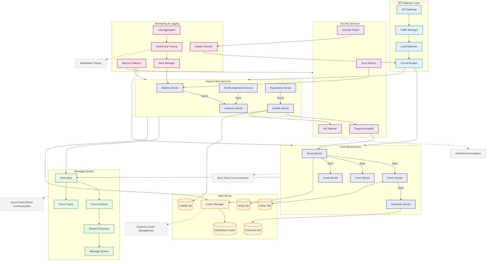

# BPM Platform - Mikroservisler Arası İletişim Akışı (Geliştirilmiş)

Bu diyagram, BPM Platform'daki mikroservisler arasındaki iletişim akışını ve etkileşimleri gösterir.

## Diyagram Açıklaması

### Gateway Katmanı
- **API Gateway**: Dış dünya ile iletişim noktası
- **Traffic Manager**: Trafik yönetimi ve yönlendirme
- **Load Balancer**: Akıllı yük dengeleme
- **Circuit Breaker**: Hata toleransı ve izolasyon

### Core Mikroservisler (Sync İletişim)
- **Süreç Servisi**: BPMN süreç yönetimi
- **Görev Servisi**: Task yönetimi
- **Form Servisi**: Dinamik form yönetimi
- **Kural Servisi**: İş kuralları yönetimi
- **Doküman Servisi**: Doküman işlemleri

### Destek Mikroservisleri (Mixed İletişim)
- **Bildirim Servisi**: Akıllı bildirim yönetimi
- **Kimlik Doğrulama**: Auth işlemleri
- **Kullanıcı Servisi**: Kullanıcı yönetimi
- **Raporlama**: Gelişmiş raporlama
- **Analitik**: AI destekli analiz

### AI ve ML Servisleri
- **Öngörülü Analitik**: Performans tahminleri
- **Anomali Tespiti**: Anormal durum tespiti
- **Öneri Motoru**: Akıllı öneriler
- **ML Pipeline**: Model eğitimi ve deployment

### Mesajlaşma Sistemi
- **Event Bus**: Merkezi event yönetimi
- **Event Schema**: Event yapı tanımları
- **Message Queue**: Async mesajlaşma
- **Stream Processor**: Real-time işleme
- **Event Tracer**: Event izleme

### Veri Depolama
- **Distributed Cache**: Dağıtık önbellek
- **Cache Manager**: TTL ve politika yönetimi
- **Process DB**: Süreç verileri
- **Task DB**: Task verileri
- **Analytics DB**: Analiz verileri

### İzleme ve Logging
- **Distributed Tracing**: End-to-end izleme
- **Metrics Collector**: Metrik toplama
- **Log Aggregator**: Merkezi loglama
- **Health Checker**: Sağlık kontrolü
- **Alert Manager**: Alarm yönetimi

### Önemli Özellikler
- Async/Sync iletişim dengesi
- AI destekli analitik ve öneriler
- Dinamik cache yönetimi
- Distributed tracing
- Event schema yönetimi 