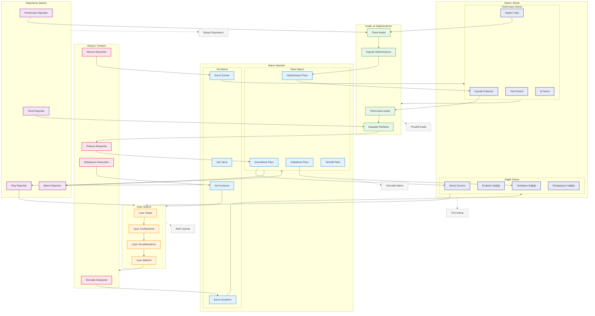

# BPM Platform - İzleme ve Bakım Akışı

Bu diyagram, BPM Platform'un izleme ve bakım süreçlerini gösterir.

## Diyagram Açıklaması

### Sistem İzleme
#### Performans İzleme
- **Kaynak Kullanımı**: CPU, RAM, Disk
- **Sistem Yükü**: İşlem yükü
- **Yanıt Süresi**: Servis yanıt süreleri
- **İş Hacmi**: İşlem kapasitesi

#### Sağlık İzleme
- **Servis Durumu**: Servis sağlığı
- **Endpoint Sağlığı**: API durumu
- **Veritabanı Sağlığı**: DB performansı
- **Entegrasyon Sağlığı**: Bağlantı durumu

### Bakım İşlemleri
#### Planlı Bakım
- **Güncelleme Planı**: Versiyon güncellemeleri
- **Yedekleme Planı**: Veri yedekleme
- **Temizlik Planı**: Sistem temizliği
- **Optimizasyon Planı**: Sistem optimizasyonu

#### Acil Bakım
- **Acil Yama**: Kritik düzeltmeler
- **Acil Kurtarma**: Hızlı müdahale
- **Sorun Çözme**: Problem giderme
- **Servis Düzeltme**: Servis onarımı

### Analiz ve Değerlendirme
- **Performans Analizi**: Sistem performansı
- **Trend Analizi**: Eğilim analizi
- **Kapasite Planlama**: Kaynak planlaması
- **Kaynak Optimizasyonu**: Verimlilik artırma

### Uyarı Sistemi
- **Uyarı Tespiti**: Problem tespiti
- **Uyarı Sınıflandırma**: Kategorizasyon
- **Uyarı Önceliklendirme**: Önem sırası
- **Uyarı Bildirimi**: Bildirim yönetimi

### Aksiyon Yönetimi
- **Otomatik Aksiyonlar**: Otomatik müdahale
- **Manuel Aksiyonlar**: Manuel müdahale
- **Eskalasyon Aksiyonları**: Yükseltme
- **Önleyici Aksiyonlar**: Proaktif önlemler

### Raporlama Sistemi
- **Performans Raporları**: Performans metrikleri
- **Bakım Raporları**: Bakım kayıtları
- **Olay Raporları**: Olay kayıtları
- **Trend Raporları**: Trend analizleri

### Önemli Özellikler
- 7/24 izleme
- Otomatik bakım
- Proaktif analiz
- Akıllı uyarılar
- Detaylı raporlama