# BPM Platform - Çok Dilli Destek Akışı

Bu diyagram, BPM Platform'un çok dilli destek ve yerelleştirme süreçlerini gösterir.

```mermaid
graph TB
    %% Stil Tanımlamaları
    classDef content fill:#E8EAF6,stroke:#3F51B5,stroke-width:2px
    classDef manager fill:#E3F2FD,stroke:#2196F3,stroke-width:2px
    classDef storage fill:#E8F5E9,stroke:#4CAF50,stroke-width:2px
    classDef ui fill:#FFF3E0,stroke:#FF9800,stroke-width:2px
    classDef service fill:#FCE4EC,stroke:#E91E63,stroke-width:2px
    classDef cache fill:#F3E5F5,stroke:#9C27B0,stroke-width:2px

    %% İçerik Yönetimi
    subgraph ContentManagement["İçerik Yönetimi"]
        %% Metin İçerikleri
        subgraph TextContent["Metin İçerikleri"]
            UILabels[Arayüz Etiketleri]:::content
            ErrorMessages[Hata Mesajları]:::content
            HelpTexts[Yardım Metinleri]:::content
            EmailTemplates[E-posta Şablonları]:::content
        end

        %% Süreç İçerikleri
        subgraph ProcessContent["Süreç İçerikleri"]
            ProcessNames[Süreç İsimleri]:::content
            TaskLabels[Görev Etiketleri]:::content
            FormLabels[Form Etiketleri]:::content
            ReportLabels[Rapor Etiketleri]:::content
        end
    end

    %% Dil Yönetimi
    subgraph LanguageManagement["Dil Yönetimi"]
        %% Dil Ayarları
        LanguageSelector[Dil Seçici]:::manager
        LocaleManager[Yerel Ayar Yöneticisi]:::manager
        TranslationManager[Çeviri Yöneticisi]:::manager
        FallbackManager[Yedek Dil Yöneticisi]:::manager
        
        %% Çeviri Araçları
        AutoTranslator[Otomatik Çevirmen]:::manager
        TranslationValidator[Çeviri Doğrulayıcı]:::manager
        ContextManager[Bağlam Yöneticisi]:::manager
        PluralManager[Çoğul Yöneticisi]:::manager
    end

    %% Depolama ve Cache
    subgraph Storage["Depolama ve Cache"]
        %% Veritabanı
        TranslationDB[(Çeviri DB)]:::storage
        LocaleDB[(Yerel Ayar DB)]:::storage
        
        %% Önbellek
        TranslationCache[Çeviri Önbellek]:::cache
        LocaleCache[Yerel Ayar Önbellek]:::cache
        
        %% Dosya Sistemi
        ResourceFiles[Kaynak Dosyaları]:::storage
        BackupStore[Yedek Depo]:::storage
    end

    %% Kullanıcı Arayüzü
    subgraph UserInterface["Kullanıcı Arayüzü"]
        %% Dil Seçenekleri
        LanguageSelector[Dil Seçici]:::ui
        RegionSelector[Bölge Seçici]:::ui
        
        %% Format Ayarları
        DateFormatter[Tarih Biçimleyici]:::ui
        NumberFormatter[Sayı Biçimleyici]:::ui
        CurrencyFormatter[Para Birimi Biçimleyici]:::ui
        TimeZoneManager[Saat Dilimi Yöneticisi]:::ui
    end

    %% Servisler
    subgraph Services["Servisler"]
        %% API Servisleri
        TranslationAPI[Çeviri API]:::service
        LocalizationAPI[Yerelleştirme API]:::service
        
        %% Yardımcı Servisler
        ImportExport[İçe/Dışa Aktarma]:::service
        VersionControl[Versiyon Kontrol]:::service
        QualityChecker[Kalite Kontrol]:::service
        MissingTranslator[Eksik Çeviri Yönetici]:::service
    end

    %% Bağlantılar - İçerik Yönetimi
    TextContent --> TranslationManager
    ProcessContent --> TranslationManager
    TranslationManager --> TranslationDB

    %% Bağlantılar - Dil Yönetimi
    LanguageSelector --> LocaleManager
    LocaleManager --> TranslationManager
    TranslationManager --> AutoTranslator
    AutoTranslator --> TranslationValidator

    %% Bağlantılar - Depolama
    TranslationDB --> TranslationCache
    LocaleDB --> LocaleCache
    TranslationManager --> ResourceFiles
    ResourceFiles --> BackupStore

    %% Bağlantılar - UI
    LanguageSelector --> DateFormatter
    RegionSelector --> NumberFormatter
    LocaleManager --> CurrencyFormatter
    LocaleManager --> TimeZoneManager

    %% Bağlantılar - Servisler
    TranslationAPI --> TranslationManager
    LocalizationAPI --> LocaleManager
    ImportExport --> ResourceFiles
    QualityChecker --> TranslationValidator

    %% Geri Bildirim Döngüleri
    TranslationValidator --> MissingTranslator
    MissingTranslator --> AutoTranslator
    QualityChecker --> TranslationManager
    VersionControl --> ResourceFiles

    %% Notlar
    note1[Dynamic Content Loading]:::note
    note2[Fallback Mechanism]:::note
    note3[Cache Management]:::note
    note4[Format Localization]:::note
    note5[Quality Assurance]:::note

    %% Not Bağlantıları
    ContentManagement -.-> note1
    FallbackManager -.-> note2
    Storage -.-> note3
    UserInterface -.-> note4
    Services -.-> note5

    classDef note fill:#F5F5F5,stroke:#9E9E9E,stroke-width:1px
```



## Diyagram Açıklaması

### İçerik Yönetimi
#### Metin İçerikleri
- **Arayüz Etiketleri**: UI elementleri için metinler
- **Hata Mesajları**: Hata ve uyarı metinleri
- **Yardım Metinleri**: Kullanıcı yardım içerikleri
- **E-posta Şablonları**: Çok dilli e-posta şablonları

#### Süreç İçerikleri
- **Süreç İsimleri**: BPMN süreç isimleri
- **Görev Etiketleri**: Task tanımlamaları
- **Form Etiketleri**: Form alan etiketleri
- **Rapor Etiketleri**: Rapor başlık ve açıklamaları

### Dil Yönetimi
- **Dil Seçici**: Kullanıcı dil tercihleri
- **Yerel Ayar Yöneticisi**: Locale yönetimi
- **Çeviri Yöneticisi**: Çeviri işlemleri
- **Yedek Dil Yöneticisi**: Fallback mekanizması

### Depolama ve Cache
- **Çeviri DB**: Çeviri veritabanı
- **Yerel Ayar DB**: Locale veritabanı
- **Çeviri Önbellek**: Performans optimizasyonu
- **Kaynak Dosyaları**: Statik çeviri dosyaları

### Kullanıcı Arayüzü
- **Dil/Bölge Seçici**: Kullanıcı tercihleri
- **Tarih Biçimleyici**: Tarih formatları
- **Sayı Biçimleyici**: Sayı formatları
- **Para Birimi Biçimleyici**: Para birimi formatları

### Servisler
- **Çeviri API**: Çeviri servisleri
- **Yerelleştirme API**: Locale servisleri
- **İçe/Dışa Aktarma**: Veri transferi
- **Kalite Kontrol**: Çeviri kalitesi

### Önemli Özellikler
- Dinamik içerik yükleme
- Yedek dil mekanizması
- Önbellek yönetimi
- Format yerelleştirme
- Kalite güvencesi
``` 