# BPM Platform - Paket Diyagramı

Bu diyagram, BPM Platform'un yazılım paketlerini ve aralarındaki ilişkileri gösterir.

```mermaid
graph TB
    %% Stil Tanımları
    classDef frontend fill:#E6F3FF,stroke:#333,stroke-width:2px
    classDef backend fill:#E6FFE6,stroke:#333,stroke-width:2px
    classDef core fill:#FFE6E6,stroke:#333,stroke-width:2px
    classDef infra fill:#FFFFE6,stroke:#333,stroke-width:2px
    classDef services fill:#F0F0F0,stroke:#333,stroke-width:2px
    classDef security fill:#E6E6FF,stroke:#333,stroke-width:2px
    classDef monitoring fill:#FFE6CC,stroke:#333,stroke-width:2px
    classDef ai fill:#F0FFF0,stroke:#333,stroke-width:2px
    classDef pipeline fill:#FFE6FF,stroke:#333,stroke-width:2px
    classDef eventDriven fill:#F0F0FF,stroke:#333,stroke-width:2px

    %% Frontend Paketleri
    subgraph Frontend["Frontend"]
        subgraph Web["Web Uygulaması"]
            subgraph WebSrc["src"]
                subgraph WebApp["app"]
                    subgraph Core["core"]
                        Auth["auth"]:::frontend
                        Http["http"]:::frontend
                        Guards["guards"]:::frontend
                        Interceptors["interceptors"]:::frontend
                        ErrorHandler["error<br/>handler"]:::frontend
                    end

                    subgraph Shared["shared"]
                        Components["components"]:::frontend
                        Directives["directives"]:::frontend
                        Pipes["pipes"]:::frontend
                        Utils["utils"]:::frontend
                        SharedUtils["shared<br/>utils"]:::frontend
                    end

                    subgraph Features["features"]
                        Process["process"]:::frontend
                        Forms["forms"]:::frontend
                        Tasks["tasks"]:::frontend
                        Reports["reports"]:::frontend
                        Analytics["analytics"]:::frontend
                    end

                    Layouts["layouts"]:::frontend
                    Services["services"]:::frontend
                    Store["store"]:::frontend
                end

                Assets["assets"]:::frontend
                Environments["environments"]:::frontend
                Styles["styles"]:::frontend
            end
            Tests["tests"]:::frontend
        end

        subgraph Mobile["Mobil Uygulama"]
            subgraph MobileSrc["src/app"]
                Navigation["navigation"]:::frontend
                Screens["screens"]:::frontend
                MobileComponents["components"]:::frontend
                MobileServices["services"]:::frontend
                MobileUtils["utils"]:::frontend
                MobileSharedUtils["shared<br/>utils"]:::frontend
            end
        end
    end

    %% Backend Paketleri
    subgraph Backend["Backend"]
        subgraph CorePackages["Core"]
            subgraph ProcessEngine["Process Engine"]
                subgraph BPMN["bpmn"]
                    Engine["engine"]:::core
                    Parser["parser"]:::core
                    Validator["validator"]:::core
                end
                Execution["execution"]:::core
                Persistence["persistence"]:::core
            end

            subgraph FormEngine["Form Engine"]
                Builder["builder"]:::core
                Renderer["renderer"]:::core
                Validation["validation"]:::core
            end

            subgraph RuleEngine["Rule Engine"]
                Executor["executor"]:::core
                Compiler["compiler"]:::core
                Evaluator["evaluator"]:::core
            end
        end

        subgraph Infrastructure["Infrastructure"]
            subgraph DB["Database"]
                Repositories["repositories"]:::infra
                Entities["entities"]:::infra
                Migrations["migrations"]:::infra
                Replication["replication"]:::infra
            end

            subgraph Messaging["Messaging"]
                Kafka["kafka"]:::infra
                RabbitMQ["rabbitmq"]:::infra
                EventBus["event<br/>bus"]:::eventDriven
                DLQ["dead letter<br/>queue"]:::eventDriven
            end

            subgraph Cache["Cache"]
                Redis["redis"]:::infra
                Memory["memory"]:::infra
                DistCache["distributed<br/>cache"]:::infra
            end

            subgraph Storage["Storage"]
                Local["local"]:::infra
                Cloud["cloud"]:::infra
                Backup["backup"]:::infra
            end
        end

        subgraph API["API"]
            Controllers["Controllers"]:::backend
            DTOs["DTOs"]:::backend
            Middleware["Middleware"]:::backend
            Validators["Validators"]:::backend
            APIGateway["API<br/>Gateway"]:::backend
            CircuitBreaker["Circuit<br/>Breaker"]:::backend
        end

        subgraph Services["Services"]
            subgraph DocService["Document Service"]
                Manager["manager"]:::services
                Versioning["versioning"]:::services
            end

            subgraph NotifService["Notification Service"]
                Email["email"]:::services
                Push["push"]:::services
                SMS["sms"]:::services
                PriorityQueue["priority<br/>queue"]:::services
            end

            subgraph IntService["Integration Service"]
                Adapters["adapters"]:::services
                Transformers["transformers"]:::services
                RetryService["retry<br/>service"]:::services
            end
        end

        subgraph Common["Common"]
            CommonUtils["Utils"]:::backend
            Constants["Constants"]:::backend
            Types["Types"]:::backend
            Errors["Errors"]:::backend
        end

        subgraph Security["Security"]
            Authentication["Authentication"]:::security
            Authorization["Authorization"]:::security
            Encryption["Encryption"]:::security
            OAuth["OAuth/OIDC"]:::security
            Vault["Vault"]:::security
        end

        subgraph Monitoring["Monitoring"]
            Metrics["Metrics"]:::monitoring
            Logging["Logging"]:::monitoring
            Tracing["Tracing"]:::monitoring
            AIMetrics["AI<br/>Metrics"]:::monitoring
            SLAMonitor["SLA<br/>Monitor"]:::monitoring
        end

        subgraph AI["AI"]
            subgraph ML["Machine Learning"]
                Models["models"]:::ai
                Training["training"]:::ai
                Prediction["prediction"]:::ai
            end
            subgraph NLP["Natural Language Processing"]
                Analysis["analysis"]:::ai
                Processing["processing"]:::ai
            end
        end

        subgraph Pipeline["CI/CD Pipeline"]
            Build["build"]:::pipeline
            Test["test"]:::pipeline
            Deploy["deploy"]:::pipeline
            AutoScale["auto<br/>scale"]:::pipeline
        end

        subgraph Discovery["Service Discovery"]
            Registry["service<br/>registry"]:::backend
            HealthCheck["health<br/>check"]:::backend
            LoadBalancer["load<br/>balancer"]:::backend
        end
    end

    %% İlişkiler
    Frontend --> API
    API --> CorePackages
    API --> Services
    CorePackages --> Infrastructure
    Services --> Infrastructure
    CorePackages --> Common
    Services --> Common
    Infrastructure --> Common
    Security --> Common
    Monitoring --> Infrastructure
    AI --> Infrastructure
    AI --> Monitoring
    Pipeline --> Infrastructure
    Discovery --> Infrastructure

    %% Shared Utils İlişkileri
    SharedUtils --> MobileSharedUtils
    SharedUtils --> Utils
    MobileSharedUtils --> MobileUtils

    %% Event-Driven İlişkiler
    EventBus --> Services
    EventBus --> CorePackages
    DLQ --> NotifService

    %% Monitoring İlişkileri
    AIMetrics --> ML
    SLAMonitor --> Services

    %% Security İlişkileri
    OAuth --> Authentication
    Vault --> Encryption

    %% Notlar
    note["Temel iş mantığı<br/>paketleri"]
    CorePackages -.-> note

    note2["Altyapı ve veritabanı<br/>paketleri"]
    Infrastructure -.-> note2

    note3["Destek servisleri<br/>paketleri"]
    Services -.-> note3

    note4["Güvenlik ve<br/>yetkilendirme"]
    Security -.-> note4

    note5["Yapay zeka<br/>servisleri"]
    AI -.-> note5

    note6["CI/CD ve<br/>otomasyon"]
    Pipeline -.-> note6
```

## Diyagram Açıklaması

### Yeni ve Geliştirilen Bileşenler

#### Frontend Geliştirmeleri
- **ErrorHandler**: Frontend hata yönetimi ve retry mekanizmaları
- **SharedUtils**: Web ve mobil arasında paylaşılan yardımcı fonksiyonlar
- **Analytics**: Frontend analitik ve izleme bileşeni

#### Backend Geliştirmeleri
- **Event-Driven Architecture**:
  - EventBus: Olay tabanlı iletişim
  - DLQ: Dead Letter Queue yönetimi
  - PriorityQueue: Öncelikli bildirim kuyruğu

#### Infrastructure Geliştirmeleri
- **Database**: Replikasyon desteği
- **Cache**: Dağıtık önbellekleme
- **Storage**: Yedekleme sistemi

#### Security Geliştirmeleri
- **OAuth/OIDC**: Modern kimlik doğrulama protokolleri
- **Vault**: Hassas veri yönetimi

#### Monitoring Geliştirmeleri
- **AIMetrics**: AI/ML performans izleme
- **SLAMonitor**: Servis seviyesi izleme

#### Pipeline ve Service Discovery
- **CI/CD Pipeline**: Otomatik build, test ve dağıtım
- **Service Discovery**: Servis kayıt ve izleme
- **AutoScale**: Otomatik ölçeklendirme

### İlişki Türleri
- **Doğrudan Bağımlılıklar**: Kesintisiz oklar
- **Event-Driven İlişkiler**: EventBus üzerinden
- **Shared Utils**: Paylaşılan kod
- **Monitoring**: Metrik ve log toplama
</rewritten_file>