# BPM Platform - Performans İzleme ve Metrik Toplama Akışı (Geliştirilmiş)

Bu diyagram, BPM Platform'un performans izleme ve metrik toplama sistemini gösterir.

```mermaid
graph TB
    %% Stil Tanımlamaları
    classDef collector fill:#E8EAF6,stroke:#3F51B5,stroke-width:2px
    classDef processor fill:#E3F2FD,stroke:#2196F3,stroke-width:2px
    classDef storage fill:#E8F5E9,stroke:#4CAF50,stroke-width:2px
    classDef alert fill:#FFF3E0,stroke:#FF9800,stroke-width:2px
    classDef dashboard fill:#FCE4EC,stroke:#E91E63,stroke-width:2px
    classDef ai fill:#F3E5F5,stroke:#9C27B0,stroke-width:2px
    classDef integration fill:#FFEBEE,stroke:#D32F2F,stroke-width:2px

    %% Metrik Toplayıcılar
    subgraph Collectors["Metrik Toplayıcılar"]
        %% Sistem Metrikleri
        subgraph SystemMetrics["Sistem Metrikleri"]
            CPUMetrics[CPU Kullanımı]:::collector
            MemoryMetrics[Bellek Kullanımı]:::collector
            DiskMetrics[Disk I/O]:::collector
            NetworkMetrics[Ağ Trafiği]:::collector
        end

        %% Süreç Metrikleri
        subgraph ProcessMetrics["Süreç Metrikleri"]
            WorkflowMetrics[İş Akışı Metrikleri]:::collector
            TaskMetrics[Görev Metrikleri]:::collector
            BottleneckMetrics[Darboğaz Metrikleri]:::collector
            CompletionMetrics[Tamamlanma Süreleri]:::collector
        end

        %% Kullanıcı Metrikleri
        subgraph UserMetrics["Kullanıcı Metrikleri"]
            SessionMetrics[Oturum Metrikleri]:::collector
            BehaviorMetrics[Davranış Metrikleri]:::collector
            UsageMetrics[Kullanım Metrikleri]:::collector
            SatisfactionMetrics[Memnuniyet Metrikleri]:::collector
        end

        %% API Metrikleri
        subgraph APIMetrics["API Metrikleri"]
            ResponseTimeMetrics[Yanıt Süreleri]:::collector
            ErrorRateMetrics[Hata Oranları]:::collector
            RequestMetrics[İstek Metrikleri]:::collector
            EndpointMetrics[Endpoint Kullanımı]:::collector
        end

        %% SLA Metrikleri
        subgraph SLAMetrics["SLA Metrikleri"]
            PerformanceMetrics[Performans SLA]:::collector
            AvailabilityMetrics[Erişilebilirlik SLA]:::collector
            ResponseSLA[Yanıt Süresi SLA]:::collector
            QualityMetrics[Kalite SLA]:::collector
        end
    end

    %% Metrik İşleme
    subgraph Processing["Metrik İşleme"]
        PrometheusServer[Prometheus Server]:::processor
        MetricAggregator[Metrik Agregatör]:::processor
        DataProcessor[Veri İşleyici]:::processor
        TrendAnalyzer[Trend Analizör]:::processor
        AnomalyDetector[Anomali Dedektörü]:::processor
        MLProcessor[ML İşlemci]:::ai
    end

    %% AI ve ML Katmanı
    subgraph AILayer["AI & ML Katmanı"]
        ARIMAModel[ARIMA Model]:::ai
        ProphetModel[Prophet Model]:::ai
        MLOpsEngine[MLOps Engine]:::ai
        AutoScaler[Auto Scaler]:::ai
        PredictiveAnalytics[Öngörülü Analitik]:::ai
    end

    %% Metrik Depolama
    subgraph Storage["Metrik Depolama"]
        TimeSeriesDB[(Time Series DB)]:::storage
        MetricCache[(Metrik Cache)]:::storage
        HistoricalDB[(Geçmiş Veriler DB)]:::storage
        ArchiveDB[(Arşiv DB)]:::storage
        RetentionManager[Retention Manager]:::storage
    end

    %% Olay Yönetimi
    subgraph IncidentManagement["Olay Yönetimi"]
        AlertManager[Alert Manager]:::alert
        NotificationEngine[Bildirim Motoru]:::alert
        EscalationManager[Eskalasyon Yöneticisi]:::alert
        IncidentManager[Olay Yöneticisi]:::alert
        RCAEngine[Kök Neden Analizi]:::alert
    end

    %% Dış Sistem Entegrasyonları
    subgraph Integrations["Entegrasyonlar"]
        ServiceNow[ServiceNow]:::integration
        JiraService[Jira Service]:::integration
        EmailSystem[E-posta Sistemi]:::integration
        SMSGateway[SMS Gateway]:::integration
        TeamsIntegration[MS Teams]:::integration
    end

    %% Görselleştirme
    subgraph Visualization["Görselleştirme"]
        GrafanaDashboards[Grafana Dashboards]:::dashboard
        CustomDashboards[Özel Dashboardlar]:::dashboard
        ReportGenerator[Rapor Üreteci]:::dashboard
        MetricExplorer[Metrik Gezgini]:::dashboard
        DashboardBuilder[Dashboard Builder]:::dashboard
    end

    %% Metrik Akış Bağlantıları
    Collectors --> PrometheusServer
    PrometheusServer --> MetricAggregator
    MetricAggregator --> DataProcessor
    DataProcessor --> MLProcessor
    DataProcessor --> TrendAnalyzer
    DataProcessor --> AnomalyDetector

    %% AI Bağlantıları
    MLProcessor --> ARIMAModel & ProphetModel
    ARIMAModel & ProphetModel --> PredictiveAnalytics
    PredictiveAnalytics --> AutoScaler
    MLOpsEngine --> AILayer

    %% Depolama Bağlantıları
    DataProcessor --> TimeSeriesDB
    TimeSeriesDB --> MetricCache
    MetricCache --> HistoricalDB
    HistoricalDB --> ArchiveDB
    RetentionManager --> Storage

    %% Olay Yönetimi Bağlantıları
    AnomalyDetector --> AlertManager
    AlertManager --> NotificationEngine
    AlertManager --> EscalationManager
    EscalationManager --> IncidentManager
    IncidentManager --> RCAEngine

    %% Entegrasyon Bağlantıları
    IncidentManager --> ServiceNow & JiraService
    NotificationEngine --> EmailSystem & SMSGateway & TeamsIntegration

    %% Görselleştirme Bağlantıları
    TimeSeriesDB --> GrafanaDashboards & CustomDashboards
    MetricCache --> MetricExplorer
    DashboardBuilder --> CustomDashboards
    HistoricalDB --> ReportGenerator

    %% Geri Bildirim Döngüleri
    RCAEngine -->|İyileştirme Önerileri| AutoScaler
    TrendAnalyzer -->|Trend Bilgisi| PredictiveAnalytics
    PredictiveAnalytics -->|Optimizasyon Önerileri| MetricAggregator

    %% Notlar
    note1[ML-Enhanced Anomaly Detection]:::note
    note2[Automated Scaling Decisions]:::note
    note3[Multi-tier Storage Strategy]:::note
    note4[Customizable Alerting]:::note
    note5[SLA Compliance Tracking]:::note

    %% Not Bağlantıları
    AILayer -.-> note1
    AutoScaler -.-> note2
    Storage -.-> note3
    NotificationEngine -.-> note4
    SLAMetrics -.-> note5

    classDef note fill:#F5F5F5,stroke:#9E9E9E,stroke-width:1px
```

## Diyagram Açıklaması

### Metrik Toplayıcılar
#### Sistem Metrikleri
- **CPU Kullanımı**: İşlemci kullanım oranları
- **Bellek Kullanımı**: RAM ve swap kullanımı
- **Disk I/O**: Disk okuma/yazma performansı
- **Ağ Trafiği**: Network kullanım metrikleri

#### Süreç Metrikleri
- **İş Akışı Metrikleri**: BPMN süreç performansı
- **Görev Metrikleri**: Task tamamlanma oranları
- **Darboğaz Metrikleri**: Süreç darboğazları
- **Tamamlanma Süreleri**: İşlem süreleri

#### Kullanıcı Metrikleri
- **Oturum Metrikleri**: Kullanıcı oturum analizi
- **Davranış Metrikleri**: Kullanıcı etkileşimleri
- **Kullanım Metrikleri**: Feature kullanım oranları
- **Memnuniyet Metrikleri**: Kullanıcı deneyimi

#### API Metrikleri
- **Yanıt Süreleri**: API endpoint performansı
- **Hata Oranları**: API hata istatistikleri
- **İstek Metrikleri**: API kullanım oranları
- **Endpoint Kullanımı**: Endpoint popülerliği

#### SLA Metrikleri
- **Performans SLA**: Performans hedefleri
- **Erişilebilirlik SLA**: Uptime hedefleri
- **Yanıt Süresi SLA**: Latency hedefleri
- **Kalite SLA**: Hata oranı hedefleri

### AI ve ML Katmanı
- **ARIMA Model**: Zaman serisi analizi
- **Prophet Model**: Trend tahminleme
- **MLOps Engine**: ML model yönetimi
- **Auto Scaler**: Otomatik ölçeklendirme
- **Öngörülü Analitik**: Performans tahminleri

### Metrik Depolama
- **Time Series DB**: Gerçek zamanlı veriler
- **Metrik Cache**: Sık erişilen veriler
- **Geçmiş Veriler DB**: Orta vadeli veriler
- **Arşiv DB**: Uzun vadeli veriler
- **Retention Manager**: Veri saklama politikaları

### Olay Yönetimi
- **Alert Manager**: Alarm yönetimi
- **Bildirim Motoru**: Özelleştirilebilir bildirimler
- **Eskalasyon Yöneticisi**: Olay yükseltme
- **Olay Yöneticisi**: Incident tracking
- **Kök Neden Analizi**: RCA engine

### Entegrasyonlar
- **ServiceNow**: ITSM entegrasyonu
- **Jira Service**: Issue tracking
- **E-posta Sistemi**: Mail bildirimleri
- **SMS Gateway**: SMS bildirimleri
- **MS Teams**: Teams entegrasyonu

### Görselleştirme
- **Grafana Dashboards**: Standart paneller
- **Özel Dashboardlar**: Kişiselleştirilmiş paneller
- **Rapor Üreteci**: Otomatik raporlama
- **Metrik Gezgini**: İnteraktif analiz
- **Dashboard Builder**: Panel oluşturucu

### Önemli Özellikler
- ML destekli anomali tespiti
- Otomatik ölçeklendirme kararları
- Çok katmanlı depolama stratejisi
- Özelleştirilebilir bildirimler
- SLA uyumluluk takibi 