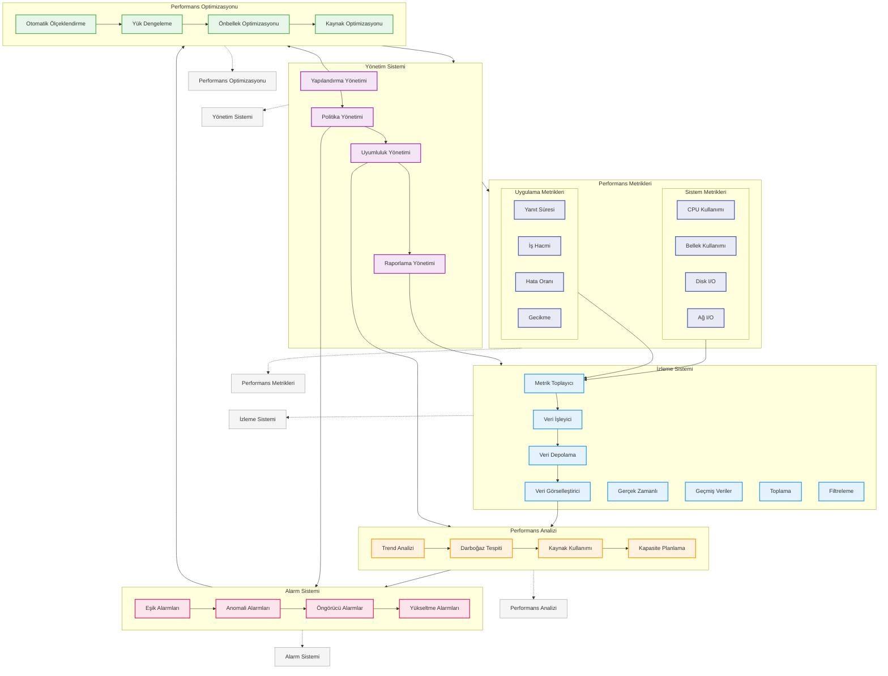

# BPM Platform - Performans İzleme Akışı

Bu diyagram, BPM Platform'un performans izleme ve metrik toplama süreçlerini gösterir.



## Diyagram Açıklaması

### Performans Metrikleri
#### Sistem Metrikleri
- **CPU Kullanımı**: CPU usage monitoring
- **Bellek Kullanımı**: Memory usage monitoring
- **Disk I/O**: Disk input/output monitoring
- **Ağ I/O**: Network input/output monitoring

#### Uygulama Metrikleri
- **Yanıt Süresi**: Response time monitoring
- **İş Hacmi**: Throughput monitoring
- **Hata Oranı**: Error rate monitoring
- **Gecikme**: Latency monitoring

### İzleme Sistemi
#### İzleme Bileşenleri
- **Metrik Toplayıcı**: Metric collector
- **Veri İşleyici**: Data processor
- **Veri Depolama**: Data storage
- **Veri Görselleştirici**: Data visualizer

#### İzleme Özellikleri
- **Gerçek Zamanlı**: Real-time monitoring
- **Geçmiş Veriler**: Historical data
- **Toplama**: Aggregation
- **Filtreleme**: Filtering

### Performans Analizi
- **Trend Analizi**: Trend analysis
- **Darboğaz Tespiti**: Bottleneck detection
- **Kaynak Kullanımı**: Resource usage analysis
- **Kapasite Planlama**: Capacity planning

### Alarm Sistemi
- **Eşik Alarmları**: Threshold alarms
- **Anomali Alarmları**: Anomaly alarms
- **Öngörücü Alarmlar**: Predictive alarms
- **Yükseltme Alarmları**: Escalation alarms

### Performans Optimizasyonu
- **Otomatik Ölçeklendirme**: Auto scaling
- **Yük Dengeleme**: Load balancing
- **Önbellek Optimizasyonu**: Cache optimization
- **Kaynak Optimizasyonu**: Resource optimization

### Yönetim Sistemi
- **Yapılandırma Yönetimi**: Configuration management
- **Politika Yönetimi**: Policy management
- **Uyumluluk Yönetimi**: Compliance management
- **Raporlama Yönetimi**: Reporting management

### Önemli Özellikler
- Performans metrikleri
- İzleme sistemi
- Performans analizi
- Alarm sistemi
- Performans optimizasyonu
- Yönetim sistemi
``` 