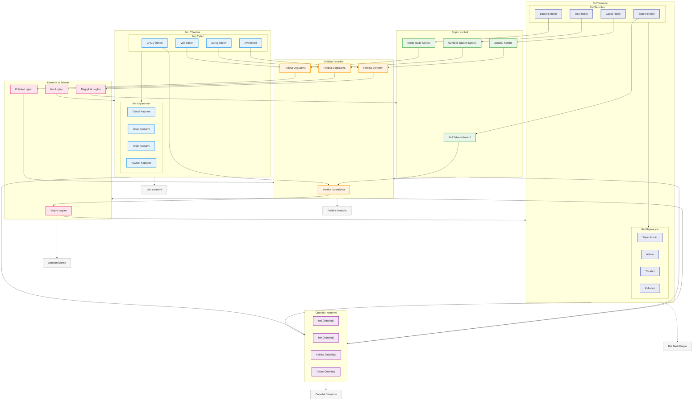

# BPM Platform - Yetkilendirme Akışı

Bu diyagram, BPM Platform'un yetkilendirme ve erişim kontrol süreçlerini gösterir.

## Diyagram Açıklaması

### Rol Yönetimi
#### Rol Tanımları
- **Sistem Rolleri**: Öntanımlı roller
- **Özel Roller**: Kullanıcı tanımlı
- **Dinamik Roller**: Koşula bağlı
- **Geçici Roller**: Süreli roller

#### Rol Hiyerarşisi
- **Süper Admin**: Tam yetki
- **Admin**: Yönetim yetkileri
- **Yönetici**: Süreç yönetimi
- **Kullanıcı**: Temel yetkiler

### İzin Yönetimi
#### İzin Tipleri
- **CRUD İzinleri**: Temel işlemler
- **Süreç İzinleri**: İş süreçleri
- **Veri İzinleri**: Veri erişimi
- **API İzinleri**: API kullanımı

#### İzin Kapsamları
- **Global Kapsam**: Sistem geneli
- **Grup Kapsamı**: Grup bazlı
- **Proje Kapsamı**: Proje bazlı
- **Kaynak Kapsamı**: Kaynak bazlı

### Erişim Kontrol
- **Rol Tabanlı**: RBAC modeli
- **Öznitelik Tabanlı**: ABAC modeli
- **İsteğe Bağlı**: DAC modeli
- **Zorunlu**: MAC modeli

### Politika Yönetimi
- **Politika Tanımlama**: Kural tanımı
- **Politika Doğrulama**: Kural kontrolü
- **Politika Uygulama**: Kural yürütme
- **Politika Denetimi**: Kural denetimi

### Denetim ve İzleme
- **Erişim Logları**: Access logs
- **İzin Logları**: Permission logs
- **Politika Logları**: Policy logs
- **Değişiklik Logları**: Change logs

### Önbellek Yönetimi
- **Rol Önbelleği**: Role cache
- **İzin Önbelleği**: Permission cache
- **Politika Önbelleği**: Policy cache
- **Token Önbelleği**: Token cache

### Önemli Özellikler
- Rol bazlı erişim
- İzin yönetimi
- Politika kontrolü
- Denetim izleme
- Önbellek yönetimi