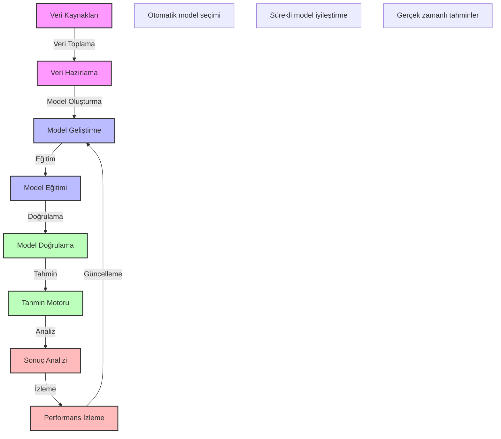

# BPM Platform - Tahminsel Analitik Akışı

Bu diyagram, BPM platformundaki tahminsel analitik süreçlerini göstermektedir.

## Önemli Noktalar

1. Veri Hazırlama
   - Veri temizleme
   - Özellik mühendisliği
   - Veri normalizasyonu
   - Veri zenginleştirme

2. Model Geliştirme
   - Algoritma seçimi
   - Hiperparametre optimizasyonu
   - Model karşılaştırma
   - Model seçimi

3. Model Eğitimi ve Doğrulama
   - Cross-validation
   - Model performans metrikleri
   - Hata analizi
   - Model iyileştirme

4. Tahmin ve Analiz
   - Gerçek zamanlı tahminler
   - Batch tahminler
   - Sonuç yorumlama
   - Güven skorları

5. Performans İzleme
   - Model drift analizi
   - Yeniden eğitim tetikleyicileri
   - Performans metrikleri
   - İyileştirme önerileri