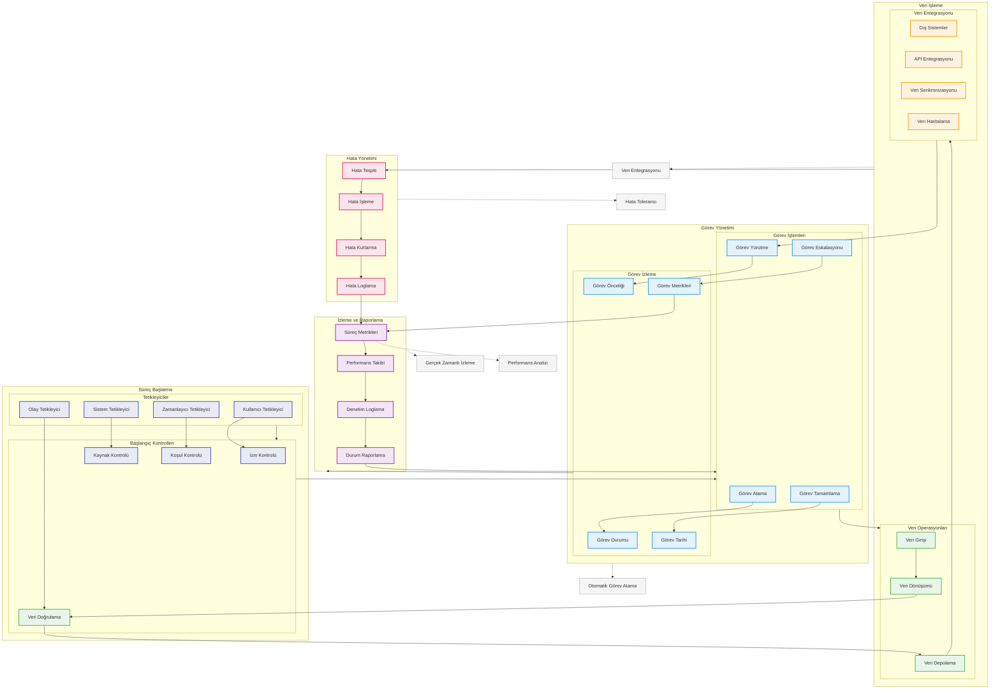

# BPM Platform - Süreç Yürütme Akışı

Bu diyagram, BPM Platform'da süreçlerin nasıl yürütüldüğünü ve yönetildiğini gösterir.

## Diyagram Açıklaması

### Süreç Başlatma
#### Tetikleyiciler
- **Kullanıcı Tetikleyici**: Manuel başlatma
- **Sistem Tetikleyici**: Otomatik başlatma
- **Zamanlayıcı Tetikleyici**: Zamanlanmış başlatma
- **Olay Tetikleyici**: Olay tabanlı başlatma

#### Başlangıç Kontrolleri
- **İzin Kontrolü**: Yetki kontrolü
- **Kaynak Kontrolü**: Sistem kaynakları
- **Koşul Kontrolü**: Başlangıç koşulları
- **Veri Doğrulama**: Giriş verisi kontrolü

### Görev Yönetimi
#### Görev İşlemleri
- **Görev Atama**: İş dağıtımı
- **Görev Yürütme**: Görev işleme
- **Görev Tamamlama**: İş bitirme
- **Görev Eskalasyonu**: Yükseltme

#### Görev İzleme
- **Görev Durumu**: Anlık durum
- **Görev Önceliği**: Önceliklendirme
- **Görev Tarihi**: Zaman yönetimi
- **Görev Metrikleri**: Performans ölçümü

### Veri İşleme
#### Veri Operasyonları
- **Veri Girişi**: Form verileri
- **Veri Dönüşümü**: Format dönüşümü
- **Veri Doğrulama**: Veri kontrolü
- **Veri Depolama**: Kalıcı depolama

#### Veri Entegrasyonu
- **Dış Sistemler**: Harici sistemler
- **API Entegrasyonu**: API bağlantıları
- **Veri Senkronizasyonu**: Eşzamanlama
- **Veri Haritalama**: Veri eşleştirme

### Hata Yönetimi
- **Hata Tespiti**: Problem tespiti
- **Hata İşleme**: Hata yönetimi
- **Hata Kurtarma**: Recovery işlemleri
- **Hata Loglama**: Log kayıtları

### İzleme ve Raporlama
- **Süreç Metrikleri**: KPI'lar
- **Performans Takibi**: Performans analizi
- **Denetim Loglama**: Audit trail
- **Durum Raporlama**: Durum raporları

### Önemli Özellikler
- Otomatik görev atama
- Gerçek zamanlı izleme
- Veri entegrasyonu
- Hata toleransı
- Performans analizi